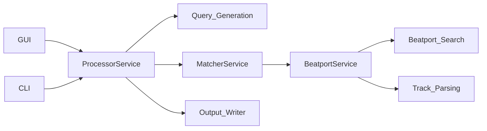

# Technical analysis

This document explains how CuePoint works under the hood. It is written for technical readers who want the architecture, data flow, and system behavior details.

## High-level architecture

CuePoint exposes **two tools** from the start screen:

- **inKey** — Rekordbox playlist → Beatport metadata enrichment. Shared core pipeline (parsing, query generation, search, scoring, export) surfaced through GUI and CLI. Both call the same services (`ProcessorService`).
- **inCrate** — Inventory from full Rekordbox collection, discovery (Beatport genre charts from library artists, new releases from labels), and Beatport playlist creation. Orchestration: `InventoryService`, `IncrateDiscoveryService`, and `src/cuepoint/incrate/` (inventory DB, discovery, playlist writer, enrichment).

Primary orchestration for **inKey** happens in `src/cuepoint/services/processor_service.py`, which:

1. Normalizes track inputs.
2. Generates search queries.
3. Calls the matcher to search and score.
4. Builds `TrackResult` objects for export.



## Data flow (end-to-end)

1. **Input parsing**: Rekordbox XML is parsed into track models.
2. **Query generation**: Multiple query variants are derived from title + artists.
3. **Search**: Beatport URLs are collected with a hybrid strategy.
4. **Candidate parsing**: Beatport track pages are parsed into metadata.
5. **Scoring + guards**: Candidates are scored and filtered.
6. **Output**: CSV exports and review files are written.

The README diagram reflects this flow:

```
Rekordbox XML -> Query Generation -> Beatport Search -> Scoring/Guards -> Outputs -> Review
```


## Input parsing

Parsing happens in `src/cuepoint/data/rekordbox.py`. Key behaviors:

- Extracts playlists and track rows from a Rekordbox XML export.
- If the artist field is missing, the app attempts to extract artists from the title.
- Titles are sanitized before queries are built (`sanitize_title_for_search`).

## Query generation

Query generation is defined in `src/cuepoint/core/query_generator.py` and uses a staged strategy:

- **Priority queries**: full title + artist combinations.
- **N-gram queries**: 1- to N-word title fragments.
- **Remix variants**: remixer and mix-type hints when detected.
- **Special phrases**: parenthetical phrases are treated as signals.
- **Reverse order queries**: optional "Artist Title" variants.

Query generation is bounded by limits like:

- `TITLE_GRAM_MAX`
- `MAX_QUERIES_PER_TRACK`
- `CROSS_TITLE_GRAMS_WITH_ARTISTS`

These defaults are documented in `config/config.yaml.template` and enforced via `SETTINGS` in `src/cuepoint/models/config.py`.

## Search strategy

Beatport search combines multiple approaches (`src/cuepoint/data/beatport_search.py`):

- **Direct search** (Beatport pages or internal APIs) for accuracy.
- **DuckDuckGo** discovery for URLs when direct search fails or is limited.
- **Browser automation** (Playwright/Selenium) as a fallback when pages are JS-rendered.

The service entry point (`src/cuepoint/services/beatport_service.py`) caches search results and logs diagnostics.

## Candidate parsing

Track URLs are parsed in `src/cuepoint/data/beatport.py` to extract:

- title, artists, key
- year, BPM, label, genre
- release name and release date

Parsed track data is cached for reuse.

## Matching and scoring

Core scoring lives in `src/cuepoint/core/matcher.py`.

**Score composition**

- Weighted title similarity and artist similarity.
- Bonuses for key and year matches.
- Mix-type bonuses or penalties (remix vs original mix).
- Special phrase bonuses.

**Guards**

Guards reject false positives early, including:

- Token subset matches (too few significant tokens).
- Weak overlap between title and artist tokens.
- Title-only mode checks when artists are missing.

**Early exit**

If a high-quality candidate is found, the matcher can stop early to save time. Thresholds such as `EARLY_EXIT_SCORE` and `EARLY_EXIT_MIN_QUERIES` define when this happens.

## Concurrency and time budgets

Processing is parallelized:

- **Track workers**: parallelize tracks within a playlist.
- **Candidate workers**: fetch and parse Beatport candidates in parallel.
- **Per-track time budgets**: hard caps prevent runaway search times.

These are configured through `SETTINGS` and `config/config.yaml.template`.

## Caching and determinism

Caching reduces repeated network calls:

- Search results are cached (short TTL).
- Track page parses are cached (longer TTL).
- Requests-cache can be enabled for HTTP response caching.

The system can also run deterministically using the `SEED` setting for reproducible ordering.

## Outputs and artifacts

Exports are written by `src/cuepoint/services/output_writer.py`:

- **Main CSV**: one row per track with match details.
- **Candidates CSV**: all candidates with scores.
- **Queries CSV**: per-query audit trail.
- **Review CSV**: low-confidence matches for manual review.

The review file is only generated when any tracks fall below the acceptance threshold.

## Configuration

Configuration is layered:

1. **Defaults** in `src/cuepoint/models/config.py`.
2. **YAML** overrides in `config.yaml` (see `config/config.yaml.template`).
3. **CLI** overrides and presets (`--fast`, `--turbo`, `--exhaustive`, etc.).

Settings are mapped from nested YAML into a flat `SETTINGS` dict and are read by core services.

## GUI and CLI interfaces

**GUI**

- Built with PySide6/Qt (`src/cuepoint/ui/`).
- Runs processing in a background thread and streams progress.
- Shares the same `ProcessorService` as the CLI.

**CLI**

- Entry point: run from project root as `python main.py` (root `main.py` delegates to `src/main.py`). CLI logic in `src/cuepoint/cli/cli_processor.py`.
- Accepts `--xml`, `--playlist`, `--out`, and other flags.
- Writes outputs to the configured output directory.

## Update flow

The desktop app includes an update manager (`src/cuepoint/update/`):

- Checks an appcast feed for new releases.
- Downloads the correct installer for the platform.
- Hands off to the installer after user confirmation.

## Constraints and assumptions

- A valid Rekordbox XML export is required.
- Beatport availability and metadata quality affect match quality.
- Network conditions can impact search performance.

## Key files at a glance

- Core pipeline: `src/cuepoint/services/processor_service.py`
- Matching/scoring: `src/cuepoint/core/matcher.py`
- Query generation: `src/cuepoint/core/query_generator.py`
- Beatport search: `src/cuepoint/data/beatport_search.py`
- Output writer: `src/cuepoint/services/output_writer.py`
- Config defaults: `src/cuepoint/models/config.py`
- Config template: `config/config.yaml.template`
