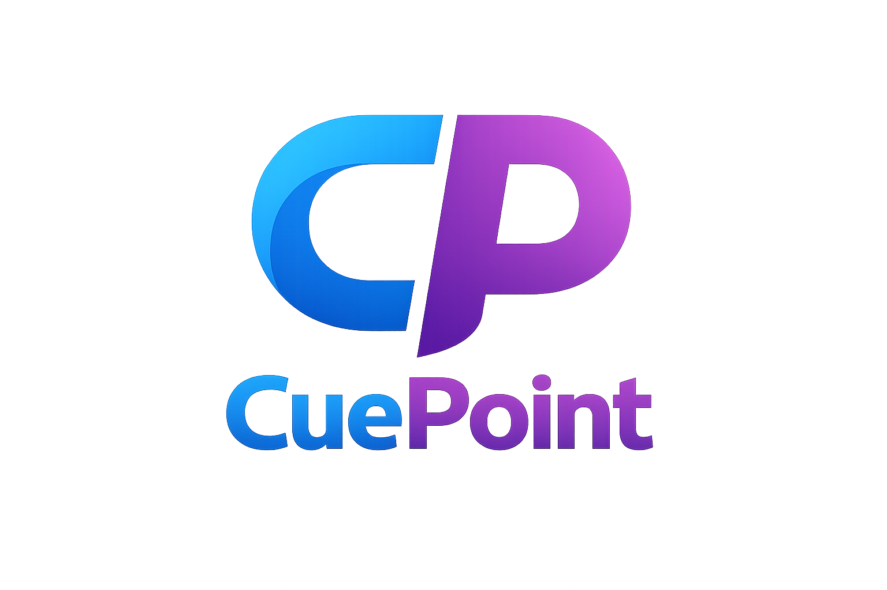
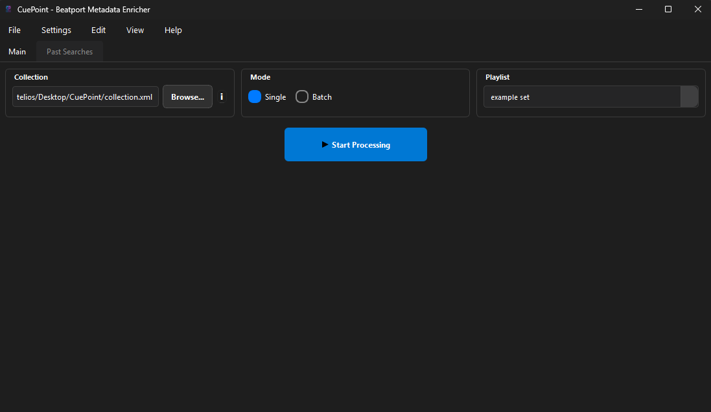
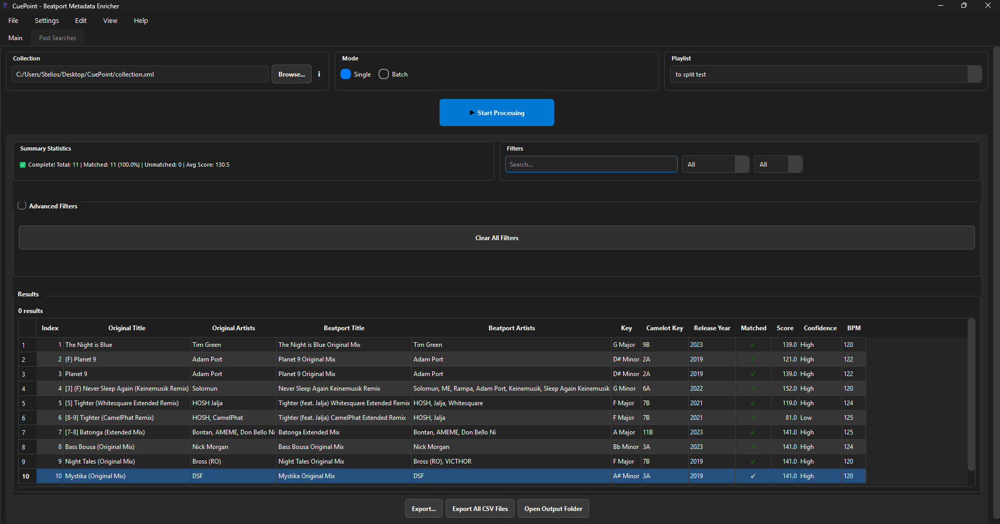
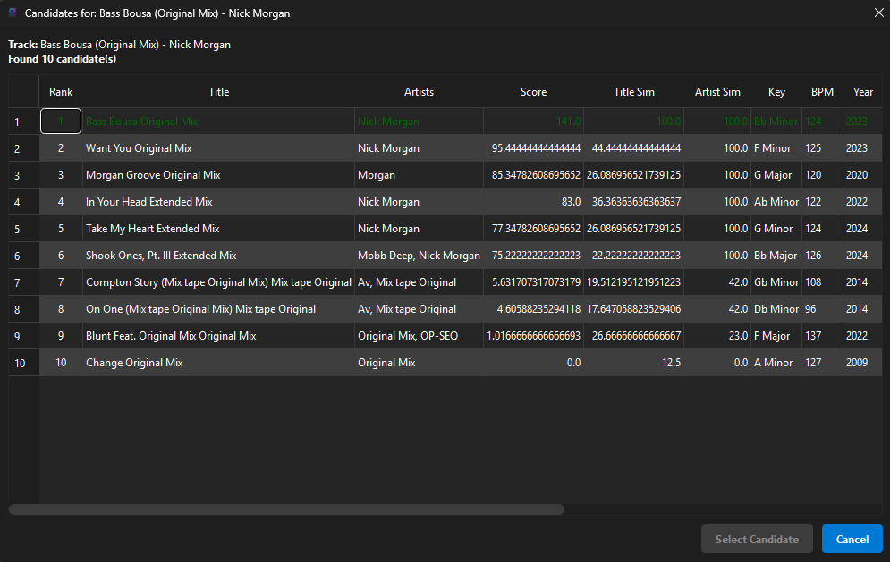
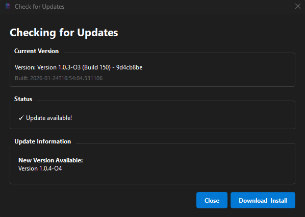
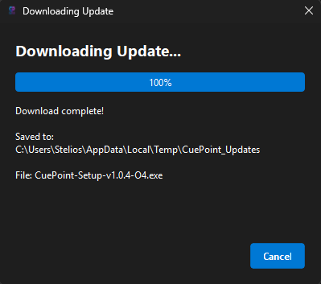
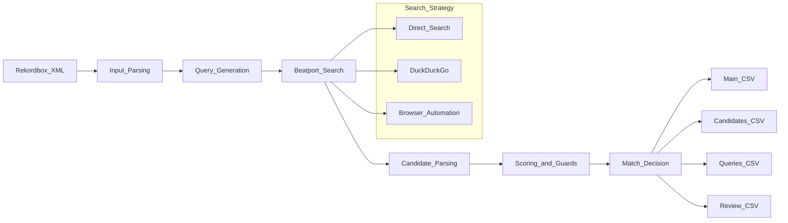

  <h1>  

    
  
</h1>
  
<strong>Accurate music metadata for Rekordbox libraries, sourced from Beatport.</strong>

  

    <a href="DOCS/how-to-run.md">How to run</a>
    •
    <a href=".github/TECHNICAL_ANALYSIS.md">Technical analysis</a>
  

  

    
    
    
    
  

<table width="100%">
  <tr>
    <td width="33%">
      <h3>Clean metadata</h3>
      
Key, BPM, label, genre, release date-kept consistent and reviewable.

    </td>
    <td width="33%">
      <h3>Auditable matches</h3>
      
Every query and candidate is logged so decisions are traceable.

    </td>
    <td width="33%">
      <h3>Built for scale</h3>
      
Handles large libraries with parallel search and time budgets.

    </td>
  </tr>
</table>

<h2>What is Cuepoint</h2>

  DJs use an app called Rekordbox to import downloaded songs, sort them into playlists, and export them to
  USBs for performance. To play reliably, each track needs metadata like musical key, label, and release date.
  The official source for this data is Beatport.com. CuePoint takes a Rekordbox XML export of its playlists,
  matches each track to Beatport, and outputs clean metadata you can review or import back into your library.
  It keeps a full audit trail of queries and candidates so you can verify every decision.

<h2>Context</h2>
<ul>
  <li><strong>Rekordbox</strong>: DJ library software used to organize music, playlists, and performance data.</li>
  <li><strong>Beatport</strong>: Online music store with official release metadata (label, release date, genre, key, BPM).</li>
</ul>

CuePoint bridges Rekordbox (your library) and Beatport (official metadata) so you don’t have to fix this by hand.

<h2>Why it matters</h2>

  Manual matching is slow and inconsistent. Accurate keys, labels, genres, and release dates matter for sets,
  exports, and library hygiene. Beatport has the official info, but copying it track‑by‑track is a time sink.

<h2>What’s implemented</h2>
<ul>
  <li><strong>Update manager</strong>: in‑app update checks, download flow, and installer handoff</li>
  <li><strong>Auto‑research</strong>: optional second‑pass search for missed matches</li>
  <li><strong>Config system</strong>: YAML config + CLI overrides for repeatable runs</li>
  <li><strong>Caching</strong>: request caching to speed up repeated runs</li>
  <li><strong>Audit logging</strong>: query and candidate logs for verification</li>
  <li><strong>GUI + CLI</strong>: run via desktop UI or command line</li>
</ul>

<h2>How to run</h2>

See <code>DOCS/how-to-run.md</code> for:

<ul>
  <li>Install from GitHub Releases</li>
  <li>Build locally</li>
  <li>Run the GUI directly</li>
</ul>

<h2>UI</h2>

<em>Main window</em>

  

<em>Match review</em>

  

<em>Playlist detail</em>

  

<em>Track candidates</em>

  

<em>Automatic check for an available update</em>

  

<em>Download update</em>

  

<h2>Quick demo</h2>

  

<h2>What you get</h2>
<ul>
  <li>Clean metadata: key, BPM, label, genres, release details</li>
  <li>Review workflow: low‑confidence rows flagged for manual pass</li>
  <li>Audit trail: every query and candidate recorded</li>
</ul>

<h2>Before / After</h2>

<table width="100%">
  <tr>
    <th align="left">Before (Rekordbox export)</th>
    <th align="left">After (CuePoint)</th>
  </tr>
  <tr>
    <td>Missing key, label, release date, genre</td>
    <td>Key, label, release date, genre filled in</td>
  </tr>
  <tr>
    <td>Manual lookup track‑by‑track</td>
    <td>Batch matching with review flags</td>
  </tr>
  <tr>
    <td>No audit trail</td>
    <td>Queries + candidates logged for verification</td>
  </tr>
</table>

<h2>How it works (short)</h2>
<ol>
  <li>Parse the Rekordbox XML export.</li>
  <li>Generate multiple search queries per track.</li>
  <li>Search Beatport and collect candidates.</li>
  <li>Score candidates and apply guards.</li>
  <li>Write results and review files.</li>
</ol>

<h2>Architecture</h2>

<h2>Technical analysis</h2>

  Deeper technical details, pipeline notes, and constraints live in
  <a href=".github/TECHNICAL_ANALYSIS.md">.github/TECHNICAL_ANALYSIS.md</a>.

<h2>Inputs</h2>
<ul>
  <li>Rekordbox XML export file</li>
  <li>Playlist name (must match the XML playlist name exactly)</li>
</ul>

<h2>Project layout</h2>
<ul>
  <li><code>SRC/cuepoint</code>: application code</li>
  <li><code>SRC/tests</code>: canonical tests</li>
  <li><code>scripts/</code>: utilities</li>
  <li><code>ARCHIVE/</code>: legacy material</li>
</ul>

<h2>License</h2>

See <code>THIRD_PARTY_LICENSES.txt</code> and repository notices.

  <h3>Get started</h3>
  

    
    
  

