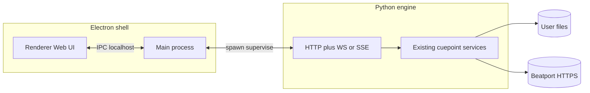

# Phase 0 — Discovery and architecture

## Purpose

Establish **why** the stack is Electron + Python engine, define **process and trust boundaries**, record **architecture decision records (ADRs)**, and plan **spikes** that reduce unknowns before large implementation. Detailed user security and repo hygiene are in **Phase 0b** and **0c**; this document references them.

**Prerequisites:** Product goals (Rekordbox ↔ Beatport workflows, inCrate, export, audit).

**Outcomes:** Written ADRs, sequence diagrams, spike backlog, clear vocabulary shared with Phases 2–10.

---

## Problem statement and constraints

- **Problem:** The Qt GUI (`src/cuepoint/ui/`) must be replaced by a **pixel-art** Electron UI while **preserving Python** as the source of truth for matching, API calls, and file I/O.
- **Constraints:**
  - **Three OSes** in parity milestone: Windows, macOS, Linux.
  - **Single parity milestone** then cutover; Qt GUI **removed** afterward.
  - **IPC required** between shell and engine (two processes minimum).
  - **Mouse-first** UX for v1; accessibility documented as follow-up.

---

## Goals vs non-goals

| Goals | Non-goals (Phase 0) |
|--------|---------------------|
| Stable process model and ADRs | Final visual design (Phase 1) |
| Spike plan for IPC packaging | Full OpenAPI (Phase 3) |
| Align with security docs 0b/0c | Implementing CI (Phase 9) |

---

## Alternatives considered

| Option | Pros | Cons | Verdict |
|--------|------|------|---------|
| **A. Keep PySide6, pixel theme** | No IPC; one process | Still “Python GUI”; less web-native iteration | **Rejected** (product direction: Electron) |
| **B. Tauri + Python engine** | Smaller runtime than Electron | Rust shell; team/tooling curve | **Deferred**; Electron chosen |
| **C. Electron + Python engine** | Mature desktop web stack; large ecosystem | Heavier than Tauri | **Selected** |
| **D. Rewrite core in Node/Rust** | Single language UI | High risk; discard domain logic in Python | **Rejected** |

---

## Target architecture (reference)

**Trust boundaries:**

1. **Renderer:** Untrusted for filesystem; no raw secrets; use **preload** / **contextBridge** for narrow APIs.
2. **Main:** OS dialogs, spawn engine, window state; still no domain secrets in logs by default.
3. **Engine:** Full access only per **user intent** (paths chosen in UI); must enforce **auth token** on localhost (see Phase 0b).

---

## Recommended defaults (from plan)

| Area | Default |
|------|---------|
| Engine packaging | **PyInstaller one-directory** per OS |
| IPC | **HTTP** on `127.0.0.1` + JSON; **WebSocket or SSE** for streaming |
| UI | **Vite + React + TypeScript**; **PixiJS** for pixel layers where needed |

---

## ADRs (stubs — fill during implementation)

| ID | Title | Decision | Status |
|----|--------|----------|--------|
| ADR-001 | Desktop shell runtime | Use Electron for the packaged shell | Accepted — [001-electron-shell.md](adr/001-electron-shell.md) |
| ADR-002 | Engine packaging | PyInstaller one-dir per platform | Accepted — [002-engine-packaging.md](adr/002-engine-packaging.md) |
| ADR-003 | IPC style | HTTP JSON API + streaming channel | Accepted — [003-http-ipc.md](adr/003-http-ipc.md) |
| ADR-004 | Renderer ↔ main bridge | contextBridge with explicit typed surface | Proposed |
| ADR-005 | Parity strategy | Full GUI parity then remove Qt | Proposed |

Implementation commits should add ADR files under `docs/adr/` or `docs/ui-overhaul/adr/` when the team chooses a location (one substep below).

---

## Spikes (recommended)

| Spike | Question | Success criteria |
|-------|------------|------------------|
| S1 | Engine starts from Electron with correct **cwd** and **resource paths** on three OSes | Demo: health endpoint returns after cold start |
| S2 | **Port + token** negotiation without races (two launches) | Documented algorithm + test |
| S3 | **WebSocket** through corporate proxy (usually N/A for localhost) | Confirm localhost only |
| S4 | **PyInstaller** size and AV false positives on Windows | Baseline numbers in ADR appendix |

---

## Design decisions (summary)

| Decision | Rationale | Reversibility | Impact |
|----------|-----------|---------------|--------|
| Python engine separate process | Reuse `cuepoint` package unchanged | Medium (could embed later) | Packaging, CI |
| HTTP over abstract socket | Debuggable, OpenAPI-friendly | Medium | Phase 3 |
| Electron not Tauri | Ecosystem match | Medium | Binary size |

---

## Architectural drivers (prioritized)

Drivers are **forces** that constrain the solution. Order reflects **negotiation priority** for tradeoffs (earlier = harder to sacrifice).

| Priority | Driver | Implication |
|----------|--------|-------------|
| 1 | **Correctness / auditability** of matching | Engine keeps Python domain logic; UI is a view/controller |
| 2 | **User trust** (data stays local, explicit consent) | 0b controls, 7 transparency |
| 3 | **Cross-platform shipping** (Win/macOS/Linux) | One Electron + one engine artifact story (9) |
| 4 | **Time-to-parity** vs **UX novelty** | Parity milestone before cosmetic polish |
| 5 | **Install size** | PyInstaller + Electron trade space for velocity (measure in S4) |

---

## Assumptions register

| ID | Assumption | If false, then… |
|----|------------|------------------|
| A-1 | Users run with **admin-equivalent malware** possibility same as any desktop app | 0b mitigations are **best-effort**, not absolute |
| A-2 | **Beatport** remains HTTPS API reachable from user network | Offline mode documented |
| A-3 | **Python 3.x** runtime acceptable bundled per OS | ADR-002 revisit |
| A-4 | Team can maintain **OpenAPI** or generated client | Phase 3 spike |

---

## Quality attributes (ISO/IEC 25010–inspired)

| Attribute | Target (documentation intent) | Verified by |
|-----------|--------------------------------|-------------|
| **Functional suitability** | Full GUI parity (Phase 6) | Checklist + tests |
| **Performance efficiency** | Engine cold start **TBD** ms; UI **TBD** FPS lists | Spikes S1/S4 + Phase 5 budgets |
| **Compatibility** | Three OSes same feature set | Phase 9 matrix |
| **Usability** | Mouse-first; pixel readability (Phase 1 metrics) | Manual matrix |
| **Reliability** | Engine crash does not brick shell without recovery | Phase 4 supervision |
| **Security** | 0b SHALL statements | Code review + CI |
| **Maintainability** | Thin HTTP layer; no logic fork in TS | Arch review |

---

## Failure modes and detection

| Failure | Symptom | Detection | Response (product) |
|---------|---------|-----------|-------------------|
| Engine bind failure | UI spinner forever | Health timeout | Show “Engine failed to start” + logs path |
| Port collision | Second instance errors | Single-instance + retry port | User message per 4 |
| Token mismatch | 401 on all calls | Client error counter | Restart engine handshake |
| Renderer compromise | N/A easily | — | Minimize secret material in renderer (0b) |

---

## Phase-to-artifact traceability matrix

| Phase | Primary artifact | Consumers |
|-------|------------------|-----------|
| 0 | ADRs, diagrams | 2–10 |
| 0b | Security requirements | 3, 4, 7, 9 |
| 1 | Tokens, component specs | 5, 6 |
| 3 | OpenAPI | 5, 8 |
| 6 | Parity IDs | 8, 10 |

---

## Traceability

| This phase | Downstream |
|------------|------------|
| Process diagram | Phase 4 (Electron), Phase 3 (API) |
| ADRs | Phase 2 (repo), Phase 9 (release) |

---

## Measurable acceptance criteria (Phase 0 doc complete)

- [ ] ADR table has **Proposed** entries for shell, packaging, IPC, bridge, parity.
- [ ] Mermaid diagram reviewed by at least one implementer.
- [ ] Spike list prioritized (S1–S2 before broad UI work).

---

## Risk register

| Risk | Likelihood | Impact | Mitigation | Owner |
|------|------------|--------|------------|-------|
| IPC security mistakes | Med | High | Phase 0b + code review | TBD |
| Path bugs on macOS `.app` bundle | Med | Med | Spike S1 | TBD |
| Duplicate `SRC/` vs `src/` confusion | Low | Med | Single canonical root in README | TBD |

---

## Substeps and suggested commits

| ID | Description | Suggested commit message | Verification |
|----|-------------|----------------------------|--------------|
| 0.1 | Add Phase 0 doc (this file) to repo | `docs(ui-overhaul): add phase 0 architecture and ADR stubs` | File present, index links |
| 0.2 | Add `docs/ui-overhaul/adr/README.md` pointing to ADR table | `docs(ui-overhaul): add ADR index for ui overhaul` | Link from README |
| 0.3 | Add ADR-001..005 as separate files when team picks folder | `docs(adr): add electron and engine IPC decisions` | Files exist, table updated |
| 0.4 | Spike S1 notes: path resolution on Win/macOS/Linux | `docs(ui-overhaul): document engine path resolution spike` | Spike section filled |
| 0.5 | Update Phase 0 revision history after review | `docs(ui-overhaul): revise phase 0 after review` | Revision table |

---

## Revision history

| Date | Change | Author |
|------|--------|--------|
| 2026-04-03 | Initial version | — |
| 2026-04-03 | Added drivers, assumptions, quality attributes, failure modes, traceability matrix | — |
