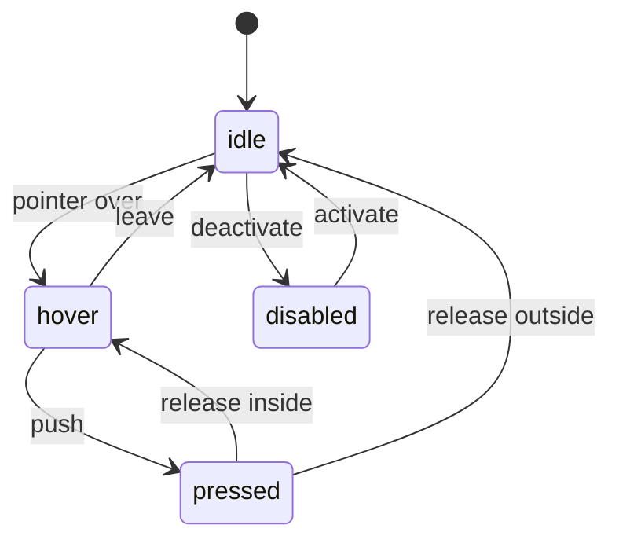
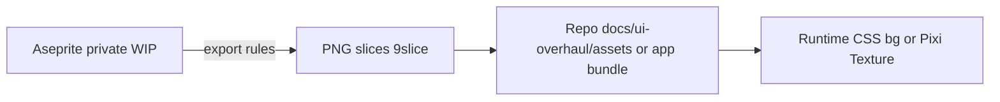

# Phase 1 — Pixel design system (analytical specification)

## Purpose

Define a **16-bit–inspired, colorful** pixel-art **design system** for the Electron UI: **color tokens**, **typography**, **grid**, **component states**, **9-slice** rules, **Pixi vs DOM** split, and **asset pipeline** from authoring tool to runtime. This document is an **engineering spec**, not a mood board.

**Prerequisites:** [phase-0-architecture.md](phase-0-architecture.md), [phase-0c-repo-hygiene.md](phase-0c-repo-hygiene.md) (asset policy).

**Outcomes:** Token tables, component state machines, acceptance metrics, traceability IDs for [phase-6-gui-parity.md](phase-6-gui-parity.md).

---

## Visual reference analysis (informative)

Two reference directions inform tokens and components (see [README analytical standard](README.md)):

| Reference | Visual grammar | Primary use in CuePoint |
|-----------|------------------|-------------------------|
| **Grayscale beveled controls** | Light face, dark BR shadow, black outline, square icon + text buttons | **Icon toolbar**, transport-adjacent actions, compact **confirm/cancel** chrome |
| **Colorful 16-bit panels** | Saturated base, highlight TL, shadow BR, optional drop shadow, badges | **Nav sections**, **feature cards**, **status counts** |

**Analytical rule:** The **default shell** follows the **colorful** system; **monochrome** elements MAY be used where **information density** or **icon clarity** benefits (document per component in the registry below).

---

## Problem statement and constraints

- **Problem:** Pixel UI must stay **crisp** at multiple display scales and **not** blur (no bilinear scaling on art).
- **Constraints:**
  - **Electron/WebView** and **mixed DPI** (Windows scaling).
  - **Mouse-first** v1; hit targets must still be usable.
  - **Performance:** Large lists (tracks, candidates) must scroll smoothly within a reasonable budget.

---

## Goals vs non-goals

| Goals | Non-goals |
|--------|-----------|
| Integer scaling for pixel layers | Photorealistic skinning |
| Reusable button / panel / list row | Full WCAG contrast certification (follow-up) |
| Documented pipeline Aseprite → PNG | In-repo `.ase` sources (see 0c) |

---

## Alternatives considered

| Approach | Pros | Cons | Notes |
|----------|------|------|--------|
| **CSS-only** pixel UI | Fast layout, easy theming | Complex animations; subpixel blur risk | Good for **chrome** with `image-rendering: pixelated` |
| **Pixi-only** entire app | Full control | Heavy for forms and accessibility hooks | Usually **overkill** |
| **Hybrid** (chosen direction) | CSS for structure; Pixi for game-like layers | Two layout systems | Use **clear boundary** (e.g. list body in Pixi or virtualized DOM) |

| API style (cross-ref Phase 3) | Pros | Cons |
|-------------------------------|------|------|
| REST + JSON | Simple | Verbose for batch |
| JSON-RPC | Batched calls | Less tooling |
| **REST default** with optional batch endpoint | Balance | Document in Phase 3 |

---

## Design decisions

| ID | Decision | Rationale | Reversibility | Impact |
|----|----------|-----------|---------------|--------|
| DS-1 | **Base art size** e.g. **320×180 logical “pixel”** or fixed **tile** multiples | Consistent grid | Medium | All mocks |
| DS-2 | **Scale** = integer factor (1×, 2×, 3×) user-selectable | Crisp art | Easy | Settings |
| DS-3 | **9-slice** for panels/buttons | Resize without distorting corners | Medium | Asset count |
| DS-4 | **Palette** as named tokens (not raw hex in components) | Theme + parity testing | Easy | Code + CSS vars |

---

## Decision scoring: where DOM vs Pixi (worksheet)

For each **surface**, score 1–5 (higher = better fit). Sum guides default placement; **tie** → prefer **DOM** for forms.

| Criterion | Weight | DOM | Pixi | Notes |
|-----------|--------|-----|------|-------|
| Layout complexity (flex, wrapping) | 2 | high | low | |
| Crisp pixel animation | 2 | low | high | |
| Text input / IME | 3 | high | low | |
| Large virtualized lists | 2 | medium | medium | Either with virtualization |
| Debug/hot reload ergonomics | 1 | high | medium | |

**Worked example (to fill during implementation):** Results table → likely **DOM + virtualizer**; animated **equalizer** or **mascot** → **Pixi** overlay.

---

## Color science and contrast (analytical)

- **Base:** “Colorful 16-bit” — **limited palette** (e.g. 32–64 colors) with **per-token** roles: `bg.app`, `bg.panel`, `fg.primary`, `accent.success`, `accent.danger`, `border.light`, `border.shadow`.
- **Contrast:** For **body text** on `bg.panel`, aim for **≥ 4.5:1** where feasible; **decorative** pixel chrome may be lower but **primary actions** must remain distinguishable.
- **Proof:** Document **pair** checks in a table (foreground on background).

### Contrast verification protocol (repeatable)

1. Pick **final** hex (or sRGB) for each token pair used for **reading** (body, caption, button label).
2. Measure with a **trusted** contrast tool (browser devtools, APCA if adopted—**document which**).
3. Record in **token table** column `contrast_on_target` (numeric).
4. If below target, adjust **one** of: background lightness, text color, or **outline** (1px dark rim on glyphs).

### Placeholder token table (fill with real values)

| Token | Role | Base hex (TBD) | On background | Min ratio target | Measured |
|-------|------|----------------|---------------|------------------|----------|
| `fg.primary` | Body text | TBD | `bg.panel` | 4.5:1 | TBD |
| `fg.muted` | Secondary | TBD | `bg.panel` | 4.5:1 (or 3:1 large text) | TBD |
| `accent.danger` | Destructive label | TBD | `bg.panel` | Distinguishable + readable | TBD |

---

## Grid and spacing

| Token | Definition |
|-------|------------|
| `unit` | 1 **CSS px** at 1× scale **or** 1 **game pixel** in Pixi space (pick one canonical model in implementation) |
| `space.xs` … `space.xl` | Multiples of `unit` (e.g. 4, 8, 12, 16) |
| **Safe area** | Padding from window edge for draggable regions vs content |

### Layout invariants

- All **interactive** boxes align to **`unit`** grid (no half-pixel offsets for bitmap chrome).
- **Window resize:** 9-slice panels scale; **content** reflows in **DOM**; **Pixi** stage receives **integer** scale factor from same helper as CSS.

---

## Typography

- **Font:** **Licensed pixel font** (bitmap or TTF with pixel metrics); store **license file** in repo per Phase 0c.
- **Sizes:** Discrete scale only (e.g. 8px, 10px, 12px **game** pixels, scaled by integer factor).
- **Rendering:** Prefer **no subpixel antialiasing** on pixel fonts (CSS `image-rendering` / canvas settings).

---

## Component specification template (copy per component)

Use one row per component in an appendix file or design tracker.

| Field | Value |
|-------|--------|
| **Component ID** | e.g. `CMP-BUTTON-PRIMARY` |
| **Parity IDs** | e.g. `P-DLG-EXPORT` primary action |
| **DOM vs Pixi** | DOM / Pixi / Hybrid (which subparts) |
| **States** | idle, hover, pressed, disabled, loading |
| **Assets** | list PNG + JSON 9-slice paths |
| **Min size** | game px × px at 1× |
| **Focus ring** | deferred (a11y phase) or pixel outline spec |
| **Sound** | none / click (future) |

---

## Component anatomy (normative patterns)

### Button (text)

```
┌──────────────────────────────┐  ← border.highlight (top-left)
│  [icon]  LABEL               │  ← padding space.md
└──────────────────────────────┘  ← border.shadow (bottom-right)
```

### State machine (interactive controls)



---

## Asset pipeline



**Export rules:** 1× PNG; **no** premultiplied alpha mismatch; **consistent** padding; **metadata** JSON for 9-slice insets (left, right, top, bottom).

### Pipeline invariants (analytical)

| Step | Invariant | Verification |
|------|-----------|--------------|
| Authoring | Integer canvas size; snap all pixels | Visual diff |
| Export | No stray semi-transparent edge pixels | Alpha histogram |
| Runtime | Scale ∈ {1,2,3,…} for bitmap layers | Unit test |
| Hot reload | Same checksum → no flicker | Manual |

---

## Motion and feedback (analytical)

| Interaction | Expected feedback | Duration target (TBD) |
|-------------|-------------------|------------------------|
| Button press | 1px inset + shadow invert | 50–100 ms hold |
| Long job | Progress + cancel | N/A |
| Error | Modal + log link | Immediate |

---

## Traceability

| Design token / component | Parity ID (see Phase 6) | Notes |
|----------------------------|-------------------------|--------|
| `Button.Primary` | TBD | Maps to dialogs’ primary actions |
| `Panel.Section` | TBD | Config, results |
| `List.Row` | TBD | Results, history |

---

## Measurable acceptance criteria

- [ ] All pixel bitmaps use **integer** scale factors in the default theme (no fractional browser zoom as **required** for crispness—document behavior if user zooms OS).
- [ ] Minimum **hit target** **44×44 CSS px** equivalent at default scale for primary actions (or document smaller with **risk** entry).
- [ ] **Atlas** size budget: e.g. **&lt; 4 MB** compressed in shipped app (tune per project).
- [ ] **Cold load** of first screen: within **performance budget** defined in Phase 5 (placeholder: **&lt; 2 s** on reference laptop).
- [ ] **Contrast table** filled for all **reading** token pairs before **beta**.
- [ ] **Component registry** exists with ≥ **N** core components (pick N after UI inventory—suggest **10** minimum: primary/secondary button, panel, list row, modal frame, text field, select, tab, badge, toast, toolbar icon).

---

## Risk register

| Risk | Likelihood | Impact | Mitigation |
|------|------------|--------|------------|
| Blurry scaling on HiDPI | Med | High | Centralize scale helper; tests with screenshots |
| Font licensing | Low | High | Legal review of font file |
| Two layout systems (CSS+Pixi) | Med | Med | Clear ownership per component type |

---

## Substeps and suggested commits

| ID | Description | Suggested commit message | Verification |
|----|-------------|---------------------------|--------------|
| 1.1 | Add Phase 1 analytical spec | `docs(ui-overhaul): add phase 1 pixel design system` | Linked from README |
| 1.2 | Add palette token table (markdown) | `docs(ui-overhaul): define color tokens for pixel theme` | Table in doc |
| 1.3 | Add `docs/ui-overhaul/assets/README.md` for export rules | `docs(ui-overhaul): document pixel asset export pipeline` | Folder exists |
| 1.4 | Add first reference PNG slices (placeholder) | `docs(ui-overhaul): add sample 9-slice placeholders` | Files in repo |
| 1.5 | Map design components to Phase 6 IDs | `docs(ui-overhaul): link design system to parity matrix` | Phase 6 updated |

---

## Revision history

| Date | Change | Author |
|------|--------|--------|
| 2026-04-03 | Initial version | — |
| 2026-04-03 | Added reference analysis, DOM/Pixi scoring, contrast protocol, component template, motion, pipeline invariants | — |
