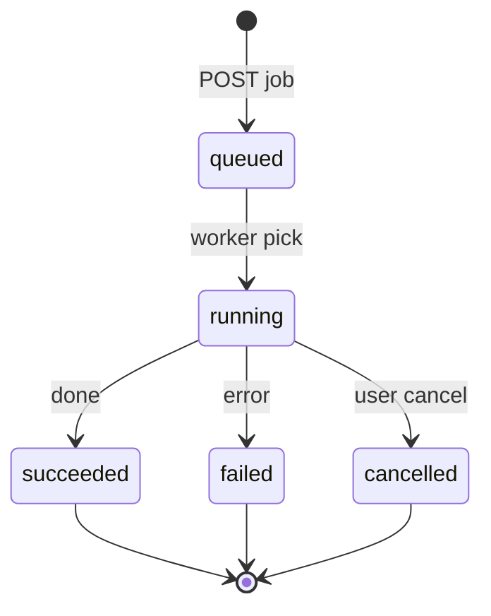

# Phase 3 — Engine API (Python)

## Purpose

Specify the **HTTP** (and **WebSocket** or **SSE**) **contract** between the **Electron shell** and the **Python engine**: resources, **job IDs**, **errors**, **streaming events**, and mapping to **existing services** and **controllers**—without duplicating business logic in TypeScript.

**Prerequisites:** [phase-0b-security-and-privacy.md](phase-0b-security-and-privacy.md) (auth), [phase-2-repo-layout.md](phase-2-repo-layout.md).

**Outcomes:** OpenAPI or equivalent schema, error envelope, event catalog, substeps with commits.

---

## API design principles (normative)

| ID | Principle | Rationale |
|----|-----------|-----------|
| API-P1 | **Thin adapter:** handlers map HTTP → service calls; **no** business rules in routing layer | Single source of truth in Python |
| API-P2 | **Idempotency** where safe: `GET` and status polls safe to repeat | UI retries |
| API-P3 | **Explicit versioning** in path (`/v1/`) | Parallel evolution |
| API-P4 | **Streaming** for long jobs; avoid tight polling loops | CPU + UX |
| API-P5 | **Errors** are machine-stable (`code`) + human (`message`) | Client logic + support |

---

## Resource lifecycle model



Every job resource SHALL expose: `id`, `state`, `progress` (0–1 or phase enum), `created_at`, `updated_at`, `error` (if failed).

---

## Problem statement and constraints

- **Problem:** Long-running **matching** and **export** need **progress** and **cancellation**.
- **Constraint:** **Localhost-only**; **authenticated** requests (Phase 0b).

---

## Goals vs non-goals

| Goals | Non-goals |
|--------|-----------|
| Stable JSON for CRUD | GraphQL |
| Job progress stream | Public HTTP API |

---

## Alternatives considered

| Style | Pros | Cons |
|-------|------|------|
| REST only | Simple | Polling for progress |
| **REST + WebSocket** | Push progress | More code |
| gRPC | Efficient | Poor in browser without proxy |

**Decision:** **REST** for commands and queries; **WebSocket** (or **SSE**) for **job events**.

---

## Authentication (normative)

- Header: `Authorization: Bearer <token>` on **every** request (including WebSocket upgrade if used).
- Token obtained per Phase 0b handshake (never logged).

---

## Error envelope (recommended shape)

```json
{
  "error": {
    "code": "VALIDATION_ERROR",
    "message": "Human-readable message",
    "details": {}
  }
}
```

Map from existing Python exceptions consistently; **do not** leak stack traces to renderer in **production** unless “Send report” flow.

---

## Resource sketch (illustrative — refine against code)

| Method | Path | Purpose |
|--------|------|---------|
| GET | `/health` | Liveness (no auth optional for bootstrap; if open, must not leak data) |
| POST | `/v1/session/start` | Handshake (optional) |
| GET | `/v1/config` | Read config |
| PUT | `/v1/config` | Write config |
| POST | `/v1/jobs/match` | Start match job |
| GET | `/v1/jobs/{id}` | Job status |
| WS | `/v1/events` | Subscribe to job + log events |

**Mapping:** Implement handlers by delegating to `cuepoint.services.*` and `GUIController` / `ResultsController` equivalents—**thin** HTTP layer.

### Handler-to-module traceability (fill during implementation)

| Operation (TBD opId) | Python entry | Qt analogue |
|----------------------|--------------|-------------|
| Start match job | `main_controller` / services | `batch_processor` |
| Export | `export_controller` | `export_dialog` |
| Config read/write | `config_controller` | `config_panel`, `settings_dialog` |

---

## WebSocket / SSE event catalog (template)

| Event type | Payload fields | When emitted |
|------------|----------------|--------------|
| `job.progress` | `job_id`, `progress`, `message?` | Throttled during run |
| `job.finished` | `job_id`, `state` | Terminal |
| `log.line` | `level`, `message` (redacted) | Optional; rate-limited |

**Analytical note:** If log streaming risks **PII**, default to **progress-only** events and keep detailed logs **file + viewer** (Phase 7).

---

## Traceability

| API area | Python modules |
|----------|----------------|
| Match | `main_controller.py`, services |
| Export | `export_controller.py`, `export_service` |
| Config | `config_controller.py`, `ConfigService` |

---

## Measurable acceptance criteria

- [ ] OpenAPI spec **versioned** (`/v1/`).
- [ ] Contract tests: **golden** requests/responses for **health** and **one** job lifecycle.

---

## Risk register

| Risk | Mitigation |
|------|------------|
| API drift | Codegen client from OpenAPI |

---

## Substeps and suggested commits

| ID | Description | Suggested commit message | Verification |
|----|-------------|---------------------------|--------------|
| 3.1 | Add Phase 3 doc | `docs(ui-overhaul): add phase 3 engine API specification` | |
| 3.2 | Add `openapi.yaml` skeleton | `docs(api): add openapi skeleton for cuepoint engine` | Validate with linter |
| 3.3 | Implement `GET /health` in engine (future) | `feat(engine): add localhost health endpoint` | curl |
| 3.4 | Add TS client generation script (future) | `chore(ui): add openapi typescript client generation` | |

---

## Revision history

| Date | Change | Author |
|------|--------|--------|
| 2026-04-03 | Initial version | — |
| 2026-04-03 | Added API principles, job state machine, handler traceability, event catalog template | — |
