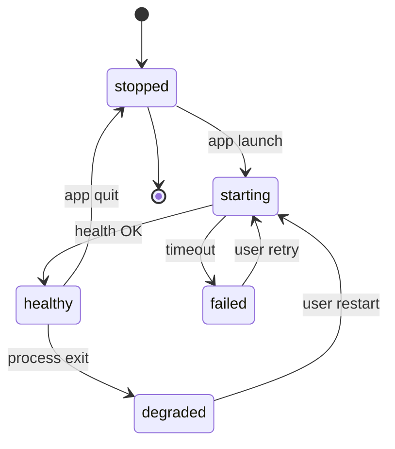

# Phase 4 — Electron shell

## Purpose

Define **Electron main process** responsibilities: **window lifecycle**, **single instance**, **spawn/kill Python engine**, **secure preload** bridge to renderer, **native dialogs**, **deep links** (if any), and coordination with **auto-update** (Phase 9).

**Prerequisites:** Phase 0–3.

**Outcomes:** Main process architecture, **contextBridge** API surface, engine supervision policy.

---

## Main vs renderer responsibility matrix

| Concern | Main | Renderer |
|---------|------|----------|
| Spawn engine | Yes | No |
| Hold API token | Yes (preferred) | Avoid |
| File dialogs | Yes | Request via IPC |
| Window state | Yes | Optional UI prefs (non-secret) |
| HTTP to engine | Yes if proxying | Only if ADR allows direct |
| Deep links | Main registers | — |

---

## State machine: engine supervision

**Timeouts (TBD numerically):** `T_health`, `T_terminate`, `T_kill` documented in code constants table.

---

## Problem statement and constraints

- **Problem:** Two processes (shell + engine) must **start** and **stop** cleanly on **install**, **update**, and **crash**.
- **Constraint:** **No** token in renderer storage unless ADR-approved.

---

## Goals vs non-goals

| Goals | Non-goals |
|--------|-----------|
| Reliable engine lifecycle | Linux sandboxing (optional later) |
| Minimal preload API | Full node in renderer |

---

## Alternatives considered

| Option | Pros | Cons |
|--------|------|------|
| Renderer calls engine directly | Simple | **Exposes** token to renderer |
| **Main proxies** sensitive calls | Hides token | More main code |

**Recommendation:** **Main** holds token; **preload** exposes `invokeEngine(method, payload)` that **main** forwards over **HTTP** with **Authorization**.

---

## Process supervision

| Event | Behavior |
|-------|----------|
| App quit | **SIGTERM** engine; wait **N s**; **SIGKILL** if needed |
| Engine exit | Show **recoverable** error; offer **Restart** |
| Crash | Log path; optional **report** dialog |

---

## Security (cross-reference 0b)

- `nodeIntegration: false`
- `contextIsolation: true`
- `sandbox: true` for renderer (Electron defaults evolve—follow latest secure baseline)

---

## Traceability

| Feature | Phase |
|---------|-----|
| File dialogs | Parity matrix |
| Update | 9 |

---

## Measurable acceptance criteria

- [ ] **Single instance** lock on each OS.
- [ ] No **token** in renderer **DevTools** **Application** tab by default.
- [ ] **Forced kill** test: engine unresponsive → user-visible recovery path within **TBD** seconds.
- [ ] **Update** path: new shell + old engine → **blocked** or **auto-update engine** per ADR.

---

## Substeps and suggested commits

| ID | Description | Suggested commit message | Verification |
|----|-------------|---------------------------|--------------|
| 4.1 | Add Phase 4 doc | `docs(ui-overhaul): add phase 4 electron shell` | |
| 4.2 | Implement BrowserWindow + preload stub (future) | `feat(electron): add secure browser window and preload` | |
| 4.3 | Engine spawn + health wait (future) | `feat(electron): spawn python engine and wait for health` | |
| 4.4 | Single instance lock (future) | `feat(electron): enforce single application instance` | |

---

## Revision history

| Date | Change | Author |
|------|--------|--------|
| 2026-04-03 | Initial version | — |
| 2026-04-03 | Added responsibility matrix, engine state machine, extended acceptance criteria | — |
