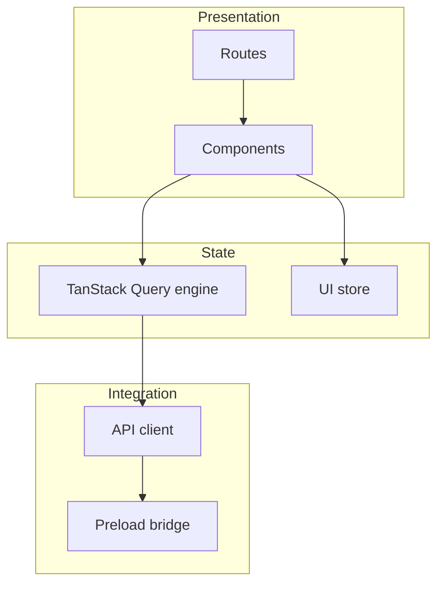

# Phase 5 — Frontend foundations

## Purpose

Define the **React** application **shell**: **routing**, **global state**, **API client** to the engine, integration with **Pixi** (where used), **error boundaries**, and **loading** states—aligned with the **pixel design system** (Phase 1).

**Prerequisites:** Phases 1–4, OpenAPI client (Phase 3).

**Outcomes:** Architecture diagram, state ownership table, substeps with commits.

---

## Frontend architecture (layered)

---

## State ownership rules (normative)

| State type | Owner | Examples |
|------------|-------|----------|
| **Server / engine** | TanStack Query cache | Job status, config snapshot |
| **Ephemeral UI** | Local component state | Hover, open accordion |
| **Cross-route UI** | Zustand (or similar) | Selected playlist id, panel widths |
| **Secrets** | **Not** in renderer | See Phase 4 proxy pattern |

---

## Performance budgets (document targets)

| Metric | Target (TBD) | Measurement |
|--------|--------------|-------------|
| First contentful paint | TBD ms | Lighthouse / manual |
| Time to interactive (shell) | TBD ms | — |
| Results list scroll | 60 fps ± tolerance | Performance panel |
| Pixi stage CPU | TBD % on idle | Profiler |

---

## Problem statement and constraints

- **Problem:** Complex flows (match → review → export) need predictable **navigation** and **job** state.
- **Constraint:** **Mouse-first**; keyboard shortcuts can follow Qt parity (Phase 6).

---

## Goals vs non-goals

| Goals | Non-goals |
|--------|-----------|
| Clear route/module boundaries | Micro-frontends |
| Typed API client | Full offline-first PWA |

---

## Alternatives considered

| State | Pros | Cons |
|-------|------|------|
| Redux | Strict | Boilerplate |
| **Zustand** / **TanStack Query** | Simple + server state | Pick one pattern |
| React Context only | Light | Poor for async jobs |

**Recommendation:** **TanStack Query** for **server/engine** state; **lightweight store** for **UI chrome** (panels, selection).

---

## Routing (illustrative)

| Route | Screen |
|-------|--------|
| `/` | Tool selection |
| `/match` | Main match workflow |
| `/incrate` | inCrate |
| `/settings` | Settings modal or page |

**Parity:** Map to `MainWindow` pages and stacked dialogs.

---

## Pixi vs DOM boundary

| Use DOM | Use Pixi |
|---------|----------|
| Forms, focusable inputs, native a11y hooks later | Animated pixel decorations, large virtualized pixel lists (optional) |

Document **which** list implementation (DOM virtualized vs Pixi) in ADR when profiling.

---

## Traceability

| Frontend area | Phase 6 IDs |
|---------------|-------------|
| Router | MW-01 … |

---

## Measurable acceptance criteria

- [ ] **First paint** under agreed budget (see Phase 1).
- [ ] **No** raw `fetch` to engine without **central** client (token injection in one place).

---

## Risk register

| Risk | Mitigation |
|------|------------|
| Duplicate state | Single source for job ID |

---

## Substeps and suggested commits

| ID | Description | Suggested commit message | Verification |
|----|-------------|---------------------------|--------------|
| 5.1 | Add Phase 5 doc | `docs(ui-overhaul): add phase 5 frontend foundations` | |
| 5.2 | Add React router + layout shell (future) | `feat(ui): add react router and app shell` | |
| 5.3 | Add API client wrapper with auth injection (future) | `feat(ui): add engine api client with bearer auth` | |
| 5.4 | Add TanStack Query setup (future) | `feat(ui): configure tanstack query for engine calls` | |

---

## Revision history

| Date | Change | Author |
|------|--------|--------|
| 2026-04-03 | Initial version | — |
| 2026-04-03 | Added layered diagram, state ownership rules, performance budgets | — |
