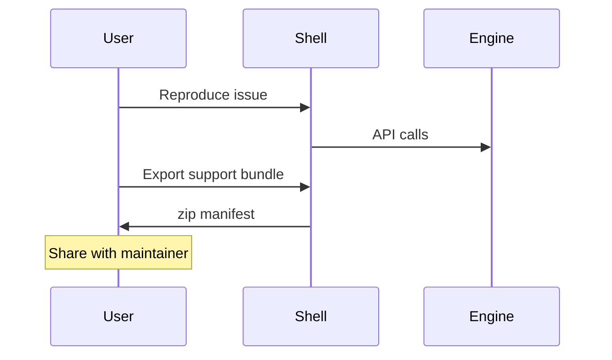

# Phase 7 — Observability and support

## Purpose

Define **logging**, **diagnostics**, **support bundles**, and **crash** behavior for the **two-process** app, consistent with [phase-0b-security-and-privacy.md](phase-0b-security-and-privacy.md) (**redaction**).

**Prerequisites:** Phase 4 (lifecycle).

**Outcomes:** Log format, bundle contents manifest, parity with current Qt **log viewer** / **diagnostics** dialogs.

---

## Log record schema (recommended fields)

Each structured log line SHOULD include:

| Field | Type | Example | Notes |
|-------|------|---------|-------|
| `ts` | ISO-8601 | | UTC preferred |
| `level` | enum | `info` | |
| `session_id` | string | | Correlates shell + engine |
| `component` | string | `engine.http` | |
| `event` | string | `request_completed` | Stable for analytics |
| `message` | string | Human text | Redacted |

**Forbidden fields in default config:** raw `Authorization`, cookies, full `Beatport` response bodies.

---

## Diagnostic workflow (analytical)

**SLA (documentation only):** Define expected **bundle generation time** upper bound (TBD seconds) so UX does not hang.

---

## Support bundle manifest (normative shape)

JSON manifest at bundle root, e.g. `manifest.json`:

| Key | Purpose |
|-----|---------|
| `app_version` | Shell + engine versions |
| `os` | Platform string |
| `files[]` | List of included files + SHA-256 |
| `redaction_profile` | Which rules applied |

---

## Problem statement and constraints

- **Problem:** Debugging **Electron + Python** requires **correlated** logs (correlation ID per session).
- **Constraint:** **No secrets** or **tokens** in user-facing logs.

---

## Goals vs non-goals

| Goals | Non-goals |
|--------|-----------|
| Unified log viewer in UI | Full distributed tracing |

---

## Log streams

| Source | Destination |
|--------|-------------|
| Renderer | File + optional devtools |
| Main | File |
| Engine | Existing `CuePointLogger` files |

**Correlation:** One **session ID** created at app start; passed to engine via header or env.

---

## Redaction rules (normative intent)

- Strip **Authorization** headers from any log dump.
- **Paths:** Use configurable **verbosity**; default **basename** for support bundle.
- **Beatport** responses: do not log **full** HTML; **status + length** only at info.

---

## Support bundle

| Include | Exclude |
|---------|---------|
| Version, OS, architecture | Tokens |
| Last **N** lines of logs | Full Rekordbox XML unless user opts in |
| Engine health response | Memory dumps |

---

## Traceability

| Qt dialog | New UI |
|-----------|--------|
| `log_viewer.py` | Log panel |
| `diagnostics_panel_dialog.py` | Diagnostics |
| `support_dialog.py` | Support |

---

## Measurable acceptance criteria

- [ ] User can export bundle in **≤ 3 clicks** from Help menu.
- [ ] Automated test: **grep** bundle for forbidden patterns (`Bearer`, `token=`).

---

## Substeps and suggested commits

| ID | Description | Suggested commit message | Verification |
|----|-------------|---------------------------|--------------|
| 7.1 | Add Phase 7 doc | `docs(ui-overhaul): add phase 7 observability` | |
| 7.2 | Implement session correlation ID (future) | `feat(engine): add session id to structured logs` | |
| 7.3 | Support bundle export in Electron (future) | `feat(electron): add support bundle export` | |
| 7.4 | Redaction unit tests (future) | `test(engine): assert log redaction rules` | |

---

## Revision history

| Date | Change | Author |
|------|--------|--------|
| 2026-04-03 | Initial version | — |
| 2026-04-03 | Added log schema, diagnostic sequence, bundle manifest | — |
