# CuePoint v1.0.0 — Phase 14: The Page Reviews (DEC-131)

Written 2026-10-07. This document holds 107 proposals across eleven surfaces. Each has a recommendation. The user marks each one yes or no, and the marks are recorded here beside each proposal. **Marked 2026-10-07** (DEC-159): the user took the recommendation on every proposal, so 100 are accepted and 4 declined (NAV-4, STR-4, BAR-6, BAR-10). NAV-3 and STR-1 were settled by Q-159 and Q-158, and HDR-4 is DEC-133's placement. Only the accepted proposals are built (DEC-131). The walkthrough (`PHASE14_FLOWS.md`, DEC-199) and the full review of 2026-10-08 amended some of the accepted ones; each says so beside its mark, and `PHASE14_PAGES.md` is the text that is built.

The screenshots show the app as it is today, at half size, in `phase14/`. The app was driven by Playwright against the real engine with Beatport stubbed. Native hover tooltips do not appear in screenshots, so a tooltip proposal shows the unhovered control. Line numbers are as of 2026-10-07.

Each surface below has three parts: what it does, what a new user would not understand, and the proposals. Ids are made of a surface prefix and a number, for example LIB-6.

## Contents

- [Settings](#settings)
- [The sidebar](#the-sidebar)
- [The header and menu bar](#the-header-and-menu-bar)
- [The status strip and Activity](#the-status-strip-and-activity)
- [The player bar and queue](#the-player-bar-and-queue)
- [The Library](#the-library)
- [The Inspector](#the-inspector)
- [Clean](#clean)
- [Discover](#discover)
- [Prepare](#prepare)
- [The first run](#the-first-run)

## Settings

*Paths are relative to `apps/desktop-electron/renderer/src/` unless they start with `e2e/` or `docs/`.*

### What it does

Route `/settings`, sidebar "Settings" in the system group (`components/shell/navRegistry.ts:100`) and the menu bar's Settings link (`components/AppMenuBar.tsx:102`). One scrolling column of five panels, no page heading, in this order (`screens/SettingsExportScreen.tsx:61-103`):

1. **Appearance** with a badge "Themes" (`ThemeSettingsPanel.tsx:123`)
   - "Active theme": "Neo-dark SaaS", "Retro 16-bit", "Qt evolved", "Club / DJ neon", "Muted pro" + custom themes (`tokens/theme.ts:16-20`).
   - "UI scale": "1× (compact)", "2× (default)", "3× (large)" (`ThemeSettingsPanel.tsx:132-141`).
   - **Create custom theme…**; list of custom themes with three swatches (title is the raw key, e.g. "bgApp", `:154-160`) and **Apply**, **Edit**, **Delete** (no confirm) (`:164-174`); empty: "No custom themes yet. Create one with eight colors — borders and bevels are derived automatically." (`:179-182`).
   - Modal "Create/Edit custom theme": Theme name, nine colour pickers with hex (`:15-25,193-209`), "Changes preview live across the app while this dialog is open.", **Save theme**.
2. **Audio** (`AudioSettingsPanel.tsx:313-374`)
   - "Output device" select: "System default", devices, "X (not connected)".
   - Hint: "Reading the devices this machine has…" / "N devices found. Unplugging the selected one falls back to the system default." / "Open CuePoint as a desktop app to choose an output device."
   - Checkbox "Exclusive output" + a 49-word hint about "bypassing the system mixer — no resampling…" (`:356`), or "Exclusive output is a Windows and macOS feature…" (`:357`).
   - Fallback status lines (`:360-366`), error line (`:367-371`).
3. **Waveforms** (`WaveformSettingsPanel.tsx:101-186`)
   - Status line: "Analysing · 312 of 4,000 · about 2 h left", "Paused · 3,688 to go", "All 4,000 analysed · 3 could not be read", "No checked files to analyse yet", "Waveforms need the player's decoder…" (`components/waveform/analysisWords.ts:32-60`) and a **Pause**/**Resume**/**Analyse waveforms** button (`:77-81`).
   - "Colours" radios "Three bands" / "One colour" with "Three bands draws the lows, mids and highs in colours of their own, as Rekordbox does…" (`WaveformSettingsPanel.tsx:121-139`).
   - Preview of the playing track, or "Play a track to preview its waveform here." (`analysisWords.ts:21`).
   - Danger **Delete waveform data…** + "Waveform data takes 412.3 MB on disk."; confirm modal with the cost and re-analysis time (`analysisWords.ts:184-203`); result "Deleted 4,000 waveforms, freeing 412.3 MB."
4. **Rekordbox export** (`RekordboxExportSettingsPanel.tsx:249-317`) — read-only
   - Lead: "Export from the Library: “Export to Rekordbox…” beside Import, or on a Collection’s menu. These are remembered from your last export…" (`:252-256`).
   - "Save dialog opens in" (or "Nothing exported yet. The first export's save dialog opens in your Documents folder.", `screens/library/rekordboxExport.ts:505-512`), "Key notation".
   - "Recent exports" (10): when, file name, "1,204 tracks · 37 rewritten · 6 playlists · Camelot (8A)" / "Stopped — nothing was written" / "Failed: …" (`rekordboxExport.ts:516-529`); "No exports yet."; error + **Try again**.
5. **Settings** — the Beatport token (`SettingsExportScreen.tsx:70-102`)
   - Password field "Beatport token", placeholder "Paste Bearer token" / "Enter new token to replace saved value"; hint "Saved token ••••abcd. Enter a new value to replace it." / "Stored in ~/.cuepoint/config.yaml via the Python engine." / "Open in Electron to store the token in the engine config." / "Loading token status…" (`:54-58,78-79`).
   - **Save token**, **Test connection**; test message line (`:83-100`).
   - Discover's "Open Settings" scrolls to and focuses this field (`:38-52`, `screens/discover/DiscoverScreen.tsx:286`).

Elsewhere but settings-like: Help → Privacy dialog holds "Clear cache on exit" / "Clear logs on exit" and the "No telemetry or analytics in v1.0" text (`components/PrivacyDialog.tsx:8-24,94-110`).

**Coming to this page (do not collide):**
- **Phase 13 REPORT-01** adds a **Privacy** panel, *last on the page after Rekordbox export*, with one switch **"Send error reports"** (on by default), two sentences (what a report carries / never carries) and a link to Help → Privacy; stored by main in `main-settings.json` as `errorReporting`, changed through `window.cuepoint.errorReporting.set` (`docs/v1/PHASE13_REPORTING.md:197-245`). REPORT-08 replaces PrivacyDialog's "No telemetry" lines with the switch's state and adds a Privacy section to the user guide's Settings description (`:651-669`). Note: REPORT-01 places Privacy after Rekordbox export, but today the Beatport panel comes after that, so "last" and "after Rekordbox export" disagree — SET-1 resolves it.
- **DEC-134** adds ten motion switches (microinteractions, interaction animations, state transitions, page transitions, entrance and exit, hover and focus, scroll animations, loading, shared-element transitions — the list names nine; Phase 14's spec must name the tenth). Today the renderer has only `Button.css:16` and `Toast.css:18` as motion rules.
- **Phase 16** adds an update-check button (decided elsewhere; only its slot is planned below).

Covered by `e2e/waveformSettings.spec.ts:140-305` (reached via `getByRole("link", { name: "Settings" })`), `e2e/rekordboxExport.spec.ts`, `e2e/playerAudio.spec.ts`, `e2e/discover.spec.ts`.

### What a new user would not understand

1. **The page has no heading and no order a person would guess.** Five panels in one column; the token sits last under the title **"Settings"** (`SettingsExportScreen.tsx:70`) — a panel named after the page.
2. **"Paste Bearer token"** (`:78`), **"Stored in ~/.cuepoint/config.yaml via the Python engine."** (`:57`), **"Open in Electron to store the token in the engine config."** (`:58`) — developer words. Nothing says what the token is for (Discover) or how to get one; that lives in `docs/user-guide/discover.md:131-150`.
3. **Theme names "Neo-dark SaaS", "Qt evolved"** (`tokens/theme.ts:16,18`) — "SaaS" and "Qt" are industry/toolkit words. The badge "Themes" (`ThemeSettingsPanel.tsx:123`) repeats the title.
4. **"eight colors"** (`ThemeSettingsPanel.tsx:180`) while the editor shows nine (`:15-25`); swatch titles are code keys "bgApp", "bgPanel", "accentPrimary" (`:159`). "Delete" deletes a theme with no confirm (`:171`).
5. **"UI scale"** (`:133`) — "scale" of what; "1×" vs "2× (default)" doesn't say "size of everything".
6. **"Exclusive output"** hint (`AudioSettingsPanel.tsx:356`): "system mixer", "resampling" — one long sentence where a beginner needs "leave this off unless you use an audio interface".
7. **"No checked files to analyse yet"** (`analysisWords.ts:51`) — "checked files" means the file check, which is never named; nothing says the analysis runs on its own or why waveforms matter.
8. **"Delete waveform data…"** is a red danger button at equal weight with everyday controls (`WaveformSettingsPanel.tsx:144-158`).
9. **"Key notation"**, **"rewritten"** (`RekordboxExportSettingsPanel.tsx:282`, `rekordboxExport.ts:521`) — "37 rewritten" doesn't say rewritten what (tags in the XML).
10. **Two privacy places**: exit-clearing lives in Help → Privacy (`PrivacyDialog.tsx:94-110`), error reporting will live in Settings (REPORT-01).
11. **Nothing about what happens immediately**: theme and scale apply at once, audio applies at once, the token needs Save — no unified signal of "saved".

### Proposals

#### SET-1 — Organise the page into sections with a contents rail

**Recommendation**: Yes

**Mark**: **Yes** (2026-10-07, the recommendation)

**What**:

Give the page an `h1` "Settings" and a left (or top, at narrow width) list of section links that scroll to the panels — not tabs, so Discover's deep link and e2e `getByRole("link", { name: "Settings" })` flows keep working. Order, once motion and reporting join:
1. **Appearance** — Theme, Text and control size, custom themes.
2. **Motion** — the DEC-134 switches (SET-2).
3. **Playback** — Audio output (today's Audio panel).
4. **Waveforms**.
5. **Beatport** — the token (SET-5).
6. **Rekordbox export** — read-only facts.
7. **Privacy** — REPORT-01's "Send error reports" switch, plus "Clear cache on exit"/"Clear logs on exit" mirrored from Help → Privacy (SET-7).
8. **About & updates** — version, Help → Getting started link; the slot Phase 16's "Check for updates" button drops into.

**Why**: Item 1; one stable shape before three phases add to it. Privacy stays last-but-one (only "About & updates" follows), which matches REPORT-01's "last, after Rekordbox export" in spirit — REPORT-01's text should be amended to say "after Rekordbox export" only.

**Size**: M.

**Files**: `SettingsExportScreen.tsx` (consider renaming to `SettingsScreen.tsx`; the name dates from Results, DEC-071), `screens.css`, new `settings.css`, `screens/index.ts`, `App.tsx`.

**Screenshots**:

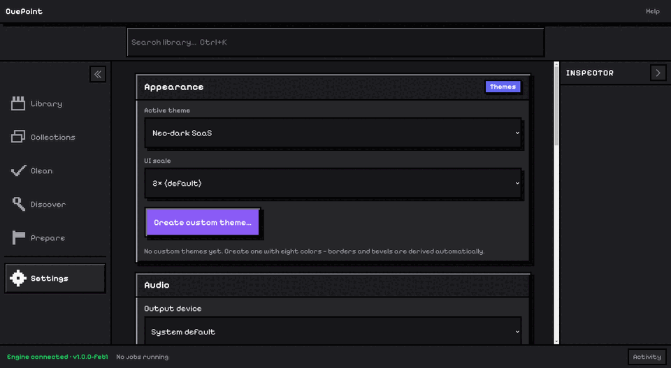

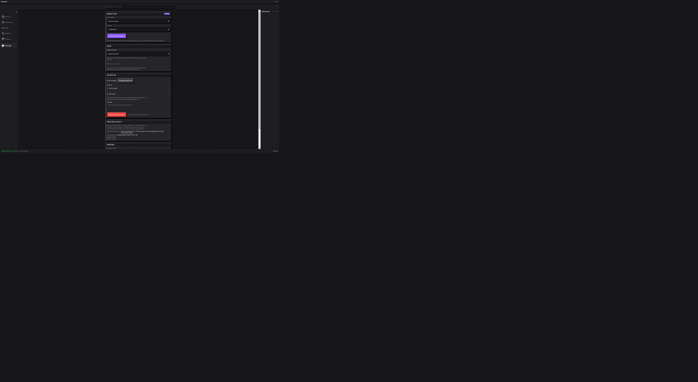

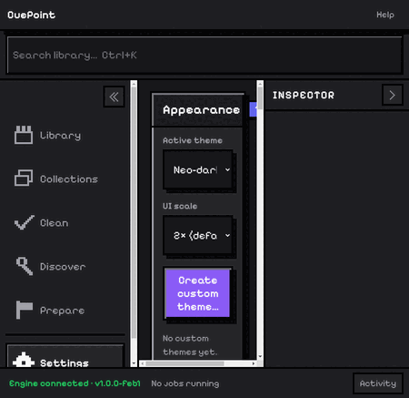

*There is no contents rail today; the narrow shot is a 900px-wide window.*

#### SET-2 — Add a Motion panel shaped for ten switches

**Recommendation**: Yes

**Mark**: **Yes** (2026-10-07, the recommendation); amended 2026-10-08: Feedback, the tenth kind (DEC-154), sits in "When things change" (PAGES-02)

**What**:

Panel "Motion" directly under Appearance (motion is an appearance choice). Top: a master line "Motion follows your system's Reduce motion setting: {on or off}" (read-only state of `prefers-reduced-motion`, DEC-134), then **Turn all on** / **Turn all off**. Below, the switches in three groups of plain words, each with a one-line description of what moves:
- *When you act*: "Button presses" (microinteractions), "Things you drag and drop" (interaction animations), "Hover and keyboard focus".
- *When things change*: "Changing state" (state transitions), "Opening and closing panels and dialogs" (entrance and exit), "Changing page" (page transitions), "Moving between views" (shared-element transitions).
- *While you wait or scroll*: "Loading", "Scrolling" (scroll animations), + the tenth kind.
Each switch previews itself (a tiny sprite next to it moves once when toggled on).

**Why**: DEC-134 puts each kind behind its own switch; plain names per DEC-132.

**Size**: M (UI; the motion itself is separate).

**Files**: New `MotionSettingsPanel.tsx` + test, a `motionSettings.ts` store, `tokens/tokens.css` (DEC-135 tokens), `SettingsExportScreen.tsx`.

**Screenshots**:

*No screenshot: the Motion panel does not exist yet.*

#### SET-3 — Use plain theme names and an honest editor

**Recommendation**: Yes

**Mark**: **Yes** (2026-10-07, the recommendation)

**What**: "Neo-dark SaaS" → "Neo dark", "Qt evolved" → "Classic", keep "Retro 16-bit", "Club neon", "Muted"; drop the "Themes" badge; hint → "No custom themes yet. Pick nine colours; borders and bevels are made from them."; swatch titles → "App background", "Panel background", "Accent" (reuse `COLOR_FIELDS` labels); **Delete** asks "Delete the theme “X”? This can't be undone."

**Why**: Items 3–4. Theme ids stay, only labels change.

**Size**: S.

**Files**: `tokens/theme.ts`, `ThemeSettingsPanel.tsx`.

**Screenshots**:

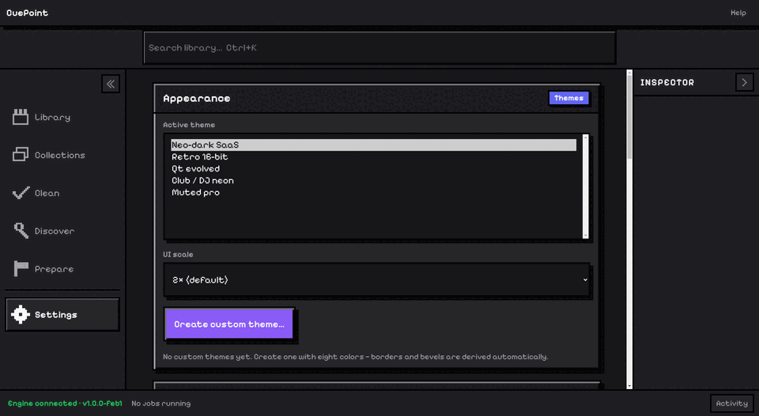

*The theme select is drawn open; the delete confirm for a custom theme was not shot.*

#### SET-4 — Rename "UI scale" to "Size"

**Recommendation**: Yes

**Mark**: **Yes** (2026-10-07, the recommendation), amended the same day: a 1.5× size is added and is the default (DEC-161)

**What**: Label "Size of text and controls"; options "Small (1×)", "Medium (1.5×) — default", "Large (2×)", "Extra large (3×)"; hint "Edges and lines snap to whole pixels at every size, so the pixel style stays sharp." (DEC-161 added 1.5× after the review.)

**Why**: Item 5.

**Size**: S.

**Files**: `ThemeSettingsPanel.tsx`.

**Screenshots**:

*The UI scale select is shown closed (2x default).*

#### SET-5 — Make the Beatport panel say what it is for and how to get a token

**Recommendation**: Yes

**Mark**: **Yes** (2026-10-07, the recommendation)

**What**: Title "Beatport" (not "Settings"); lead: "Discover uses your own Beatport token to search Beatport. Without one, Discover can still open past runs and your wantlist."; placeholder "Paste your Beatport access token"; hint when none saved: "Kept on this computer only." (drop "~/.cuepoint/config.yaml via the Python engine"); browser-tab hint: "Open CuePoint as a desktop app to save a token." (matches Audio/Waveforms wording); a link "How do I get a token?" opening the user-guide section; show the last test result with a coloured state ("Beatport accepted the token" / "rejected"). Keep `BEATPORT_TOKEN_FIELD_ID`.

**Why**: Item 2.

**Size**: S.

**Files**: `SettingsExportScreen.tsx`, `hooks/useBeatportToken.ts` (error strings `:43,63`), `docs/user-guide/discover.md`.

**Screenshots**:

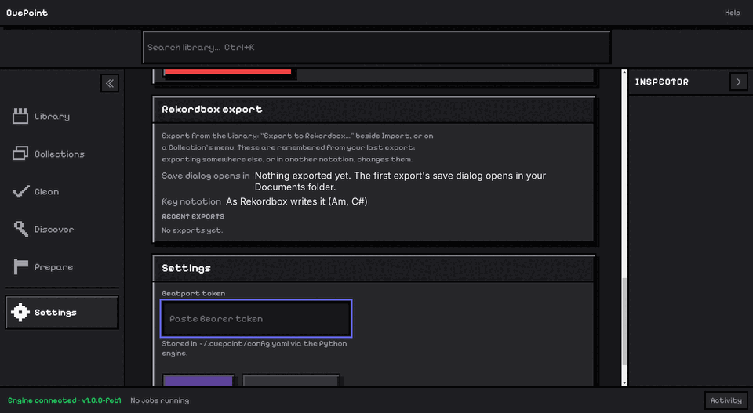

*The token field after Discover, Open Settings; a failed Test connection was not shot.*

#### SET-6 — Put the waveform danger action behind a disclosure

**Recommendation**: Yes

**Mark**: **Yes** (2026-10-07, the recommendation)

**What**: Waveforms: status + button first, then Colours + Preview, then a collapsed "Disk space" row: "Waveforms take 412.3 MB." with **Delete waveform data…** inside. Status "No checked files to analyse yet" → "Nothing to analyse yet: CuePoint analyses tracks once their files have been found. Check files on the Clean page." with a link. Add a one-line purpose: "Waveforms are drawn from your audio files, in the background, a few at a time."

**Why**: Items 7–8; DEC-132 background work.

**Size**: S.

**Files**: `WaveformSettingsPanel.tsx`, `components/waveform/analysisWords.ts`, `waveform-settings.css`, `e2e/waveformSettings.spec.ts:246-280`.

**Screenshots**:

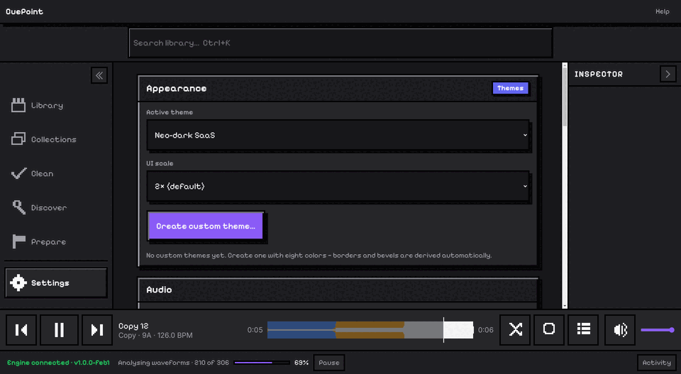

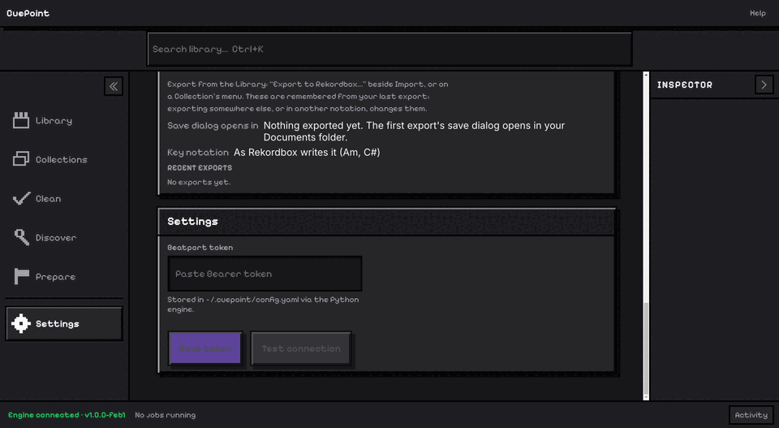

*The Waveforms panel while analysing, with the red Delete waveform data button; the empty-library variant was not shot.*

#### SET-7 — Hold every privacy choice in one Privacy panel

**Recommendation**: Yes

**Mark**: **Yes** (2026-10-07, the recommendation)

**What**: Built on REPORT-01's panel: "Send error reports" switch + its two sentences, then "When CuePoint quits: Clear cache / Clear logs" checkboxes using the same `cuepoint-privacy-clear-*-on-exit` keys as `PrivacyDialog.tsx:5-6`, so both places show the same state. Help → Privacy keeps the text and links "Change these in Settings → Privacy".

**Why**: Item 10; avoids a second privacy surface growing next to REPORT-01.

**Size**: S (after REPORT-01).

**Files**: The REPORT-01 panel, `components/PrivacyDialog.tsx`.

**Screenshots**:

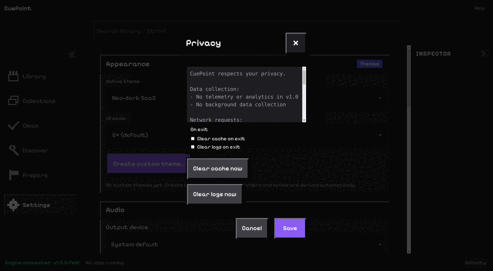

*Help, Privacy dialog shown; the REPORT-01 Privacy panel does not exist yet.*

#### SET-8 — Shorten the audio words and keep detail on demand

**Recommendation**: Yes

**Mark**: **Yes** (2026-10-07, the recommendation)

**What**: Exclusive hint → "Leave off unless you use an audio interface. On: CuePoint plays to the device directly, at its own quality, and other apps can't use it until you turn it off." with a "More" disclosure keeping today's sentence. "N devices found. Unplugging…" → "N outputs found. If the chosen one is unplugged, CuePoint switches to System default."

**Why**: Item 6.

**Size**: S.

**Files**: `AudioSettingsPanel.tsx`, `AudioSettingsPanel.test.tsx`, `e2e/playerAudio.spec.ts`.

**Screenshots**:

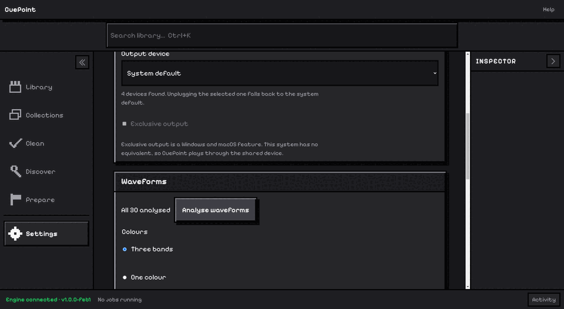

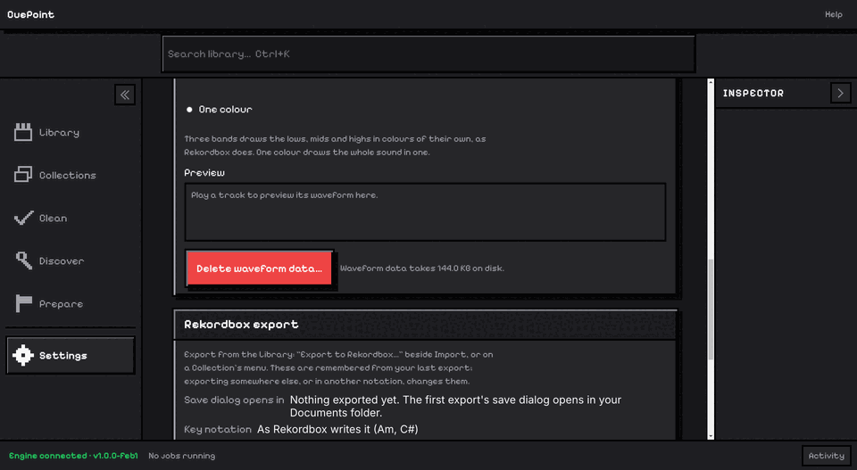

*The Audio panel on Linux, with the exclusive-output hint; the macOS and Windows variant is not reachable here.*

#### SET-9 — Write the Rekordbox export facts in plain words

**Recommendation**: Yes

**Mark**: **Yes** (2026-10-07, the recommendation)

**What**: "Key notation" → "Keys written as"; history "37 rewritten" → "37 with new tags"; lead shortened to "To export, use “Export to Rekordbox…” in the Library or on a Collection's menu. These remember your last export."

**Why**: Item 9.

**Size**: S.

**Files**: `RekordboxExportSettingsPanel.tsx`, `screens/library/rekordboxExport.ts`, `e2e/rekordboxExport.spec.ts`.

**Screenshots**:

*The Rekordbox export panel before any export; the after-export state was not shot.*

#### SET-10 — Say when a setting is saved

**Recommendation**: Yes

**Mark**: **Yes** (2026-10-07, the recommendation)

**What**: Instant settings show a brief "Saved" tick beside the control (theme, scale, colours, motion, audio, reporting); the token field keeps its explicit **Save token**. Uses DEC-134's microinteraction kind when on, plain text when off.

**Why**: Item 11.

**Size**: S.

**Files**: A small `SavedTick` component in `components/`, each panel.

**Screenshots**:

*No "Saved" tick exists today.*

#### SET-11 — Add Reset to defaults per section

**Recommendation**: Yes

**Mark**: **Yes** (2026-10-07, the recommendation); amended 2026-10-08: Appearance resets to 1.5×, not 2× (DEC-161), and each reset asks first

**What**: Appearance (Neo dark, 2×), Motion (the defaults DEC-134's amendment records), Waveforms colours (Three bands). Not for Beatport, export or Privacy.

**Why**: Motion testing (DEC-134) will leave users with odd combinations; a way back.

**Size**: S.

**Files**: `ThemeSettingsPanel.tsx`, `MotionSettingsPanel.tsx`, `WaveformSettingsPanel.tsx`.

**Screenshots**:

*No screenshot: the Motion panel and Reset control do not exist yet.*

## The sidebar

*Paths are relative to `apps/desktop-electron/renderer/src/` unless they start with `src/cuepoint/`, `docs/` or `apps/`.*

### What it does

- Lists the enabled destinations from `NAV_DESTINATIONS` (`navRegistry.ts:88-101`) in two unlabelled groups (`:30-36`):
  - workspace: Library, Collections, Clean, Discover, Prepare;
  - system: Settings.
- Each entry has a pixel icon and a label; the active entry is lit (`aria-current` via NavLink, `Sidebar.tsx:19-44`).
- Collapses to an icon rail with a «/» toggle or Ctrl/Cmd+B (`:56-86`). The collapsed state persists (`sidebarState.ts:13`, `cuepoint-ui-shell-sidebar-collapsed`).
- "Collections" opens the Library page aimed at its Collections pane (`pageId: "library"`, `navRegistry.ts:95`; `App.tsx:182-193`).
- Discover and Prepare stay lit on their nested pages (`nested: true`).

### What a new user would not understand

1. **Four one-word labels give no hint of what each page is for:**
   - **"Clean"** — a page that matches tracks on Beatport;
   - **"Discover"** — new releases on Beatport;
   - **"Prepare"** — set planning;
   - **"Collections"**.

   The labels are in `navRegistry.ts:94-100`. When expanded, there is no tooltip, because `title` is set only when collapsed (`Sidebar.tsx:32`).
2. **"Collections" and "Library" lead to the same page.** Clicking Collections lights Collections while the page heading says Library, and that is confusing without context.
3. **The collapse toggle is a bare `«`/`»` glyph** (`Sidebar.tsx:85`). Ctrl+B is not shown (its title is "Collapse navigation", `:83`).
4. **Nothing in the sidebar reflects state.** There is no hint that Clean has, say, 1,200 tracks to review, that a job belongs to a page, or that Discover has new results.
5. **Group dividers carry no labels** (`NAV_GROUP_LABELS` all null, `navRegistry.ts:33-36`). That is fine for six entries.
6. **On first run every page is equally prominent,** though only Library works before an import. Clean, Discover and Prepare each open on an empty state.

### Proposals

#### NAV-1 — Add a one-line description under each sidebar label

**Recommendation**: Yes

**Mark**: **Yes** (2026-10-07, the recommendation); amended 2026-10-08: descriptions say "values", not "tags", as INS-7 and LIB-6 do

**What**:

Add a `hint` field to `NavDestinationBase` (`navRegistry.ts:38-71`). Render it as muted `--font-size-xs` text under the label when expanded, and in `title` in both states. Suggested hints:

| Entry | Hint |
| --- | --- |
| Library | Your Rekordbox tracks |
| Collections | Your own groups and smart lists |
| Clean | Fix tags with Beatport |
| Discover | Find new music |
| Prepare | Plan a set |
| Settings | Look, sound, accounts |

**Why**: DEC-132. The one-word verbs need context.

**Size**: S.

**Files**: `navRegistry.ts`, `Sidebar.tsx`, `Sidebar.css`, `navRegistry.test.ts`, `Sidebar.test.tsx`.

**Screenshots**:

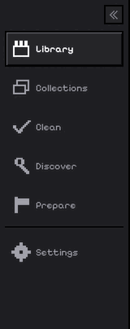

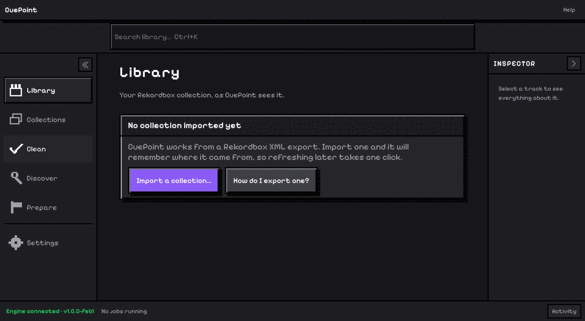

*Labels are one word each today.*

#### NAV-2 — Add tooltips with shortcuts when the sidebar is expanded

**Recommendation**: Yes

**Mark**: **Yes** (2026-10-07, the recommendation)

**What**: Give each link a `title` in both states (label plus hint). Give the toggle the title "Collapse sidebar (Ctrl+B)" and draw it as a pixel icon (`Sidebar.tsx:76-86`).

**Why**: `«` is opaque, and Ctrl+B is hidden.

**Size**: S.

**Files**: `Sidebar.tsx`, `pixelIcons.ts` (a chevron, if added).

**Screenshots**:

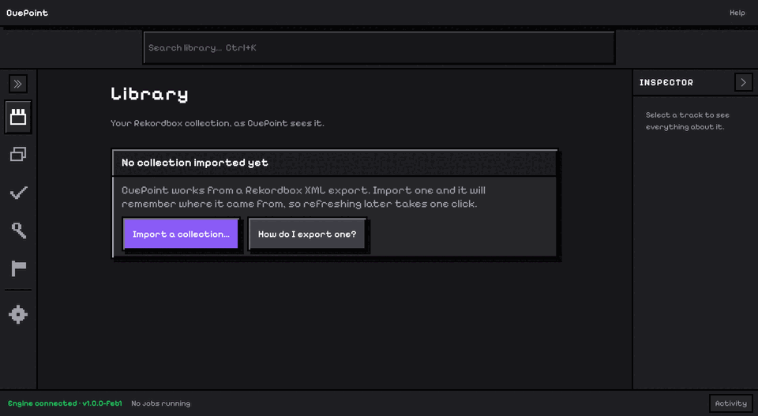

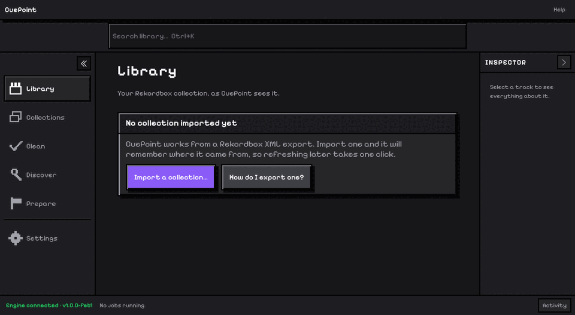

*Native tooltips are not captured by screenshots, so the hover shot shows the unhovered toggle; the collapsed rail is shown.*

#### NAV-3 — Fold Collections into Library, or label it as a shortcut

**Recommendation**: See Q-159 — not marked yes or no; the question decides.

**Mark**: Settled by Q-159 → DEC-156: Collections is nested under Library (option B).

**What**:

As option a or b:
- (a) Remove the Collections entry; the Library pane already shows Collections.
- (b) Keep it, but render it indented under Library as a sub-entry ("↳ Collections"), so it reads as a way into the Library.

**Why**: Two top-level entries for one page confuse new users (DEC-062's own rationale admits this, `navRegistry.ts:47-61`).

**Size**: S for a; M for b.

**Files**: `navRegistry.ts`, `Sidebar.tsx`/`.css`, `App.tsx:182-193`, `lastDestination.ts`, tests, `docs/user-guide/the-window.md`, `organization.md`.

**Screenshots**:

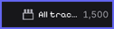

*The Collections page is the Library with its Collections section.*

#### NAV-4 — Show a count badge on pages with work waiting

**Recommendation**: No — needs a new engine count; CLN-3's tab counts show the same on the page.

**Mark**: **No** (2026-10-07, the recommendation)

**What**:

An optional square Badge per entry:
- Clean: tracks needing review, from the Health counts the engine already computes;
- Library: a dot while an import or refresh runs.

The data comes from a small shell hook polling at most once a minute.

**Why**: Makes the sidebar answer "where should I go next?".

**Size**: M–L. Needs a cheap engine count, and the cost of Health at scale (313 ms at 50k, `docs/user-guide/performance.md:130`) rules out reusing the full read.

**Files**: `navRegistry.ts`, `Sidebar.tsx`, a new hook, possibly an engine route.

**Screenshots**:

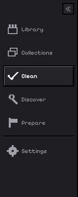

*There is no badge today, though work is waiting.*

#### NAV-5 — Dim the pages that need a collection, before the first import

**Recommendation**: Yes

**Mark**: **Yes** (2026-10-07, the recommendation); amended 2026-10-08: the hint reads "Import your Rekordbox collection first"

**What**: While `library/summary` reports `library_empty`, show Clean, Discover and Prepare muted, with the title "Import a collection first". They stay clickable, because their empty states explain.

**Why**: Steers the first run toward Library → Import.

**Size**: S–M.

**Files**: `Sidebar.tsx`, a summary hook (one already exists in `LibraryScreen`), `Sidebar.css`.

**Screenshots**:

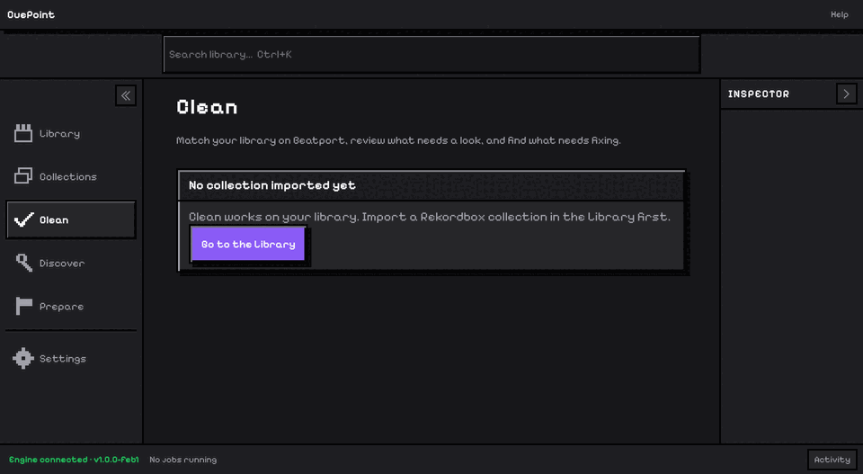

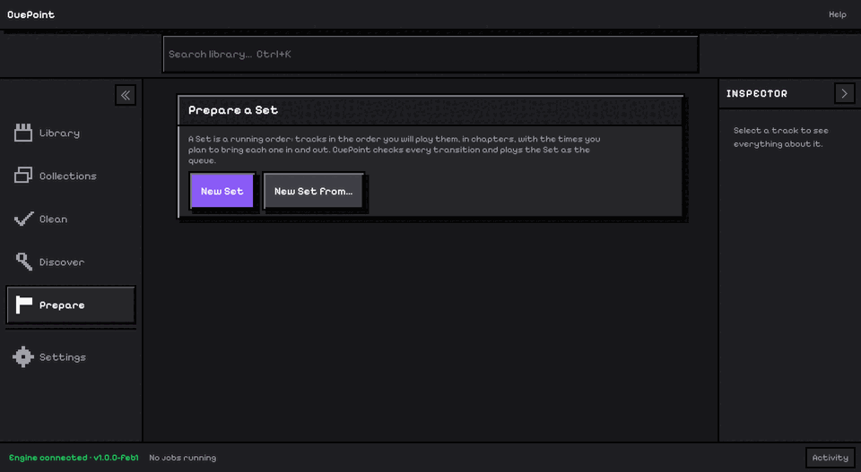

*A fresh install: all pages are equally prominent.*

#### NAV-6 — Give Settings its own space at the bottom

**Recommendation**: Yes

**Mark**: **Yes** (2026-10-07, the recommendation)

**What**: Pin the `system` group to the bottom of the rail with `margin-top: auto`, if it is not already there (check `Sidebar.css`), and add a thin divider.

**Why**: Separates "the app" from "the work".

**Size**: S.

**Files**: `Sidebar.css`.

**Screenshots**:

*Settings sits at the bottom of the full-height sidebar.*

## The header and menu bar

*Paths are relative to `apps/desktop-electron/renderer/src/` unless they start with `src/cuepoint/`, `docs/` or `apps/`.*

### What it does

- **The shell grid** has the rows menubar / header / (sidebar | content | inspector) / player / status (`AppShellLayout.css:15-29`). The header row is wrapped in `role="search"` (`AppShellLayout.tsx:57-61`) and is a container-query context named `header` (`AppShellLayout.css:41-46`).
- **The header holds only `<GlobalSearch />`** (`App.tsx:228`). It is a full-width toolbar (`GlobalSearch.css:8-16`) whose field is centred, up to `--content-max-width` (`:18-25`).
- **Search behaviour** (`useLibrarySearch.ts:8,34`):
  - Ctrl/Cmd+K focuses the field (`GlobalSearch.tsx:30-40`), and Escape closes the panel.
  - It needs at least 2 characters and is debounced.
  - The engine searches titles, artists, albums and labels.
  - The results panel lists title, artist and "album · label · BPM · key" (`:110-117`).
- **AppMenuBar** (`AppMenuBar.tsx:45-110`) is a `banner` with the brand text "CuePoint" and one menu, **Help**, holding:
  - Getting started…
  - Keyboard shortcuts…
  - Privacy…
  - Diagnostics…
  - Log Viewer…
  - Rekordbox XML export…
  - Export support bundle…
  - About CuePoint…
  - (separator) Settings

### What a new user would not understand

1. **Search results cannot be acted on.** The rows (`GlobalSearch.tsx:110-115`) are plain `<li>` with no click, Enter or arrow-key handling. A user who finds a track cannot open, select or play it. That is the biggest gap in the header. `GlobalSearch.test.tsx` has no test for selecting a result.
2. **The panel does not close when focus or a click leaves it.** It closes only on Escape (`GlobalSearch.tsx:36`), and there is no blur or outside-click handler.
3. **The Help menu stays open on an outside click,** for the same reason: only Escape and `run()` close it (`AppMenuBar.tsx:30-42`).
4. **Placeholder `"Search library…  Ctrl+K"`** (`GlobalSearch.tsx:57`). Typing one character shows nothing and does not say that two are needed.
5. **The search panel's own texts:**
   - `"Search needs the CuePoint engine, which is not connected."` (`:96`) uses the engine jargon again (see the status strip).
   - `"Search failed: {error}"` (`:102`) shows a raw error.
6. **Settings is hidden inside Help** (`AppMenuBar.tsx:101-105`), beside developer items:
   - `"Diagnostics…"` (`:77`);
   - `"Log Viewer…"` (`:82`);
   - `"Export support bundle…"` (`:92`).

   A non-technical user does not need these at the same level as "Getting started".
7. **The brand is plain text** (`AppMenuBar.tsx:46`). It has no logo and does no navigation.
8. **The header row is mostly empty space** around a centred field. There is room for DEC-133's wheel button.

### Proposals

#### HDR-1 — Make search results open the track

**Recommendation**: Yes

**Mark**: **Yes** (2026-10-07, the recommendation)

**What**:

Make each result a `role="option"` row in a `role="listbox"`.
- ↑/↓ moves through the rows.
- Enter or a click opens the Library filtered to that track and selects it. Navigate with `libraryRulesState({match:"all", rules:[{field:"id"…}]})`, or with a new `libraryTrackState`.
- Shift+Enter plays the track, and a small "▶" button on the row does the same.

**Why**: Search that cannot be followed is a dead end.

**Size**: M. Needs a navigate callback and a "select this id" opening on `LibraryScreen`.

**Files**: `GlobalSearch.tsx`, `GlobalSearch.css`, `useLibrarySearch.ts`, `App.tsx`, `screens/library/libraryLink.ts`, `LibraryScreen.tsx`, tests, `docs/user-guide/the-window.md:43-53`.

**Screenshots**:

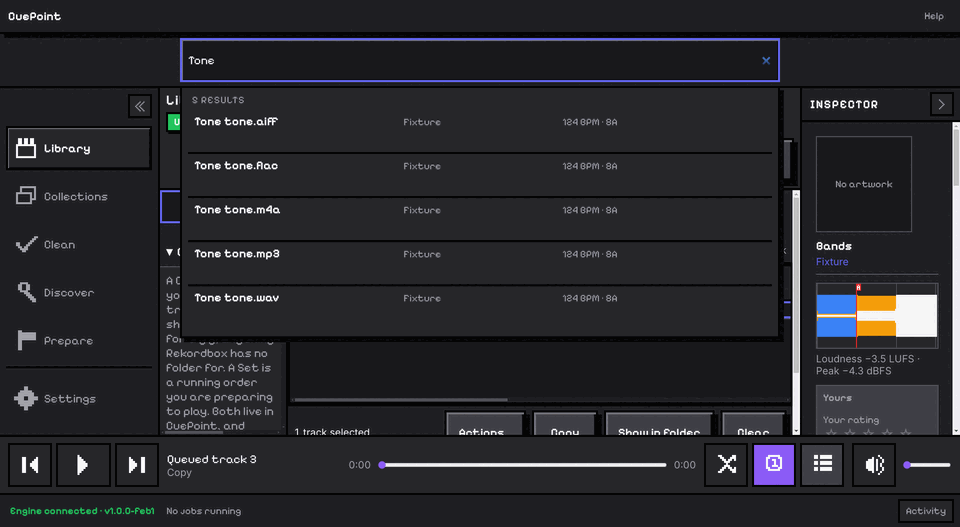

*The rows are not clickable today.*

#### HDR-2 — Close search and the Help menu on an outside click

**Recommendation**: Yes

**Mark**: **Yes** (2026-10-07, the recommendation)

**What**: A document `pointerdown` listener closes the panel or menu when the target is outside the component's root; focus leaving the component also closes the search panel.

**Why**: Today both float until Escape.

**Size**: S.

**Files**: `GlobalSearch.tsx`, `AppMenuBar.tsx`, tests.

**Screenshots**:

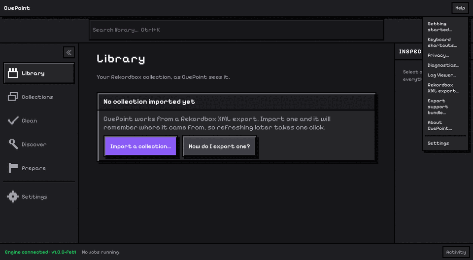

*The Help menu is open; a before and after pair was not taken.*

#### HDR-3 — Ask for one more letter

**Recommendation**: Yes

**Mark**: **Yes** (2026-10-07, the recommendation)

**What**: When the trimmed query is 1 character, show "Keep typing — at least 2 letters" instead of hiding the panel (`status === "idle"`, `GlobalSearch.tsx:47`).

**Why**: Silence reads as "broken".

**Size**: S.

**Files**: `GlobalSearch.tsx`, `useLibrarySearch.ts`, test.

**Screenshots**:

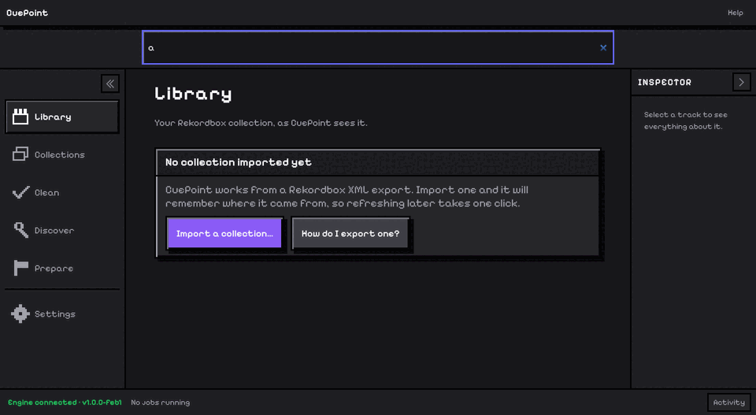

*The field with "a" typed: nothing is shown.*

#### HDR-4 — Add the Camelot wheel button beside search

**Recommendation**: Decided (DEC-133) — placement only; not marked yes or no.

**Mark**: Not marked: DEC-133 decided the wheel; this is its placement.

**What**:

A 44×scale square icon button at the right end of the header row. Where it goes:
- Option 1: as a sibling inside `.cp-global-search`, after the `<label>` (`GlobalSearch.tsx:51-69`).
- Option 2, preferred: change `App.tsx:228` to `header={<ShellHeader />}`. `ShellHeader` lays out `<GlobalSearch/>` and `<CamelotWheelButton/>` in a flex row with the same `--content-max-width` centring. This keeps the wheel out of the `search` component.
- The `role="search"` landmark is on the wrapper (`AppShellLayout.tsx:58`), so the wrapper may need to move onto the search field's container, to keep the wheel button out of the search landmark.
- The popover is absolutely positioned like `.cp-global-search__panel`, so the page does not reflow (`GlobalSearch.css:1-7`).

**Why**: DEC-133 decided the wheel; this proposal only says where its button sits.

**Size**: L for the wheel overall; S for the slot itself.

**Files**: `App.tsx`, `AppShellLayout.tsx`, a new `components/shell/ShellHeader.tsx` and `CamelotWheel*.tsx`, `pixelIcons.ts`.

**Screenshots**:

*No screenshot: the Camelot wheel button does not exist yet.*

#### HDR-5 — Split the menu bar into View and Help

**Recommendation**: Yes

**Mark**: **Yes** (2026-10-07, the recommendation)

**What**:

- Add a "View" (or "CuePoint") menu with: Settings (Ctrl+,), Keyboard shortcuts, Getting started.
- Move Diagnostics, Log Viewer and Export support bundle into a "Help → Troubleshooting" group, under a separator labelled "Troubleshooting".
- Rename "Rekordbox XML export…" to "How to export from Rekordbox…".

**Why**: Separates everyday items from support items, and Settings stops hiding in Help.

**Size**: M.

**Files**: `AppMenuBar.tsx`, `AppMenuBar.css`, `App.tsx` (menuActions), tests, `docs/user-guide/the-window.md`, `troubleshooting.md`, `getting-started.md:19,23`.

**Screenshots**:

*A single Help menu with Settings among the developer items.*

#### HDR-6 — Make the brand open home

**Recommendation**: Yes

**Mark**: **Yes** (2026-10-07, the recommendation)

**What**: Make "CuePoint" (`AppMenuBar.tsx:46`) a link to `homeDestination().path` (the Library), and draw a small pixel logo.

**Why**: A common expectation.

**Size**: S.

**Files**: `AppMenuBar.tsx`, `.css`.

**Screenshots**:

*The brand is plain text at the top left.*

#### HDR-7 — Write search's errors in plain words

**Recommendation**: Yes

**Mark**: **Yes** (2026-10-07, the recommendation)

**What**: `"Search needs the CuePoint engine…"` (`GlobalSearch.tsx:96`) becomes "Search will work once CuePoint has finished starting." `"Search failed: {error}"` (`:102`) becomes "Search didn't work. Try again." with the error in its title.

**Why**: DEC-132.

**Size**: S.

**Files**: `GlobalSearch.tsx`, `GlobalSearch.test.tsx`.

**Screenshots**:

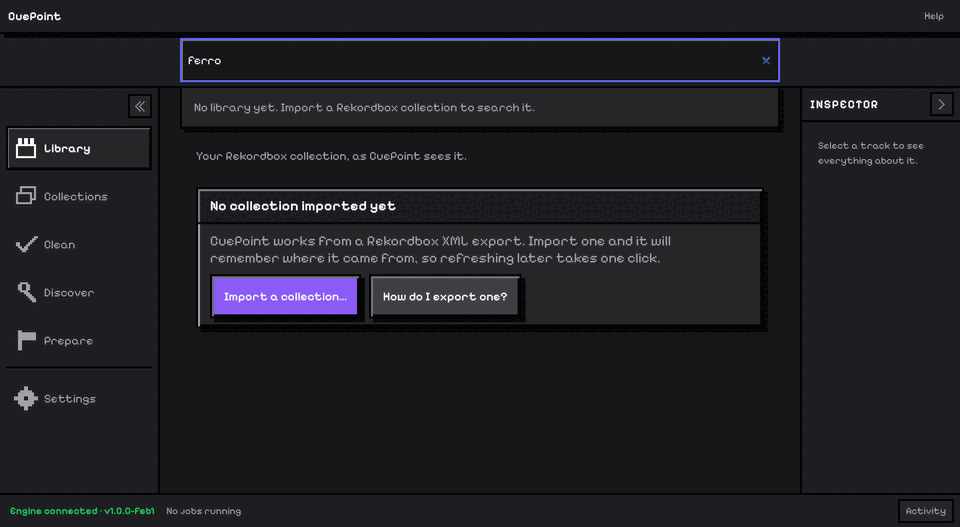

*The "No library yet…" unavailable state.*

## The status strip and Activity

*Paths are relative to `apps/desktop-electron/renderer/src/` unless they start with `src/cuepoint/`, `docs/` or `apps/`.*

### What it does

- A strip always at the bottom of the window (`role="status"`, `StatusStrip.tsx:106`). It shows, in order:
  - **Engine state** (`:107-127`): connected, reconnecting (n/3), starting, or offline with its error.
  - **A player failure line**, only while the player is broken (`:135-137`; `usePlayerStatus.ts:29-31`).
  - **"Restart engine"**, once the automatic restarts have given up (`:139-148`).
  - **The active job** (`:150-193`): a verb label, a `<progress>` with a percentage, "+N more", and Stop/Pause.
  - **"No jobs running"** when there is no job (`:195`).
  - **The "Activity" button** (`:198-204`). Ctrl/Cmd+Shift+A also opens Activity (`:89-98`).
- **ActivityPanel** is a wide modal. It loads the last 50 events when opened, has a Refresh button, and offers Revert/Restore/Resume per entry (`ActivityOffer.tsx`).

### What a new user would not understand

1. **"Engine" is internal jargon.** It appears in:
   - `"Engine connected · v${version}"` (`StatusStrip.tsx:119`);
   - `"Reconnecting to engine… (n/3)"` (`:121-123`);
   - `"Starting engine…"` (`:125`);
   - `` `Engine offline: ${status.error}` `` (`:126`), which shows a raw error string;
   - `"Engine status unknown"` (`:117`);
   - `"Restart engine"` (`:146`).

   A DJ does not know what the engine is, and the version number in a status bar is noise.
2. **"Jobs" is jargon too:** `"No jobs running"` (`:195`).
3. **Several job verbs need prior knowledge** (`useActiveJob.ts`):
   - `"Checking"` (refresh preview, `:63`) and `"Updating"` (`:68`) do not say *what*;
   - `"Indexing artists and labels"` (`:95`);
   - `"Reading cue points"` (`:99`);
   - `"Resolving Beatport identities"` (`:105`);
   - `"Queued"` (`:155`);
   - `"Working"` (`:158`).

   Counts render as `` ` ${done}/${total}` `` (`:147`), for example "Matching on Beatport 120/4000", for every job except the waveform analysis.
4. **Background work is not explained as it happens** (DEC-132). The strip shows *that* a job runs, but not what it is for, whether the user can keep working, or whether quitting is safe.
5. **"+N more" (`StatusStrip.tsx:172`)** is plain text. It cannot be clicked to see the other jobs.
6. **Activity rows are developer-shaped:**
   - The type column is the last dotted segment of the event type (`activityFormat.ts:40-43`), so `engine.started` shows as **"started"**.
   - The detail is raw `key: value` pairs (`activityFormat.ts:46-53`), for example "Engine started (v1.x) **version: 1.x · port: 51234**" (`src/cuepoint/engine/server.py:1150-1153`).
   - Nested values show as `"N fields"`/`"N items"` (`:64,67`).
7. **The other Activity texts:**
   - `"Activity needs the CuePoint engine, which is not connected."` (`ActivityPanel.tsx:82`);
   - `"Could not load activity: {error}"` (`:88`), with a raw error;
   - the count line `"N events"` (`:102`).
8. **The Activity shortcut, Ctrl+Shift+A, is not shown on the button** (`StatusStrip.tsx:198-204`).

### Proposals

#### STR-1 — Speak about the app, not "the engine"

**Recommendation**: See Q-158 — not marked yes or no; the question decides.

**Mark**: Settled by Q-158 → DEC-155: the word goes (option A).

**What**:

Replace the strings at `StatusStrip.tsx:116-126`:

| State | New text |
| --- | --- |
| Connected | "Ready" |
| Starting | "Starting up…" |
| Reconnecting | "Reconnecting… (attempt 2 of 3)" |
| Offline | "CuePoint's library service stopped" |
| Unknown | "Connecting…" |

- Move the version to Help → About.
- Put the raw `status.error` in a `title` and in Diagnostics, not in the strip.
- Rename "Restart engine" (`:146`) to "Restart library service". Alternatively keep "engine" and define it once in the first-run guide; the user decides.

**Why**: DEC-132's plain words. The strip is on screen at all times.

**Size**: S.

**Files**:

- `StatusStrip.tsx`, `StatusStrip.test.tsx`;
- e2e specs asserting "Engine connected": grep `e2e/` for `engineReady.ts`, `shell.spec.ts`, `smoke.spec.ts`;
- `docs/user-guide/the-window.md:69-79`, `troubleshooting.md`.

**Screenshots**:

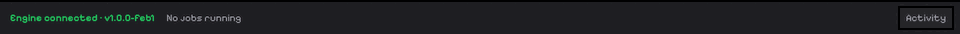

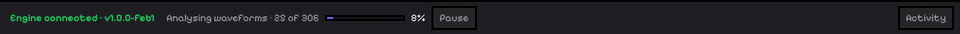

*The "Engine connected" wording; the stopped state with Restart is not reachable.*

#### STR-2 — Replace "No jobs running" with something calm, or nothing

**Recommendation**: Yes (show nothing when idle)

**Mark**: **Yes** (2026-10-07, the recommendation)

**What**: When idle, show nothing, or "All caught up" in muted text (`StatusStrip.tsx:195`).

**Why**: "jobs" is jargon, and an idle statement adds nothing.

**Size**: S.

**Files**: `StatusStrip.tsx`, tests.

**Screenshots**:

*Shows "No jobs running".*

#### STR-3 — Rewrite the job labels in plain words, with a reason on hover

**Recommendation**: Yes

**Mark**: **Yes** (2026-10-07, the recommendation)

**What**:

In `JOB_VERBS` (`useActiveJob.ts:60-110`):
- "Checking" → "Checking your Rekordbox export for changes";
- "Updating" → "Updating N tracks";
- "Indexing artists and labels" → "Getting artist and label pages ready";
- "Resolving Beatport identities" → "Linking tracks to Beatport";
- "Reading cue points" → "Reading your cue points".

Then:
- Write the count everywhere as "120 of 4,000", as the waveform analysis already is (`COUNTED_IN_WORDS`, `:118`).
- Add a `JOB_EXPLAINERS` map that `jobTitle()` returns for every type, for example "CuePoint is drawing each track's waveform. You can keep working; it pauses itself for imports."

**Why**: DEC-132, "background work explained as it happens".

**Size**: M.

**Files**: `useActiveJob.ts`, `useActiveJob.test.ts`, `StatusStrip.test.tsx`, `docs/user-guide/the-window.md`.

**Screenshots**:

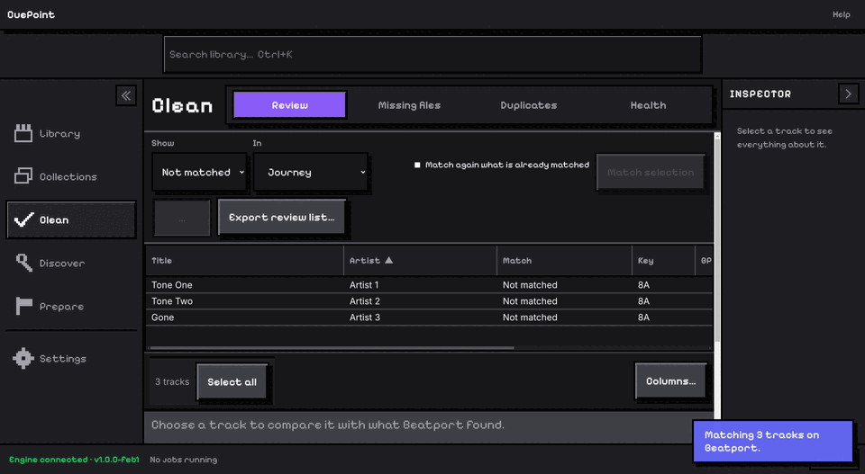

*"Analysing waveforms · N of 306"; the hover tooltip is not captured; the last shot shows a Beatport match running.*

#### STR-4 — Explain the first run of each kind of background work, once

**Recommendation**: No — an import starts five kinds at once, which would mean five toasts; LIB-1's note and STR-3's hover reasons cover it.

**Mark**: **No** (2026-10-07, the recommendation)

**What**: The first time a job type starts on this install, push an info toast with the explainer from STR-3 and a "What's this?" link to Activity. A localStorage set records the types already explained.

**Why**: DEC-132, "explained as it happens", without nagging.

**Size**: M.

**Files**: `useActiveJob.ts` or a new `useJobIntroductions.ts`, `Toast`, a storage key.

**Screenshots**:

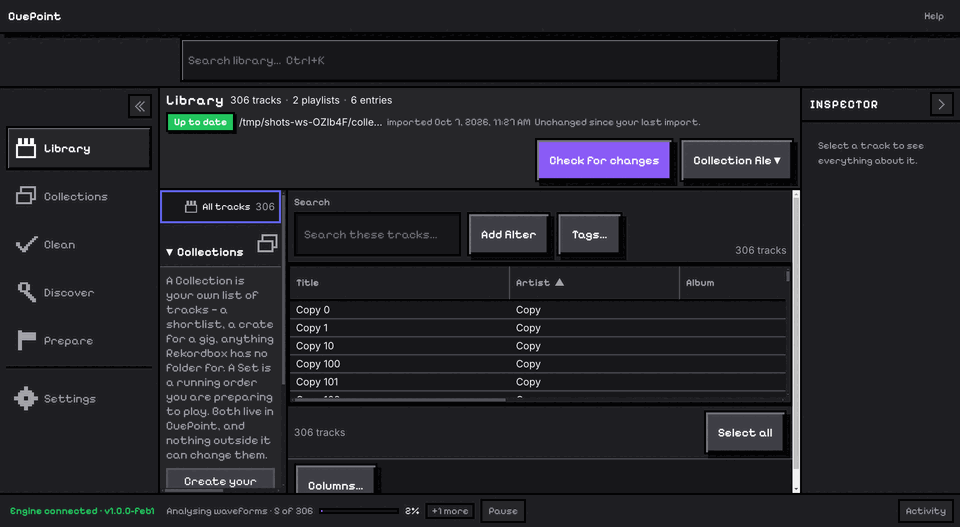

*No first-run toast exists today.*

#### STR-5 — Make "+N more" open the list of running work

**Recommendation**: Yes

**Mark**: **Yes** (2026-10-07, the recommendation)

**What**: Turn `cp-status__more` (`StatusStrip.tsx:171-173`) into a button. It opens a small popover listing every active job (from `useActiveJob`, which already lists `{state:"active", limit:5}`, `useActiveJob.ts:220`), each with its label, progress and Stop.

**Why**: The count is a dead end today.

**Size**: M.

**Files**: `StatusStrip.tsx`, `StatusStrip.css`, `useActiveJob.ts` (expose the list), tests.

**Screenshots**:

*"+1 more" is plain text during import follow-ups.*

#### STR-6 — Show Activity's event types in words

**Recommendation**: Yes

**Mark**: **Yes** (2026-10-07, the recommendation)

**What**:

Replace `formatEventType` (`activityFormat.ts:40-43`) with a map from the full type to a word, falling back to the summary only:
- `engine.started` → "App started";
- `backup.created` → "Backup";
- `library.import` → "Import";
- and so on.

**Why**: "started" alone means nothing.

**Size**: S.

**Files**: `activityFormat.ts`, `activityFormat.test.ts`.

**Screenshots**:

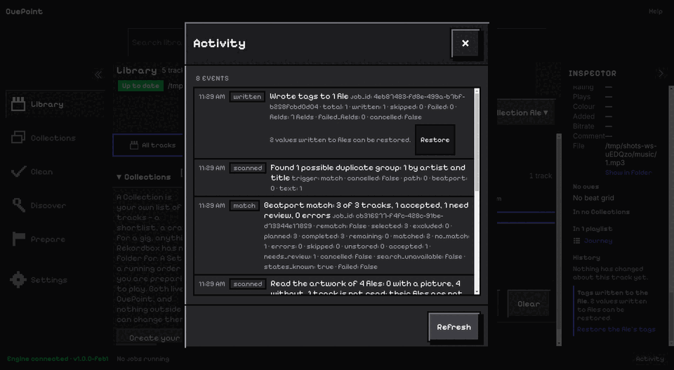

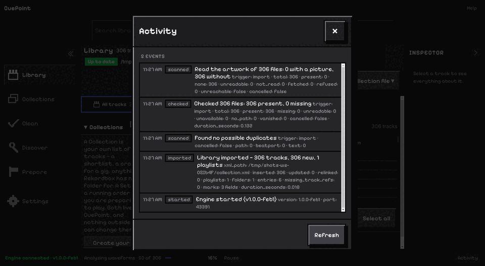

*Event-type badges read scanned, checked and imported.*

#### STR-7 — Hide raw detail keys in Activity

**Recommendation**: Yes

**Mark**: **Yes** (2026-10-07, the recommendation)

**What**: `formatEventDetail` (`activityFormat.ts:46-53`) prints only an allow-list of user-meaningful keys, with labels (track counts, playlist name, file). Everything else goes behind a per-row "Details" disclosure.

**Why**: "port: 51234" is noise to a DJ.

**Size**: S–M.

**Files**: `activityFormat.ts`, `ActivityPanel.tsx`, tests.

**Screenshots**:

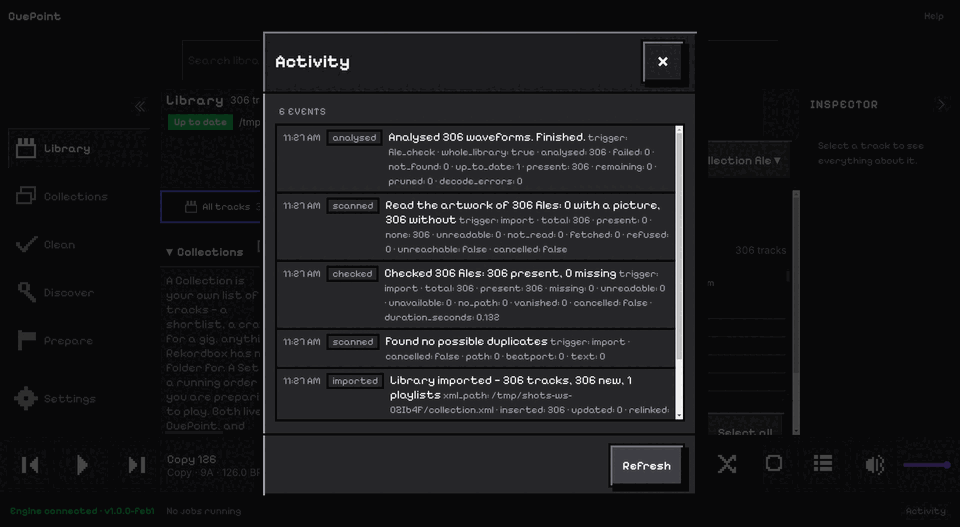

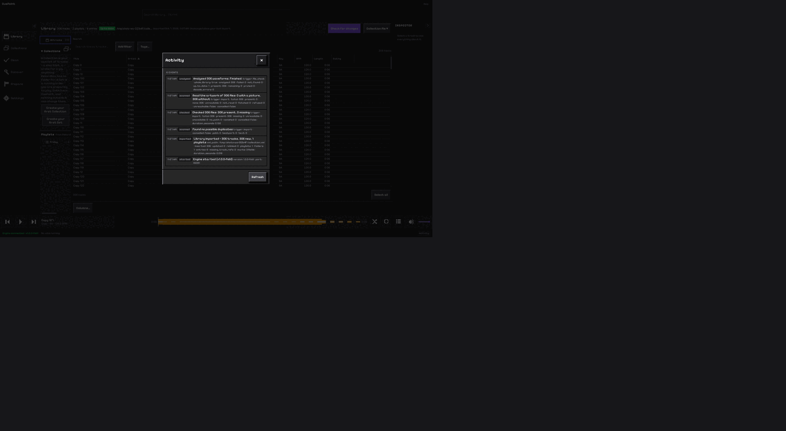

*Raw key: value details (trigger, path…) are visible.*

#### STR-8 — Group Activity by day, with plain errors

**Recommendation**: Yes

**Mark**: **Yes** (2026-10-07, the recommendation)

**What**:

- Insert day headings ("Today", "Yesterday", "3 Oct") instead of a date prefix per row (`activityFormat.ts:19-31`).
- Make the unavailable and error notes plain: "Activity will show once CuePoint has finished starting." and "Couldn't load the list. Try Refresh."

**Why**: Easier to scan; no raw errors.

**Size**: S.

**Files**: `ActivityPanel.tsx`, `activityFormat.ts`, tests.

**Screenshots**:

*A single-day list; the two-day grouping was not shot.*

#### STR-9 — Show the Activity shortcut

**Recommendation**: Yes (title only)

**Mark**: **Yes** (2026-10-07, the recommendation)

**What**: Add `title="Activity — what CuePoint has done (Ctrl+Shift+A)"` to the button (`StatusStrip.tsx:198-204`). The badge can count new entries since the panel was last opened.

**Why**: Discoverability.

**Size**: S (title only) or M (with the unread count).

**Files**: `StatusStrip.tsx`.

**Screenshots**:

*The Activity button; the hover tooltip is not captured.*

## The player bar and queue

*Paths are relative to `apps/desktop-electron/renderer/src/` unless they start with `src/cuepoint/`, `docs/` or `apps/`.*

### What it does

- The bar is not shown at all until the first track plays in a session. After that it stays until the app quits (`PlayerSlot.tsx:42-56`, DEC-053, DEC-025; `PlayerRegion.tsx:107` returns null when it has no children).
- **Transport.** Previous, Play/Pause and Next (`PlayerBar.tsx:134-160`). Each control sends a request to main and does not change its own state until main reports back (no optimistic UI).
- **Track line.** The title, then "artist · key · BPM" (`PlayerBar.tsx:162-169`; `playerFormat.ts:50-57`).
- **Seek.** A range input laid over the playing track's waveform once the waveform is ready (`PlayerBar.tsx:171-210`). Until then it is a plain slider, and the reason there is no waveform shows only as a hover title (`:175`).
- **Order controls.** Shuffle, a three-state Repeat and a Queue toggle (`:213-246`). Shuffle and Repeat persist only after main confirms them (`:102-122`).
- **Volume.** A mute button and a 0–100 slider (`:248-269`).
- **Queue panel.** It opens above the bar (`PlayerSlot.tsx:62-66`). The list is virtualised and keeps played rows above the current one. Rows can be dragged to reorder. Keyboard: Enter plays, Delete/Backspace removes, Alt+↑/↓ moves a row (`QueuePanel.tsx:86-103`). Double-click plays. Failed rows are marked "failed".
- **Global keys** (`usePlayerShortcuts.ts:76-107`): Space plays/pauses, Ctrl+←/→ is previous/next, Ctrl+↑/↓ is volume. Player failures show as toasts (`usePlayerNotices.ts`).

### What a new user would not understand

1. **There is no player until something has played, and nothing says how to play.** The bar has no placeholder, by design (`PlayerRegion.tsx:85-102`). The only instruction is in `docs/user-guide/the-window.md:33-36` ("Double-clicking a track there plays it").
2. **Icon-only buttons with no visible names.** No button in the bar has a `title`, so hovering shows nothing. The names exist only for screen readers:
   - `"Previous track"` (`PlayerBar.tsx:139`);
   - `"Pause"`/`"Play"` (`:147`);
   - `"Shuffle on"`/`"Shuffle off"` (`:218`);
   - `repeatLabel()` → `"Repeat all"`/`"Repeat one"`/`"Repeat off"` (`playerOrderState.ts:82-84`);
   - `` `Show queue (${queueLength})` `` (`PlayerBar.tsx:239`): the queue count is never shown on screen.
3. **Repeat's three states differ only by drawing and colour.** "Repeat all" and "Repeat one" are both shown as "on" (`PlayerBar.tsx:225`). Telling them apart means reading a 12×12 glyph.
4. **Why there is no waveform is hidden in a hover title** (`PlayerBar.tsx:175`). Examples:
   - `"Waiting for analysis"` (`waveform/analysisWords.ts:97`);
   - `"Waveforms need the player's decoder, which this build does not include"` (`analysisWords.ts:24-25`);
   - `` `This file could not be read (${track.reason ?? "unknown"})` `` (`:99`), which puts a raw reason code in front of the user.
5. **The unknown-time placeholder is `"–:––"`** (`playerFormat.ts:25`). It is shown before the duration arrives.
6. **Key notation is bare.** For example "Artist · 8A · 128.0 BPM" (`playerFormat.ts:50-57`). There is no hint about what 8A means or what mixes with it, and this is where DEC-133's wheel would help.
7. **Queue panel:**
   - `"Nothing queued. Playing a track fills this with what comes next."` (`QueuePanel.tsx:120`) is fine.
   - `"failed"` in lower case (`:174-176`) gives no reason; its title is only `"This track could not be played"` (`:174`).
   - The keyboard gestures (Alt+↑/↓, Delete, Enter) are not shown anywhere in the panel.
   - Dragging a row shows no drop marker.
   - There is no "Clear queue", although the bridge has `clearQueue()` (`api/cuepointBridge.types.ts:219`).
   - The close and remove controls are a bare `"×"` (`QueuePanel.tsx:113-115`, `:184`).
8. **The title and artist are not links.** You cannot get from what is playing to the track in the Library or in the Inspector.
9. **The global keys are undiscoverable.** Space and Ctrl+arrows appear only in the Shortcuts dialog (F1).

### Proposals

#### BAR-1 — Name every player button on hover

**Recommendation**: Yes

**Mark**: **Yes** (2026-10-07, the recommendation)

**What**:

Add `title` to each button in `PlayerBar.tsx:135-257`, with the shortcut where there is one:
- "Previous track (Ctrl+←)";
- "Play (Space)" / "Pause (Space)";
- "Next track (Ctrl+→)";
- "Shuffle: off";
- "Repeat: one track";
- "Show the queue (24 tracks)";
- "Mute".

**Why**: Icon-only controls are opaque to new users, and the names already exist as `aria-label`.

**Size**: S.

**Files**: `PlayerBar.tsx`, `PlayerBar.test.tsx`.

**Screenshots**:

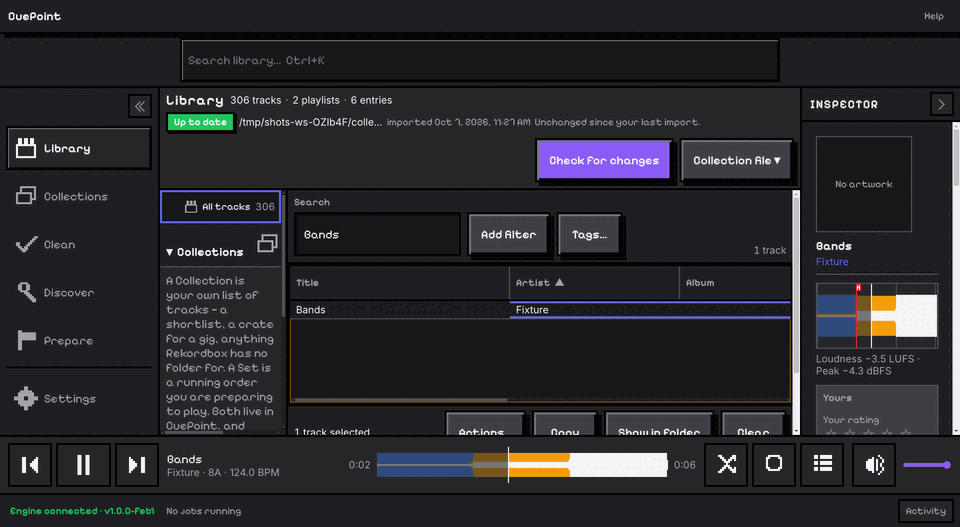

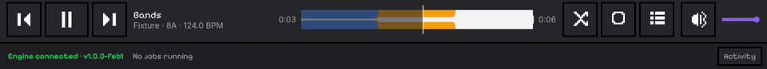

*Icon-only buttons; native title tooltips are not captured.*

#### BAR-2 — Show the queue count on the Queue button

**Recommendation**: Yes

**Mark**: **Yes** (2026-10-07, the recommendation)

**What**: A small square Badge with `queueLength` on the queue button (`PlayerBar.tsx:234-245`), hidden at 0.

**Why**: The count exists today only in the aria-label (`:239`).

**Size**: S.

**Files**: `PlayerBar.tsx`, `PlayerBar.css`.

**Screenshots**:

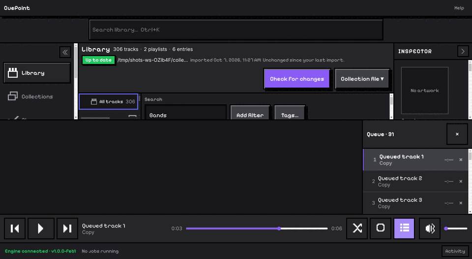

*The Queue button has no count.*

#### BAR-3 — Say the repeat state in words

**Recommendation**: Yes

**Mark**: **Yes** (2026-10-07, the recommendation)

**What**: Beside the Repeat icon, a short label ("All" / "One") when repeat is on, taken from `repeatLabel()`.

**Why**: Two of the three "on" states look alike at 1× (`PlayerBar.tsx:225-232`).

**Size**: S.

**Files**: `PlayerBar.tsx`, `PlayerBar.css`.

**Screenshots**:

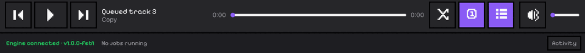

*Repeat is in "one" mode.*

#### BAR-4 — Make the playing track's title open it

**Recommendation**: Yes

**Mark**: **Yes** (2026-10-07, the recommendation)

**What**:

Make the title (`PlayerBar.tsx:163-165`) a button:
- clicking it opens the Library filtered to that track id, and the Inspector shows it;
- clicking the artist opens the Discover artist page (`entityPath`, already in `App.tsx:112-114`).

**Why**: "what is this, and where is it in my library?" has no answer from the bar today.

**Size**: M. `item.trackId` exists (`api/cuepointBridge.types.ts:46`); it needs a navigate callback passed into `PlayerSlot`.

**Files**: `PlayerBar.tsx`, `PlayerSlot.tsx`, `App.tsx`.

**Screenshots**:

*The title is not a link.*

#### BAR-5 — Make the key in the track line open the Camelot wheel

**Recommendation**: Yes

**Mark**: **Yes** (2026-10-07, the recommendation); amended 2026-10-08: the wheel opened here lights the playing track (DEC-157's precision)

**What**: Render the key part of `formatTrackMeta` as a button that opens DEC-133's wheel, lit for the playing track.

**Why**: It ties the bar to the header wheel, and "8A" stops being a mystery code.

**Size**: S, once the wheel exists.

**Files**: `PlayerBar.tsx`, `playerFormat.ts`, the wheel component.

**Screenshots**:

*The "Fixture · 8A · 124.0 BPM" line; the wheel does not exist yet.*

#### BAR-6 — Show, quietly, why there is no waveform in the seek area

**Recommendation**: No — it reverses WAVE-06's "never in the region's space"; BAR-7's plain words in the hover title are enough.

**Mark**: **No** (2026-10-07, the recommendation)

**What**: When `picture` is null and `waveformWords` is set, show a one-line muted caption inside `.cp-player-bar__wave` behind the transparent slider, for example "Waveform not drawn yet — analysing (1,204 of 50,000)".

**Why**: The reason is hidden in a hover title (`PlayerBar.tsx:175`). Note: this reverses WAVE-06's "never in the region's space" (`PlayerBar.tsx:173-174` comment), so the user must accept the reversal explicitly.

**Size**: S.

**Files**: `PlayerBar.tsx`, `PlayerBar.css`, `PlayerBar.waveform.test.tsx`.

**Screenshots**:

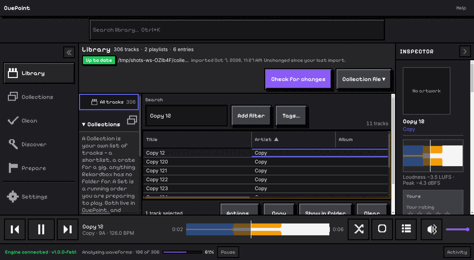

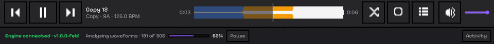

*The track is still being analysed; the true "no waveform" state was not caught.*

#### BAR-7 — Write the waveform reasons in plain words

**Recommendation**: Yes

**Mark**: **Yes** (2026-10-07, the recommendation)

**What**: In `waveformStateWords` (`analysisWords.ts:89-117`), map `failed` reasons to plain sentences instead of `(${track.reason ?? "unknown"})`. Reword `DECODER_MISSING_WORDS` as "This version of CuePoint can't draw waveforms."

**Why**: DEC-132's "plain words". Raw codes leak through today.

**Size**: S.

**Files**: `analysisWords.ts`, `analysisWords.test.ts`. The Library's Waveform column shares these words.

**Screenshots**:

*No screenshot: the failed-waveform hover title is a native tooltip and no failed-waveform state is reachable.*

#### BAR-8 — Give the queue panel a help line, a Clear button and a drop marker

**Recommendation**: Yes

**Mark**: **Yes** (2026-10-07, the recommendation)

**What**:

All in the queue panel:
- Header: add a "Clear" button (bridge `clearQueue`, behind a confirm) and a muted hint line "Drag to reorder · Alt+↑/↓ moves · Delete removes · Enter plays".
- Dragging: show a 2px×scale accent line at the drop position.
- Replace the "×" glyphs with PixelIcon `close` (if drawn) and a title.

**Why**: The gestures are invisible (`QueuePanel.tsx:86-103`), and there is no clear.

**Size**: M.

**Files**: `QueuePanel.tsx`, `QueuePanel.css`, `QueuePanel.test.tsx`, possibly `pixelIcons.ts`.

**Screenshots**:

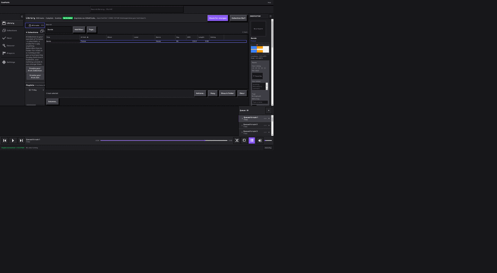

*A queue of 31 with a missing-file row; no help line, Clear button or drag marker exists yet.*

#### BAR-9 — Say why a queue row failed

**Recommendation**: Yes

**Mark**: **Yes** (2026-10-07, the recommendation)

**What**: Replace the lower-case `"failed"` tag (`QueuePanel.tsx:174-176`) with "Couldn't play" and a title carrying the notice's reason (the main-side notice text, which `usePlayerNotices` already receives).

**Why**: Today the tag says *that* it failed, never *why*.

**Size**: M. The per-item reason has to be carried on `QueueItem`.

**Files**: `QueuePanel.tsx`, `api/cuepointBridge.types.ts`, `electron/playbackQueue.ts`.

**Screenshots**:

*The FAILED tag on rows; the reason tooltip is not capturable.*

#### BAR-10 — Tell a new user how to play, before the first play

**Recommendation**: No — RUN-1's screen 4 and RUN-3's checklist say how to play.

**Mark**: **No** (2026-10-07, the recommendation)

**What**: The bar still stays absent (DEC-053). Instead, until `everPlayed`, the Library table's footer or the status strip shows "Double-click a track to play it · Space plays/pauses", once per install (localStorage flag).

**Why**: Nothing in the app explains how to play.

**Size**: S.

**Files**: `PlayerSlot.tsx` or `StatusStrip.tsx`, plus a flag.

**Screenshots**:

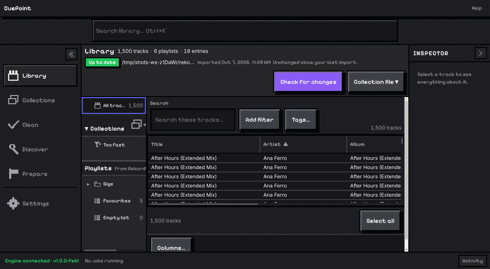

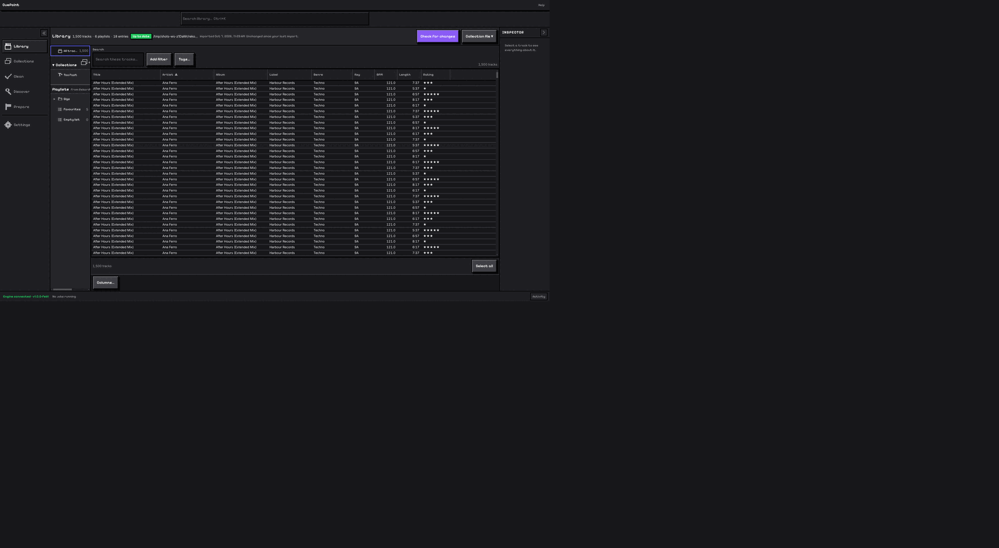

*A library with a collection, nothing played and no hint.*

## The Library

*Paths are relative to `apps/desktop-electron/renderer/src/` unless they start with `src/cuepoint/` or `e2e/`.*

### What it does

**Before anything is imported** (`screens/library/LibraryScreen.tsx:1524-1559`):
- The page shows "Library" and the subtitle "Your Rekordbox collection, as CuePoint sees it." (:1528-1529).
- A panel, "No collection imported yet", says "CuePoint works from a Rekordbox XML export. Import one and it will remember where it came from, so refreshing later takes one click." (:1531-1535).
- It offers **Import a collection…**, which opens a file dialog (:1542), and **How do I export one?**, which opens `RekordboxInstructionsDialog` (:1546).
- While the library loads, it says "Reading your library…" (:1518).
- The first-run tour (`components/OnboardingDialog.tsx:9-18`) has three steps: Welcome, "Import your collection" and "Clean". It says nothing about the Library's parts or the Inspector.

**After an import**, there are four regions.
1. **Header** (`LibraryHeader.tsx`):
   - "Library" with "N tracks · N playlists · N entries" (:70-79).
   - A badge: "Up to date", "Out of date" or "Unverified" (:93-97).
   - The full XML path (:103), "imported {date}" (:106), and a state line from `libraryFormat.ts:67-77`, for example "This export has changed since your last import. Check what a refresh would do."
   - After a refresh, a summary line such as "1,204 tracks in your library · 3 added · 1 removed · 2 unreadable marks skipped" (`libraryFormat.ts:204-214`).
   - The primary **Check for changes** (:129), which reads "Checking…" and then "Refreshing…" while busy.
   - **Collection file ▾** (:139), with "Import a different collection…" and "Export to Rekordbox…" (:155-156).
2. **Left pane** (`LibraryPane.tsx`):
   - "All tracks" with its count (:114).
   - **Collections** (`CollectionsPane.tsx`):
     - "+" buttons for New Collection, New Set and New folder (:501-526).
     - An empty state that explains Collection versus Set, with "Create your first Collection" and "Create your first Set" (:649-660).
     - On each row: inline Duplicate, Freeze, Rename and Delete (:593-632), plus F2 and Delete keys (:578-581).
     - A row menu: Open in Prepare, Duplicate, Freeze to a Collection…, New Set from…, Rename, Delete…, Save set list…, Copy set list and Export to Rekordbox… (:401-448).
     - "Broken: …" on a broken Smart Collection (:473).
     - Freeze and Delete confirmation dialogs (:693-724).
   - **Playlists** "from Rekordbox" (`PlaylistPane.tsx:104-106`):
     - Read-only. A drop is refused with "Rekordbox playlists are read-only in CuePoint. Drop onto a Collection instead." (:64).
     - When there are none: "Your export has no playlists in it." (:173).
3. **Filter bar** (`FilterBar.tsx`):
   - Search, "Search these tracks…" (:366-369); **Add filter**, **Clear all** and **Tags…** (:379-390); a live "N tracks" (:394-396).
   - A builder: Field, Condition, a value control and **Add** (:400-461).
   - Rule chips with "×", plus "Open page" for an artist or label rule (:471-499).
   - The Smart Collection row: a status, then **Save as Smart Collection…**, **Update "X"** or **Keep as a filter** (:503-535).
   - A refusal with **Try again** (:538-545).
   - A Set-scope note with **Open in Prepare** (`LibraryScreen.tsx:1630-1641`, `setScope.ts`).
4. **Track table** (`components/table/TrackTable.tsx`, `libraryColumns.tsx`):
   - Default columns: Title, Artist, Album, Label, Genre, Key, BPM and Length.
   - Hidden by default: Remixer, Rating, Year, Plays, Added, Colour, Bitrate, Comment, File, Match, Score, File status, Artwork, Waveform and Loudness (`hiddenByDefault`, :54-242).
   - An overridden value carries a "B" or "•" marker that explains itself only in its tooltip (`libraryCells.tsx:28-35`).
   - Click, Ctrl-click and Shift-click select. Double-click or Enter plays the row and queues the whole view. Right-click opens the track menu. Rows can be dragged to a Collection or Set, or reordered inside a Collection. Headers sort, resize and reorder.
   - Below the table:
     - With nothing selected, the toolbar shows "N tracks" and **Select all** (`SelectionActions.tsx:51-63`).
     - With a selection, it shows "N tracks selected (everything matching)", **Actions…**, **Copy**, **Show in folder** and **Clear** (:66-106).
     - **Columns…** (`LibraryScreen.tsx:1804-1808`) opens a dialog with checkboxes, ◀ ▶, "Reset columns" and "Done" (`ColumnPicker.tsx:42-93`).
   - The **track menu** has up to 24 entries in one flat list (`LibraryScreen.tsx:897-929`, `trackMenu.ts:72-140`, `libraryDiscover.ts:58-101`, `libraryClean.ts:150-190`):
     - Play, Play next, Add to queue
     - Show in folder, Copy
     - Add to Collection…, Add to Set…, New Set from the selection…, Remove from "X"
     - Add tag…, Remove tag…, Rate ▸, Favorite, Remove favorite
     - Artist page, Label page, Similar tracks
     - Match on Beatport, Re-match, Accept match, Reject match, Apply Beatport values…
     - Edit metadata…
     - Check files, Write tags to files…

**Dialogs:**
- Refresh preview, titled "Review this refresh" or "Nothing has changed". It shows counts, a removal warning, sample tracks, and the checkbox "I understand this removes my own work on these tracks too" (`RefreshPreviewDialog.tsx:63-160`).
- The picker: Add to Collection, Add to Set, or Add/Remove a tag (`LibraryScreen.tsx:1724-1748`).
- "That is a lot of tracks", for batches over 1,000 (:1750-1765, `libraryBatch.ts:35`).
- Save as Smart Collection, Tags, New Set from…, Export to Rekordbox, Edit metadata, Apply Beatport values, and Write tags to files.

**Keyboard:**
- Ctrl+A selects everything matching, Ctrl+F focuses search, and Esc clears the selection (`LibraryScreen.tsx:1190-1210`).
- Enter plays. Shift+F10 or the menu key opens the menu (`TrackTable.tsx:346-353`).
- F2 and Delete work in the Collections tree.

**Background work:**
- Started here: import, check and refresh (`library_import`, `library_refresh_preview`, `library_refresh_apply`), and batches over 1,000 (`library_batch`).
- An import starts a file check on its own (`src/cuepoint/engine/library_jobs.py:154`). That check starts the artwork scan and the waveform analysis. The cue-point backfill and the artist index also start unasked (`components/shell/useActiveJob.ts:62-108`).
- The Library shows only a busy label on its button. Progress appears only in the status strip.

### What a new user would not understand

1. **"Collection" means two things.**
   - The Rekordbox export: "No collection imported yet" (`LibraryScreen.tsx:1531`), "Collection file ▾" (`LibraryHeader.tsx:139`), "Import a different collection…" (:143, :155), and "Collection imported." (`LibraryScreen.tsx:1279`).
   - CuePoint's own lists: "Collections" (`CollectionsPane.tsx:495`), directly below it.
2. **The post-import jobs are never explained on the page.** The status strip cycles through "Checking files", "Reading artwork", "Analysing waveforms", "Reading cue points" and "Indexing artists and labels" (`useActiveJob.ts:62-108`). The page says only "Collection imported." (`LibraryScreen.tsx:1279`). Nothing says what these jobs are, that you can keep working, or why waveforms are missing.
3. **"Check for changes"** (`LibraryHeader.tsx:129`) does not say "with Rekordbox". As the primary button, it reads like an app-update check.
4. **Header jargon:**
   - "Unverified" (`LibraryHeader.tsx:96`).
   - "entries" (:79) counts tracks inside playlists. It reads as a third track count.
   - "imported {date}" (:106) could be the export's date or the import's.
5. **Three track counts:** the header (`LibraryHeader.tsx:74`), the filter bar (`FilterBar.tsx:394-396`) and the idle toolbar (`SelectionActions.tsx:54-56`). With a filter on, they disagree with no "of" to explain why.
6. **Empty table states rarely say what to do next** (`libraryEmpty.ts`):
   - "No tracks match this search." (:84), with no way to clear it.
   - "This playlist is empty." (:88), without saying it is Rekordbox's.
   - "Nothing matches these rules right now." (:72).
   - "No tracks yet." (:112).

   Only the Collection hint (:108) and the refresh hint (:101) point anywhere.
7. **The filter Field list is about 40 raw engine fields in one flat list** (`src/cuepoint/models/filter_rule.py:513-730`, passed through unchanged at `filterText.ts:164-168`):
   - "Match state", "Match decided by", "Match disputed", "Match score" (:594-626)
   - "File status", "File checked" (:637-652)
   - "In a duplicate group", "Duplicate signal" (:665-672)
   - "Credited artist" next to "Artist" (:697), "Label, any spelling" (:708)
   - "Rekordbox key" and "CuePoint key" next to "Key" (`_layers`, :486-509, :580-584)
   - "Condition" (`FilterBar.tsx:414`)
8. **The track menu has 24 flat entries, and some names need context:** "Re-match" (`libraryClean.ts:157`), "Check files" (:182), "Write tags to files…" (:187), "Apply Beatport values…" (:170), "Edit metadata…" (:177) and "Similar tracks" (`libraryDiscover.ts:90`). "Write tags to files" also collides with **Tags**, CuePoint's own labels: "Add tag…" (`trackMenu.ts:103`) and "Tags…" (`FilterBar.tsx:390`).
9. **The edited-value markers** "B" and "•" (`libraryCells.tsx:35`) are explained only in a tooltip.
10. **Columns:**
    - **Columns…** sits under the table (`LibraryScreen.tsx:1806`), far from the headers it changes.
    - Rating is hidden by default (`libraryColumns.tsx:116-124`).
    - "pinned" (`ColumnPicker.tsx:68`) is unexplained.
11. **Batch dialogs:**
    - "…the whole batch can be reverted from Activity." (`libraryBatch.ts:275`, and the toast at :264) does not say that Activity is a button in the status strip (`components/shell/StatusStrip.tsx:201-203`).
    - The title "That is a lot of tracks" (`LibraryScreen.tsx:1752`) gives no number.
12. **Shortcuts:**
    - The shortcuts dialog's data (`api/keyboardShortcuts.ts`) lists only Ctrl+F and Ctrl+A for the Library (:26-27). Enter, Esc, Shift+F10, F2 and Delete are missing.
    - It still lists "Open XML file Ctrl+O", "Export results Ctrl+E" and the retired Match and Results screens (:9-10, :18-22). I found no Ctrl+O or Ctrl+E handler in the renderer.

### Proposals

#### LIB-1 — Explain the work that follows an import, on the page

**Recommendation**: Yes

**Mark**: **Yes** (2026-10-07, the recommendation)

**What**:

While `file_check`, `artwork_scan`, `waveform_analysis`, `marks_backfill` or `credit_index` runs after an import, show a dismissible note under the header:

> **Getting your library ready.** CuePoint is checking that your music files are where Rekordbox says, reading their cover art and drawing each track's waveform. You can browse and play while it works. Progress is in the status strip at the bottom; **Activity** shows each step.

Add a live "Now: drawing waveforms, 1,204 of 12,000" line. The note disappears when the chain ends.

**Why**: Point 2, and DEC-132's background work.

**Size**: M.

**Files**: `LibraryScreen.tsx`, a new `LibraryReadyNote.tsx` that reuses `components/shell/useActiveJob.ts`, and `library.css`. This interacts with STR-3, which names and explains the same jobs in the status strip.

**Screenshots**:

*A real-audio 306-track import; the strip shows Analysing waveforms and there is no on-page note today.*

#### LIB-2 — Turn the first-run empty state into a three-step guide

**Recommendation**: Yes

**Mark**: **Yes** (2026-10-07, the recommendation)

**What**:

Replace the panel text with:

> 1. In Rekordbox, choose **File → Export Collection in xml format**.
> 2. Click **Import a Rekordbox export…** and pick that file.
> 3. CuePoint reads it; nothing in Rekordbox is changed. Later, **Refresh from Rekordbox** picks up what you changed there.

Keep **How do I export one?**.

**Why**: Point 1, and DEC-132's empty states and first-run guide. The menu path is the same one `libraryFormat.ts:226-227` already uses.

**Size**: S.

**Files**: `LibraryScreen.tsx:1531-1549`, `library.css`. Align it with `OnboardingDialog.tsx:13-14`.

**Screenshots**:

*A fresh home with onboarding done.*

#### LIB-3 — Say "Rekordbox" on the refresh button and its badge

**Recommendation**: Yes

**Mark**: **Yes** (2026-10-07, the recommendation); amended 2026-10-08: the button reads "Check Rekordbox for changes" (FLW-11, Q-206)

**What**: "Check for changes" becomes **Refresh from Rekordbox…**, with the busy labels "Comparing with Rekordbox…" and "Refreshing…". The badges "Up to date", "Out of date" and "Unverified" become "In sync", "Changed in Rekordbox" and "Not checked yet". "imported {date}" becomes "last read {date}". `libraryFormat.ts:74` becomes "CuePoint could not tell whether this export has changed. Refresh from Rekordbox to compare."

**Why**: Points 3 and 4.

**Size**: S.

**Files**: `LibraryHeader.tsx`, `libraryFormat.ts:67-77`, and `LibraryScreen.tsx:146-150`. These e2e specs click "Check for changes": `libraryPage`, `libraryBrowse`, `libraryJourney`, `organization`, `clean`, `prepareJourney` and `trackMarks`.

**Screenshots**:

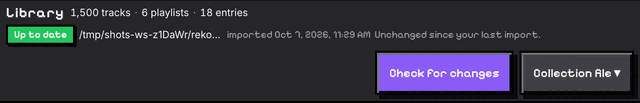

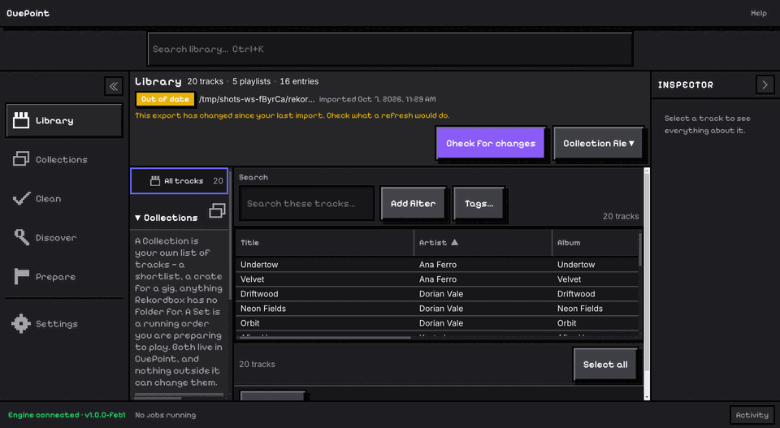

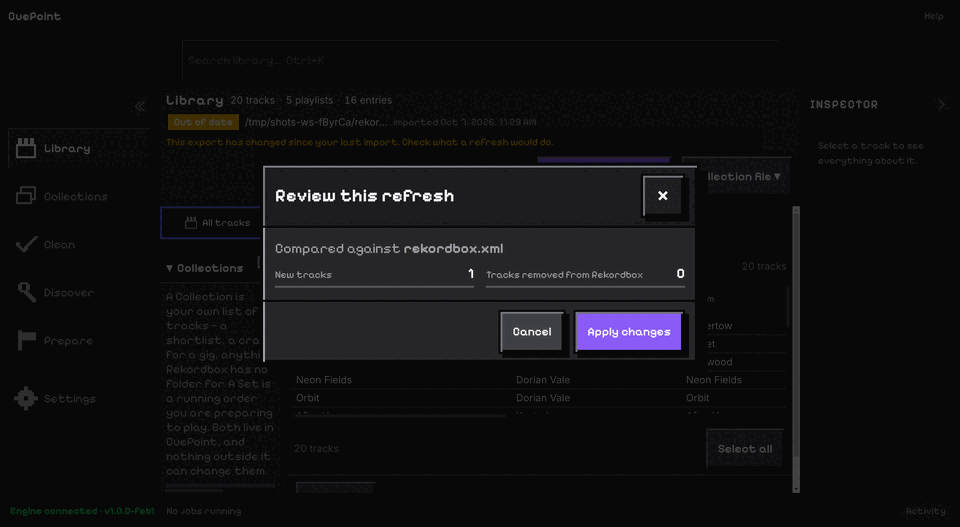

*The "Up to date" header, then the XML rewritten and Check for changes giving "Out of date".*

#### LIB-4 — Keep "Collection" for CuePoint's lists only

**Recommendation**: Yes

**Mark**: **Yes** (2026-10-07, the recommendation)

**What**: "Collection file ▾" becomes **Rekordbox file ▾**. "Import a different collection…" becomes "Import a different Rekordbox export…". "No collection imported yet" becomes "Nothing imported yet". "Collection imported." becomes "Rekordbox export imported." The subtitle becomes "Your Rekordbox library, as CuePoint sees it." Drop "· N entries" (`LibraryHeader.tsx:78-79`) and make it the playlists count's tooltip: "N tracks across your playlists".

**Why**: Points 1 and 4.

**Size**: S.

**Files**: `LibraryHeader.tsx`, `LibraryScreen.tsx:1279,1528-1542`, the unit tests, and the e2e selectors.

**Screenshots**:

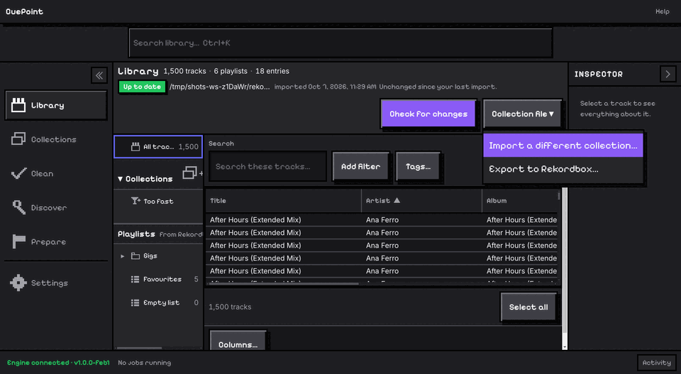

*The Collection file menu open, and the Collections section below.*

#### LIB-5 — Make every empty table say what to do next

**Recommendation**: Yes

**Mark**: **Yes** (2026-10-07, the recommendation)

**What**: In `libraryEmpty.ts`: "No tracks match this search." gains "Try fewer words, or clear the search and filters." and a **Clear search and filters** button. "This playlist is empty." gains "Playlists come from Rekordbox. Add tracks to it there, then Refresh from Rekordbox." The rules case gains **Edit the rules**, which opens Add filter. "No tracks yet." becomes "This Rekordbox export has no tracks in it. Export again from Rekordbox and import that file."

**Why**: Point 6, and DEC-132.

**Size**: S to M, because `emptyStateFor` has to return an action.

**Files**: `libraryEmpty.ts`, `LibraryScreen.tsx:1475-1488`, `emptyStates.test.tsx`.

**Screenshots**:

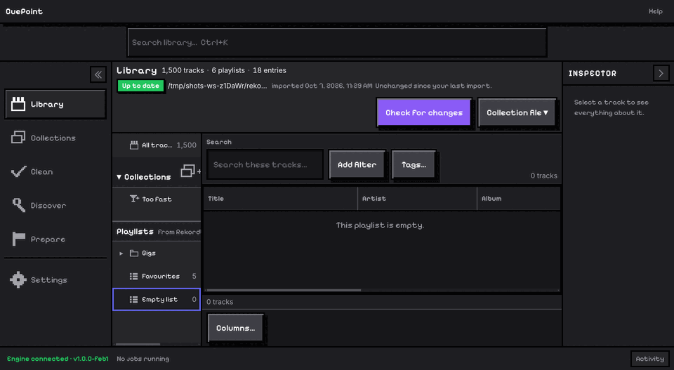

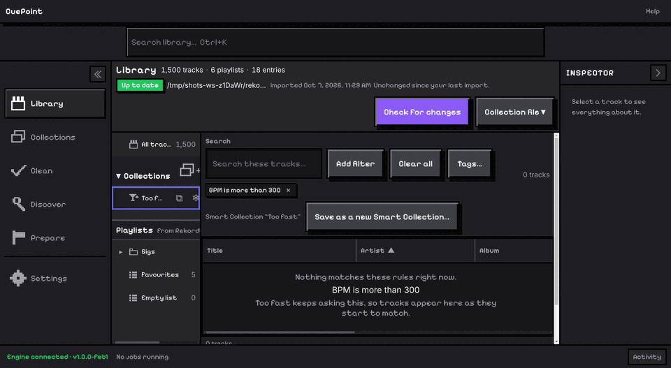

*Three of the four empty states (search, playlist, Smart Collection); the empty export state is in `library-empty-export.png`.*

#### LIB-6 — Group the track menu and name its entries plainly

**Recommendation**: Yes

**Mark**: **Yes** (2026-10-07, the recommendation); amended 2026-10-08: FLW-8 makes the groups a visible bar too, and adds Play ▸ and More ▸ (PAGES-05)

**What**:

The top level keeps Play, Play next, Add to queue, Show in folder and Copy. Then:
- **Organize ▸**: Add to Collection…, Add to Set…, New Set from these tracks…, Remove from "X", Add tag…, Remove tag…, Rate ▸, Favorite / Remove favorite.
- **Explore ▸**: Artist page, Label page, Similar tracks.
- **Beatport ▸**: Match on Beatport, Match again, Accept the match, Reject the match, Use Beatport's values….
- **Fix ▸**: Edit details…, "Check the files are still there" (replacing "Check files"), and "Save changes into the music files…" (replacing "Write tags to files…").

Submenus already exist; see Rate ▸ at `trackMenu.ts:105-126`.

**Why**: Point 8, including the "tags" collision.

**Size**: M.

**Files**: `trackMenu.ts`, `libraryClean.ts:146-195`, `libraryDiscover.ts`, `LibraryScreen.tsx:880-929`, the menu tests, and `e2e/organization`, `cleanLibrary` and `discoverPages`.

**Screenshots**:

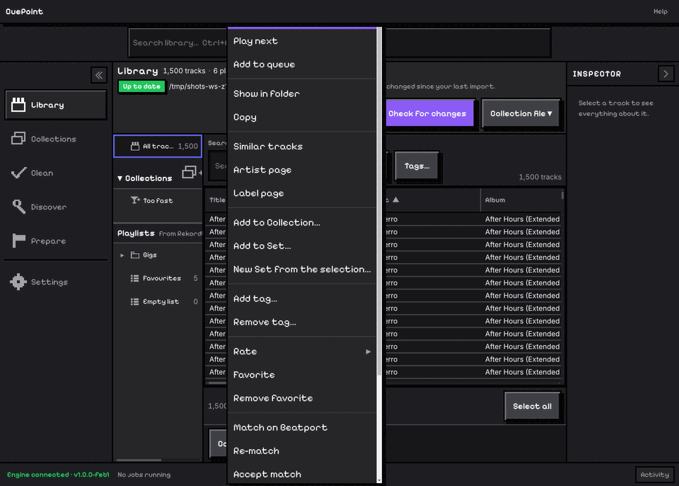

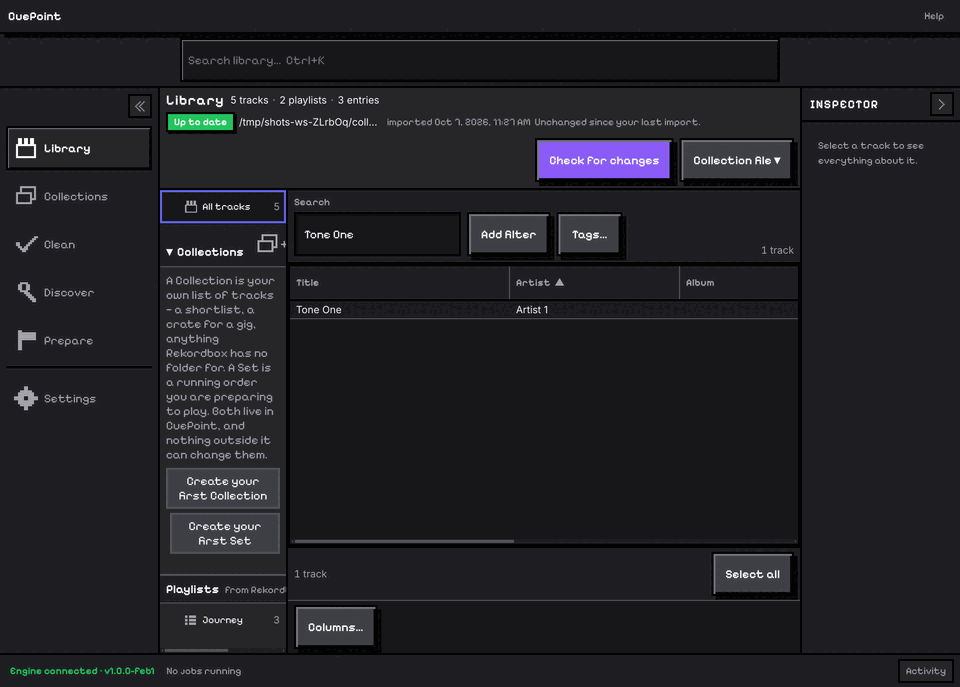

*Taken in a 1400px-tall window so the whole menu shows; the second is a track with an accepted match (Beatport items).*

#### LIB-7 — Group the filter fields under plain names

**Recommendation**: Yes

**Mark**: **Yes** (2026-10-07, the recommendation)

**What**:

Show Field in groups: Track; Your notes and ratings; Rekordbox only; Beatport match; Files (status, artwork, duplicates); Where it is (Tag, Collection). Rename these fields:

| Today | New |
|---|---|
| Match state | Beatport match |
| Match decided by | Match decided by (you or CuePoint) |
| Match disputed | A newer match disagrees |
| Match score | Beatport match score |
| File checked | Last checked on disk |
| In a duplicate group | Possible duplicate |
| Duplicate signal | Why it looks like a duplicate |
| CuePoint key/BPM/… | Your key/BPM/… |
| Rekordbox key/… | Key from Rekordbox/… |
| Credited artist | Any credited artist |
| Condition | Rule |

The engine adds a `group` to each field spec, so the renderer keeps no second copy of the grouping.

**Why**: Point 7.

**Size**: M.

**Files**: `src/cuepoint/models/filter_rule.py:513-730,1274`, `FilterBar.tsx:401-411` (optgroups; check that `components/Select` supports them), `filterText.ts`. Chips re-word themselves through `describeRule`, and no saved data changes.

**Screenshots**:

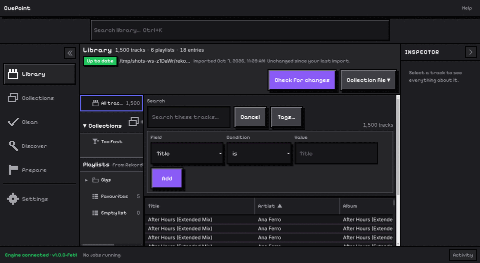

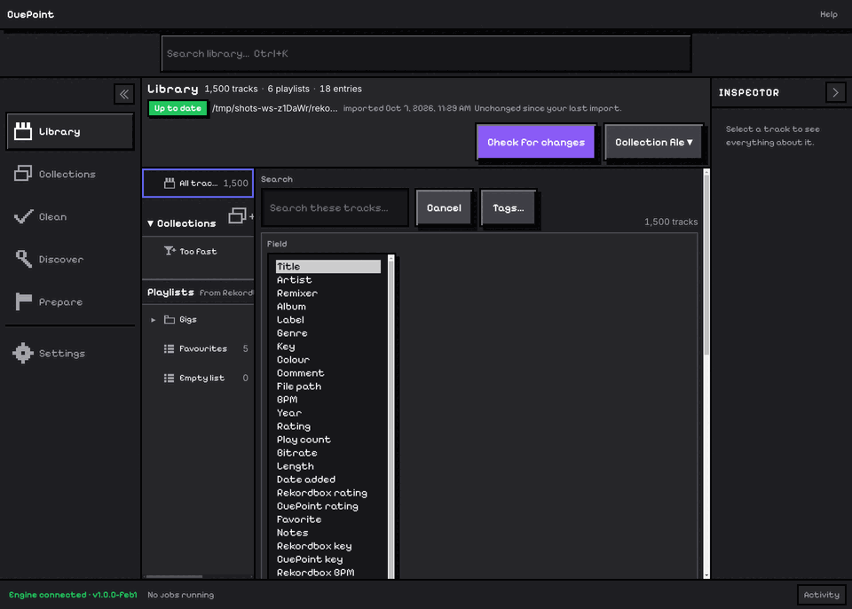

*The native select is drawn as an open list because native popups are not captured.*

#### LIB-8 — Show one track count, in context

**Recommendation**: Yes

**Mark**: **Yes** (2026-10-07, the recommendation)

**What**: Remove the idle "N tracks" from the selection toolbar (`SelectionActions.tsx:54-56`), keeping **Select all**. The filter-bar count reads "Showing 240 of 12,000 tracks" when the view is narrowed and "12,000 tracks" otherwise.

**Why**: Point 5.

**Size**: S.

**Files**: `SelectionActions.tsx`, `FilterBar.tsx:394-396` (a new library-total prop), `LibraryScreen.tsx`.

**Screenshots**:

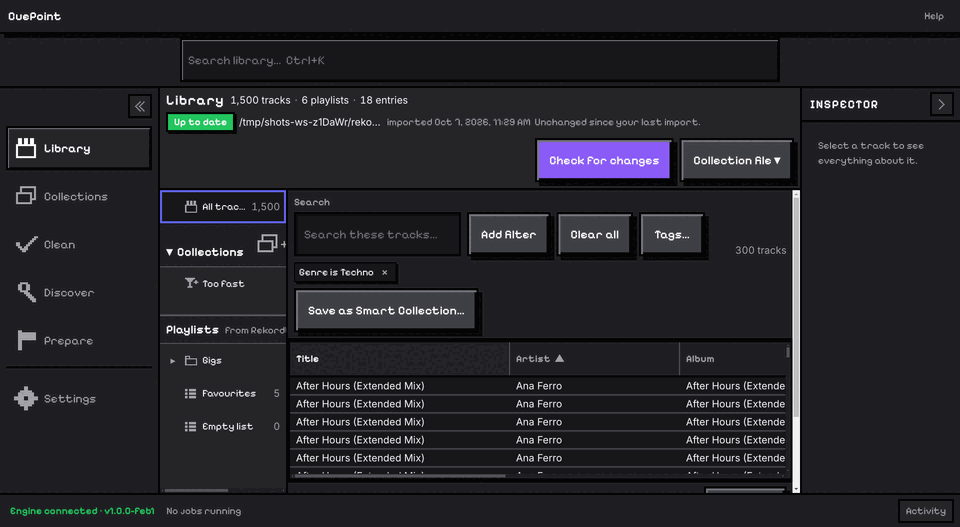

*Genre is Techno on 1,500 tracks: the toolbar count and the filter-bar count.*

#### LIB-9 — Explain the edited-value marker

**Recommendation**: Yes

**Mark**: **Yes** (2026-10-07, the recommendation)

**What**: Replace "•" with a pencil pixel icon and "B" with the Beatport pixel icon, keeping the tooltip. Add a legend line to the Columns dialog: "✎ you changed this value in CuePoint · Ⓑ taken from Beatport. Rekordbox's own value is kept underneath."

**Why**: Point 9.

**Size**: S.

**Files**: `libraryCells.tsx:20-40`, `components/PixelIcon`, `components/table/ColumnPicker.tsx`, `library.css`.

**Screenshots**:

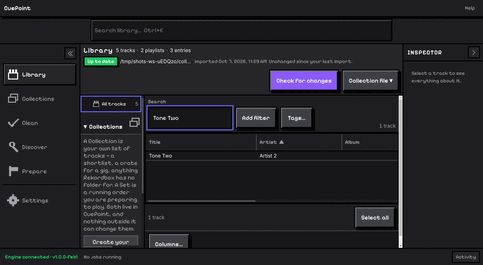

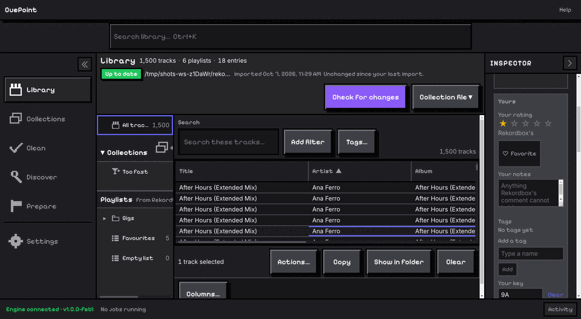

*Key and BPM applied from Beatport show the B marker; the second shows a typed override. The hover tooltip is not captured.*

#### LIB-10 — Put Columns where the columns are, and open with Rating

**Recommendation**: Yes

**Mark**: **Yes** (2026-10-07, the recommendation)

**What**: Move **Columns…** into the filter row beside **Tags…**. Also open it from a right-click on a column header. Make Rating visible by default. Replace "pinned" with the tooltip "Always shown first; cannot be moved".

**Why**: Point 10.

**Size**: S, or M with the header right-click.

**Files**: `LibraryScreen.tsx:1804-1808`, `FilterBar.tsx`, `components/table/TrackTable.tsx` (header `onContextMenu`), `libraryColumns.tsx:124`, `ColumnPicker.tsx:66-69`. A default change reaches only new layouts (`columnLayout.ts` reconcile).

**Screenshots**:

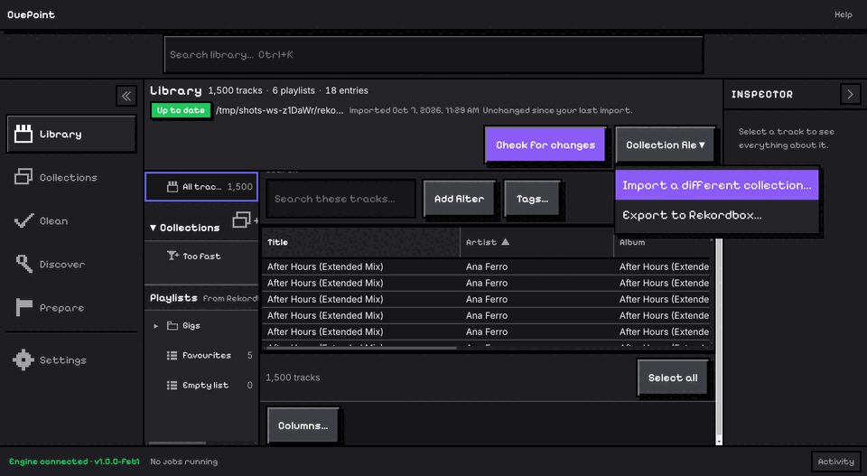

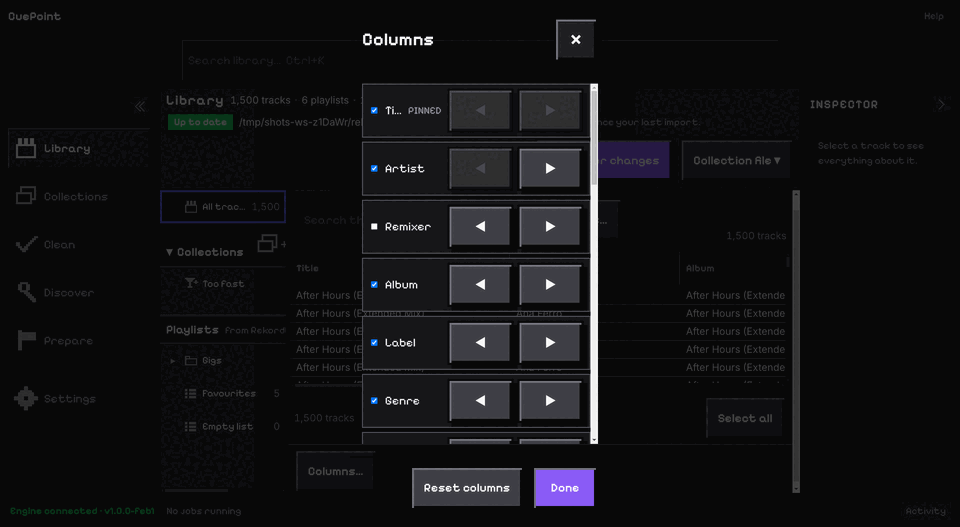

*Columns… sits at the bottom of the table; the dialog shows the PINNED label. No header right-click exists today.*

#### LIB-11 — Give the number for big batches, and say where Activity is

**Recommendation**: Yes

**Mark**: **Yes** (2026-10-07, the recommendation)

**What**: The title becomes "Change 4,213 tracks?". The consequence text becomes "It runs in the background; you can keep working. Every change is recorded in each track's History, and the whole batch can be undone from **Activity** in the status strip." The toast uses the same wording.

**Why**: Point 11.

**Size**: S.

**Files**: `LibraryScreen.tsx:1750-1765`, `libraryBatch.ts:255-279`.

**Screenshots**:

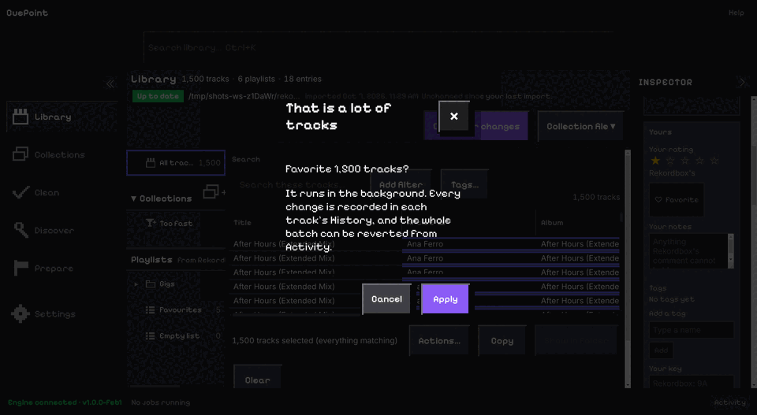

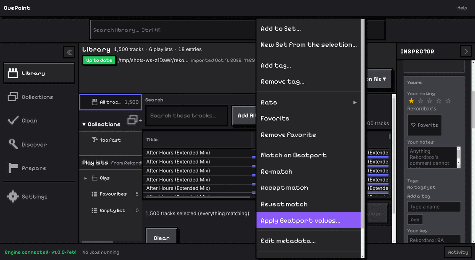

*1,500 tracks, Favorite.*

#### LIB-12 — List the Library's real shortcuts, and drop the dead ones

**Recommendation**: Yes

**Mark**: **Yes** (2026-10-07, the recommendation)

**What**: Add rows: "Play the selected track: Enter", "Clear the selection: Esc", "Track menu: Shift+F10", "Rename a Collection: F2" and "Delete a Collection: Delete". Remove Ctrl+O, Ctrl+E and the Match and Results rows (`api/keyboardShortcuts.ts:9-10,18-22`), or wire Ctrl+O to Import.

**Why**: Point 12.

**Size**: S.

**Files**: `api/keyboardShortcuts.ts`, plus `LibraryScreen.tsx` if Ctrl+O is wired. The dialog itself belongs to the shell.

**Screenshots**:

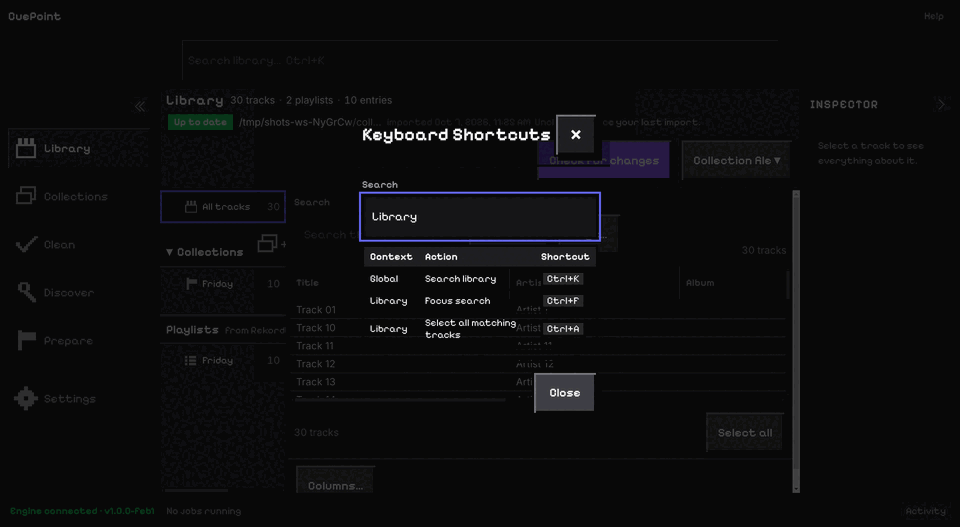

*The dialog filtered to Library.*

## The Inspector

*Paths are relative to `apps/desktop-electron/renderer/src/` unless they start with `src/cuepoint/` or `e2e/`.*

### What it does

**The container** (`components/shell/TrackInspector.tsx`) is a right-hand panel owned by the shell, so it survives navigation.
- The header says "Inspector" (:177), with "›" to hide it ("Hide track inspector (Ctrl+I)", :178-188).
- When hidden, only a thin "‹" button remains (:122-136).
- A resize handle on the left edge works by dragging or with ← and → (:153-174).
- Width and visibility persist in `cuepoint-ui-shell-inspector` (`inspectorState.ts:16`). The default width is 320 px, the minimum 220 px and the maximum half the window.
- Ctrl+I toggles it everywhere (:76-85).
- With no page content: "Select a track to see its details here." (:194).

**On the Library**, `TrackDetailPanel` (`screens/library/TrackDetailPanel.tsx`, mounted at `LibraryScreen.tsx:529-552`) shows, top to bottom:
- **States:** "Select a track to see everything about it." and "Reading the track…" (:236). Errors appear as an alert (:225-231), for example "CuePoint's engine is not available in this window" (`useTrackDetail.ts:45`).
- **Header** (:251-276): artwork, the title, and the artist (linked to Discover pages). With several tracks selected: "N tracks selected — edits here change this one" (:272-273).
- **Waveform** (`TrackWaveform.tsx`):
  - The picture with cues and grid. A click seeks only while the track is playing; otherwise the tooltip says "The track's waveform. Play the track to seek in it here." (:72).
  - With no picture, the reason (:84; `components/waveform/analysisWords.ts:89-115,155-163`): "Not checked yet", "Waiting for analysis", "Analysis paused", "File missing", "The drive or folder holding this file is not available", or "Waveforms need the player's decoder, which this build does not include".
  - A loudness line, "Loudness −8.4 LUFS · Peak −0.3 dBFS" (`loudnessWords.ts:92-104`).
- **Yours** (`TrackYours.tsx`):
  - "Your rating": five stars, a clear button ("Clear rating" or "Clear override"; :129-170, `trackEdits.ts:83`), and a source line (:173, `trackEdits.ts:66-71`): "Yours — Rekordbox's is ★★★", "Yours — Rekordbox never rated it", "Rekordbox's" or "Not rated".
  - A **Favorite** toggle (:176-186).
  - "Your notes", with the placeholder "Anything Rekordbox's comment cannot hold" and the states "Saving…" and "Saved" (:188-209).
  - Tags: chips, "No tags yet", and "Add a tag" with **Add** (:211-268).
  - Five always-visible boxes, "Your key / BPM / genre / label / year" (`TrackOverrides.tsx:92`). The placeholder is "Rekordbox: 8A" (:110). Each has **Clear** (:139) and the source "typed by you" or "applied from Beatport" (:144).
- **Beatport** (`TrackBeatportSection.tsx`):
  - "Reading the match…" (:70).
  - The state (:79): "Accepted automatically", "Needs review", "Not matched yet" or "Beatport found nothing to match", with "— a newer match disagrees" (`screens/clean/cleanFormat.ts:39-59`).
  - The candidate with "label · release · score 87.3" (:85-96), and "Artwork: …" (:98).
  - Five rows of "Rekordbox …", "Beatport …" and "Now … (from Rekordbox)", each with **Apply** (:100-128).
  - **Open on the Clean page** (:131-139).
- **From Rekordbox** (:319-362): 14 fields, and File with **Show in folder**.
- **Cues** (`TrackMarksSection.tsx`, `trackMarks.ts`):
  - "Cues · 3 hot, 5 memory", then lines such as "A · 0:32.1 · Drop" and "Beat grid · 128.00 BPM".
  - Before the cues are read: "Cues and the beat grid arrive with the next refresh." (`trackMarks.ts:81`).
- **Where it is** (:367-440): "In N Collections" or "In no Collections", "In N Sets", and "In N playlists" or "In no playlists". The buttons scope the table; a Set opens Prepare.
- **History** (`TrackHistorySection.tsx`):
  - "Reading the history…" or "Nothing has changed about this track yet." (:66-69).
  - Entries with from → to and who and when, plus **Revert** (:102).
  - "Tags written to the file. …" and **Restore the file's tags** (:116-125; `components/shell/activityActions.ts:108-118`).
- **Other pages:** Clean, Discover and Prepare fill the slot with their own content (`inspectorSlot.tsx`). Prepare adds a lead zone above Yours (`TrackDetailPanel.tsx:96-101,289`).

### What a new user would not understand

1. **"Inspector"** (`TrackInspector.tsx:177`) is a developer's word. There are two different empty texts (:194 and `TrackDetailPanel.tsx:236`), and neither says *how* to select a track: click a row.
2. **Hidden, it is a single unlabeled "‹"** (`TrackInspector.tsx:134`). A stray Ctrl+I or a click on "›" loses it.
3. **Length and repetition.**
   - It has 7 zones, about 14 imported fields, 5 override boxes and 5 Beatport rows.
   - Key, BPM, genre, label and year each appear three times: as an override placeholder (`TrackOverrides.tsx:110`), in the Beatport rows (`TrackBeatportSection.tsx:106-113`), and in From Rekordbox (`TrackDetailPanel.tsx:325-330`).
   - Nothing collapses.
4. **The five empty "Your key / BPM / …" boxes** (`TrackOverrides.tsx:92`) never say that they correct a wrong value and keep Rekordbox's.
5. **An unmatched track still shows the full Beatport table.** It says "Not matched yet" (`cleanFormat.ts:56`), then five rows of "Beatport —" (`TrackBeatportSection.tsx:109`), and there is no way to match from here. "Now" (:112), "score 87.3" (:91) and "Artwork: Not read yet" (:98, `libraryClean.ts:101`) are unexplained.
6. **Rating words:**
   - "Rekordbox's" on its own (`trackEdits.ts:70`).
   - "Clear override" (:83), whose result is unpredictable.
   - "Yours — Rekordbox's is ★★★" (:67).
   - The notes placeholder "Anything Rekordbox's comment cannot hold" (`TrackYours.tsx:198`).
7. **"Tags" means two things in one panel.** Your labels are "Tags" (`TrackYours.tsx:212`). File metadata is "Tags written to the file." and "Restore the file's tags" (`TrackHistorySection.tsx:116,125`).
8. **The waveform states assume you know the pipeline.**
   - "Not checked yet" (`analysisWords.ts:112`) does not say that the files are checked first.
   - "Waiting for analysis" (:97) does not point to progress.
   - "LUFS" and "dBFS" (`loudnessWords.ts:46,102`) are unexplained.
9. **Cue terms are Rekordbox's own and are not glossed:** "hot", "memory", "Load point" and "Beat grid · variable" (`trackMarks.ts:22-25,48,69-87`). "the next refresh" (:81) does not say it means a refresh from Rekordbox.
10. **"In no Collections" and "In no playlists"** (`TrackDetailPanel.tsx:370,422`) are dead ends.
11. **With several tracks selected,** the panel says "edits here change this one" (:272) but does not offer the way to change all of them: **Actions…** (`SelectionActions.tsx:85`).

### Proposals

#### INS-1 — Call it "Track details", and say how to fill it

**Recommendation**: Yes

**Mark**: **Yes** (2026-10-07, the recommendation)

**What**: The title becomes **Track details**, with the labels and tooltips "Show track details (Ctrl+I)" and "Hide track details (Ctrl+I)". Both empty texts become "Click a track to see its details, rate it and tag it here." The shell's fallback becomes "Nothing selected on this page."

**Why**: Point 1.

**Size**: S.

**Files**: `TrackInspector.tsx:131-194`, `TrackDetailPanel.tsx:236`, `keyboardShortcuts.ts:12`, the tests, and `e2e/shell`, `prepareJourney` and `prepareSource` (they match "Track inspector").

**Screenshots**:

*Library with nothing selected; Settings shows the fallback text in the right panel.*

#### INS-2 — Make the hidden panel findable

**Recommendation**: Yes

**Mark**: **Yes** (2026-10-07, the recommendation)

**What**: Replace the bare "‹" with a full-height vertical tab, "Track details ‹", showing the selected track's title when there is one.

**Why**: Point 2.

**Size**: S.

**Files**: `TrackInspector.tsx:122-136`, `TrackInspector.css`. The show and hide transition should follow DEC-134's "state transitions" switch.

**Screenshots**:

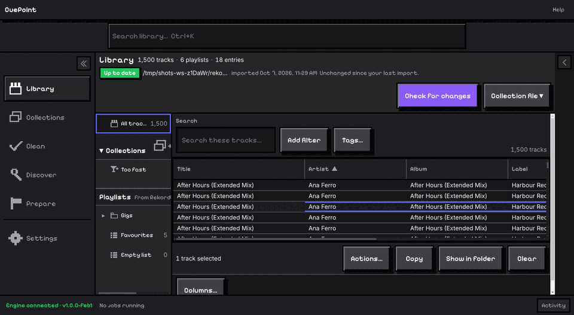

*Hidden with Ctrl+I: a bare chevron tab.*

#### INS-3 — Make sections collapsible, in a calmer order, remembered

**Recommendation**: Yes

**Mark**: **Yes** (2026-10-07, the recommendation)

**What**: The order becomes: header and waveform, **Yours**, **Details from Rekordbox**, **Cue points**, **Where it is**, **Beatport**, **History**. Every heading becomes a disclosure. Header, Yours and Details start open. Beatport and History start collapsed, with summaries such as "Beatport · Accepted" and "History · 4 changes". Each section's state persists in localStorage.

**Why**: Point 3.

**Size**: M.

**Files**: `TrackDetailPanel.tsx`, `TrackBeatportSection.tsx`, `TrackHistorySection.tsx`, `TrackMarksSection.tsx`, `TrackDetailPanel.css`. Prepare's lead zone keeps its place (:289). Expanding and collapsing follow DEC-134's motion switches.

**Screenshots**:

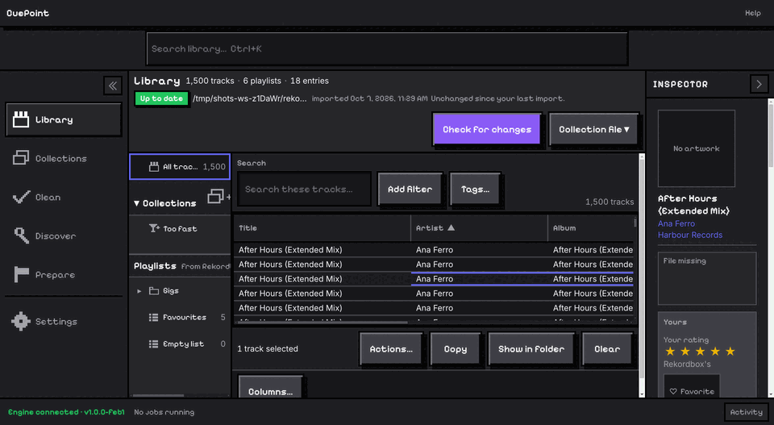

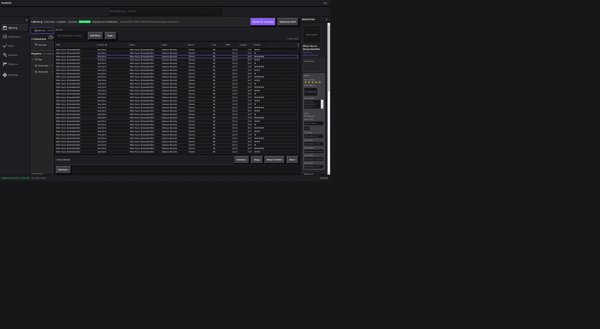

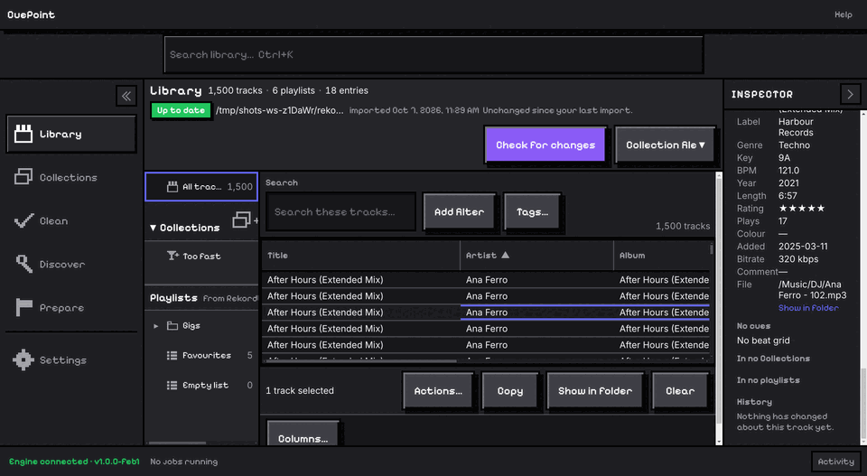

*The default width, an overview at 0.55 zoom, and scrolled to the end.*

#### INS-4 — Put the override boxes behind "Correct a value…"

**Recommendation**: Yes

**Mark**: **Yes** (2026-10-07, the recommendation); amended 2026-10-08: "Correct a value…" becomes "Edit values…", the editor Fix values uses (Q-203); for the key, going back returns to Beatport's key (DEC-201)

**What**:

A disclosure:

> **Correct a value…** Change this track's key, BPM, genre, label or year in CuePoint. Rekordbox's value is kept, and you can go back to it.

It opens on its own when the track already has an override.

**Why**: Points 3 and 4.

**Size**: S.

**Files**: `TrackOverrides.tsx`, `TrackYours.tsx:270`, `TrackDetailPanel.css`.

**Screenshots**:

*No overrides, then after typing 9A into Your key.*

#### INS-5 — Show an unmatched track one message and one action

**Recommendation**: Yes

**Mark**: **Yes** (2026-10-07, the recommendation)

**What**:

When not matched, show only:

  > Not looked up on Beatport yet. Matching finds this track on Beatport so you can compare its key, BPM, genre, label and year.

  with **Match on Beatport**, which uses the existing `startCleanMatch`.
- With a candidate:
  - "Now" becomes "Using".
  - "score 87.3" becomes "match score 87.3", with the tooltip "How closely Beatport's track matches yours; higher is closer". Verify the scale in the matcher first.
  - "Artwork: Not read yet" becomes "Cover art: not looked at yet".
  - "Beatport found nothing to match" becomes "No match found on Beatport".

**Why**: Point 5.

**Size**: M.

**Files**: `TrackBeatportSection.tsx`, `libraryClean.ts:93-103,221-225`, `screens/clean/cleanFormat.ts:39-59` (shared with Clean), and `useLibraryClean.tsx`.

**Screenshots**:

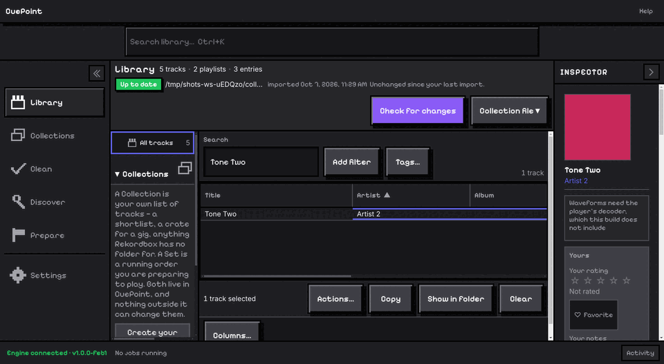

*An unmatched track (no token), then a matched track with applied values.*

#### INS-6 — Write rating and notes in plain words

**Recommendation**: Yes

**Mark**: **Yes** (2026-10-07, the recommendation)

**What**: "Rekordbox's" becomes "From Rekordbox". "Yours — Rekordbox's is ★★★" becomes "Your rating (Rekordbox has ★★★)". "Yours — Rekordbox never rated it" becomes "Your rating". "Clear override" becomes "Use Rekordbox's ★★★". The notes placeholder becomes "Anything you want to remember about this track. Kept in CuePoint."

**Why**: Point 6.

**Size**: S.

**Files**: `trackEdits.ts:66-83`, `TrackYours.tsx:198`, and their tests.

**Screenshots**:

*The rating row with Rekordbox's value; the 2-star change was not shot separately.*

#### INS-7 — Stop calling file metadata "tags"

**Recommendation**: Yes

**Mark**: **Yes** (2026-10-07, the recommendation)

**What**: "Tags written to the file." becomes "**Saved into the music file.**" "Restore the file's tags" becomes "Put the file back as it was". `writesLine` changes accordingly: "3 values saved into files can be put back." This pairs with LIB-6.

**Why**: Point 7.

**Size**: S.

**Files**: `TrackHistorySection.tsx:116-125`, `components/shell/activityActions.ts:108-118` (also used by Activity), and `WriteTagsDialog.tsx:238` (used by Clean).

**Screenshots**:

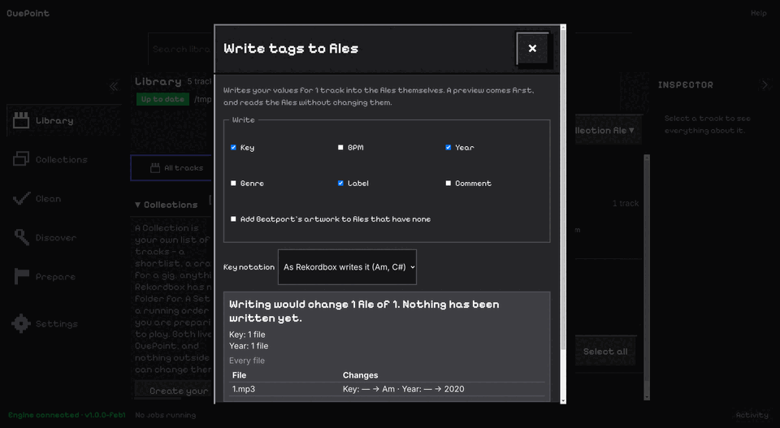

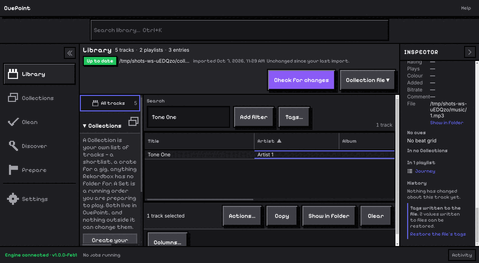

*The Write tags dialog on a matched real-audio track, and History after.*

#### INS-8 — Explain waveform and loudness states as steps

**Recommendation**: Yes

**Mark**: **Yes** (2026-10-07, the recommendation)

**What**: "Not checked yet" becomes "Waiting for CuePoint to find this file. The waveform is drawn after." "Waiting for analysis" becomes "Waveform not drawn yet. CuePoint is working through your library (see the status strip)." "Analysis paused" becomes "Waveforms are paused. Resume them in Settings." The loudness line gets the tooltip "Loudness (LUFS) is how loud the track sounds on average; Peak (dBFS) is its loudest moment. Closer to 0 is louder."

**Why**: Points 8 and 2, and DEC-132.

**Size**: S.

**Files**: `components/waveform/analysisWords.ts:89-115` (shared with the Waveform column, the player bar and Prepare), `TrackWaveform.tsx:86-90`, `loudnessWords.ts`.

**Screenshots**:

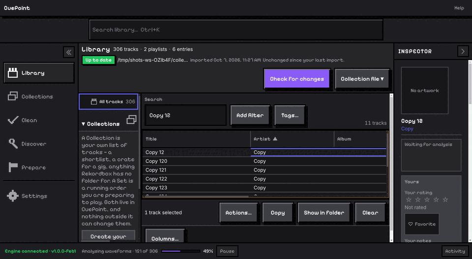

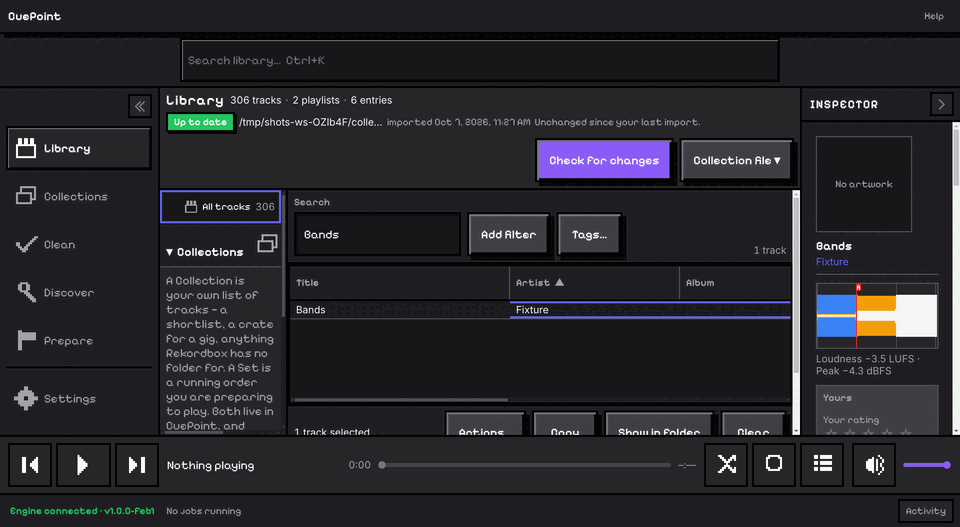

*Analysis was fast, so the "Waiting for analysis" text itself was not caught; the shots show mid-analysis and the ready state with the loudness line. The hover tooltip is not captured.*

#### INS-9 — Gloss the cue terms

**Recommendation**: Yes

**Mark**: **Yes** (2026-10-07, the recommendation)

**What**: The heading's tooltip: "Hot cues (A–H) and memory cues, as set in Rekordbox. Shown here, not editable." `trackMarks.ts:81` becomes "Cue points and the beat grid are read from Rekordbox. They appear after your next Refresh from Rekordbox." A variable grid gets the tooltip "The tempo changes during the track".

**Why**: Point 9.

**Size**: S.

**Files**: `trackMarks.ts:67-87`, `TrackMarksSection.tsx:30`.

**Screenshots**:

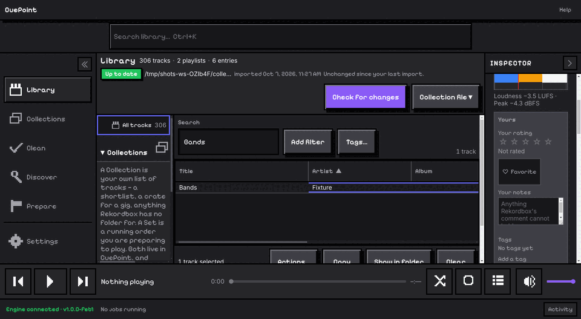

*A file with hot cue A and a 120 BPM grid.*

#### INS-10 — Turn "In no …" into the next step

**Recommendation**: Yes

**Mark**: **Yes** (2026-10-07, the recommendation); amended 2026-10-08: the hint points at the selection bar's Organize ▸, not a right-click

**What**: "In no Collections" becomes "Not in any Collection yet. Right-click the track and choose **Add to Collection…**, or drag it onto one." "In no playlists" becomes "Not in any Rekordbox playlist."

**Why**: Point 10.

**Size**: S.

**Files**: `TrackDetailPanel.tsx:367-440`.

**Screenshots**:

*The "In no Collections" and "In no playlists" lines.*

#### INS-11 — With a multi-selection, offer to edit all of them

**Recommendation**: Yes

**Mark**: **Yes** (2026-10-07, the recommendation); amended 2026-10-08: "Change all 4…" becomes "Edit values for 4 tracks…", since FLW-8 removes Actions… (Q-203)

**What**: Under "4 tracks selected — edits here change this one", add **Change all 4…**, which opens the same menu as **Actions…** (`LibraryScreen.tsx:1777-1801`).

**Why**: Point 11.

**Size**: S.

**Files**: `TrackDetailPanel.tsx:267-275` (a new `onActOnSelection` prop), `LibraryScreen.tsx:529-552`.

**Screenshots**:

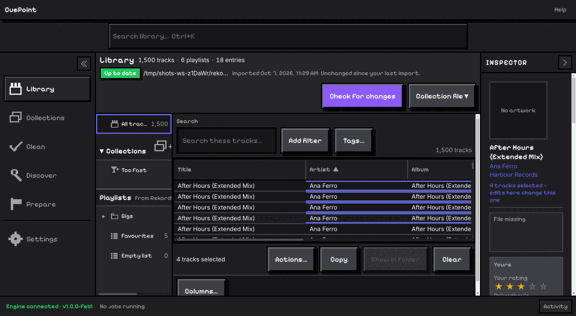

*Four rows Ctrl-clicked.*

## Clean

*Paths are relative to `apps/desktop-electron/renderer/src/screens/` unless they start with `src/` (the engine) or `e2e/`.*

### What it does

**Page states (`clean/CleanScreen.tsx`)**
- Loading: "Reading your library…" (:113).
- No library: title, subtitle "Match your library on Beatport, review what needs a look, and find what needs fixing." (:123-125), panel "No collection imported yet" / "Clean works on your library. Import a Rekordbox collection in the Library first." and **Go to the Library** (:127-132).
- Normal: an `h1` "Clean" and four tabs, **Review / Missing files / Duplicates / Health** (:141-148, labels `clean/cleanSections.ts:13-17`). There is no subtitle here, so the sentence that explains the page appears only when the library is empty. The page reopens on the tab used last (`cleanSections.ts:31-38`).

**Review tab (`clean/ReviewView.tsx`)**
- Toolbar (:544-595): **Show** select (Needs review [default], Disputed, Accepted, Rejected, No match, Not matched, `clean/cleanRules.ts:39-44`); **In** select ("The whole library", playlists, a disabled heading "CuePoint Collections", Sets shown as "(Set)", `cleanRules.ts:155-176`); a checkbox "Match again what is already matched" (:562-569); **Match selection** (:578); **Match all N** (:586); **Export review list…** (:593).
- A resume note when a match stopped part-way: "A match stopped with X of N tracks left. Resuming matches only those." + **Resume** (:596-605, `clean/cleanFormat.ts:154-160`).
- Review queue table (:609-625). Its columns are Title, Artist, Match ("Needs review · disputed", `clean/cleanColumns.tsx:39,47`), Key, BPM, Genre, Label, Year, plus Album, which is hidden.
- Selection bar: SelectionActions (copy, show in folder, select all, clear) and **Columns…** (:628-643).
- Comparison panel (`clean/ComparisonPanel.tsx`):
  - With no track chosen: "Choose a track to compare it with what Beatport found." (:131).
  - Header: artwork, title, artist, and a decision line such as "Accepted automatically" or "Needs review — a newer match disagrees" (`cleanFormat.ts:39-58`). An **Attempt** select appears when there is more than one attempt (:157-168).
  - States: "Reading its matches…" (:177), "This track has not been matched on Beatport yet." (:179), "Beatport found nothing for this attempt." / "This attempt failed: …" (:183-185).
  - The comparison table has a column per candidate. Each column head is a button "#1 · 94.0" (:217) with badges Accepted / Rejected / Proposed / Matcher's pick / Refused (`clean/comparison.ts:192-198`). The rows are:
    - Artwork, which says "Yes" or "On Beatport" (:233-242);
    - Title, Artists, Mix, Remixers, Label, Genre, Key, BPM, Year and Release, with "≠" where a value differs (:244-277);
    - the score rows Score, Before bonuses, Title similarity, Artist similarity, Year bonus, Key bonus, Guards and Found by (`comparison.ts:126-137`).
  - **Show all N candidates** (:303-309).
  - Decide group: **Accept #n**, **Reject**, **Clear decision**, **Re-match** and **Next** (:311-334).
  - After an accept, the "Apply from the accepted match" fieldset appears. It has checkboxes for Key, BPM, Genre, Label and Year, and an **Apply N fields** button (:336-364).
  - Key hint: "A accept · R reject · N next · ← → candidate · ↑ ↓ track" (:367-370).
  - A status line, for example "Accepted a match for “X”." (`cleanFormat.ts:163-176`).
- Export dialog "Export review list": a format select (CSV/Excel/JSON) and **Choose where to save…** (:673-697).
- Empty states (`clean/cleanEmpty.ts`):
  - "Nothing is matched yet." with the hint and **Show what is not matched** (:71-75, ReviewView:527-531);
  - one empty state per scope (:79-101).
- Background work: toasts "Matching N tracks on Beatport." and "Matching finished." (`cleanFormat.ts:141-146`, ReviewView:337-338), and "Stopped. What it had already done stays done." (`clean/useCleanJob.ts:98`). Progress is deliberately left to the status strip (`library/followJob.ts:4-7`). On the page, the only sign of a running match is the button's spinner.

**Missing files tab (`clean/MissingFilesView.tsx`)**
- Note: "CuePoint finds files that are not where Rekordbox says, and does not move them. To fix one, use Relocate in Rekordbox, export your collection again, then refresh the Library." (:189-191), and one line per drive that could not be reached: "At the last check: {summary}." (:194-196).
- Toolbar: **Check these again** (or **Check selected again**) (:215) and **Check every file** (:223). Table columns include File and "Expected at" (`cleanColumns.tsx:105,112`). Selection bar and Columns…
- Empty states: "Files have not been checked yet." with **Check every file** (`cleanEmpty.ts:112-115`), and "No missing files. Every file was there when CuePoint last checked, {when}." (:120-121).

**Duplicates tab (`clean/DuplicatesView.tsx`)**
- Note: "Possible duplicates are grouped by what they share. CuePoint deletes nothing: decide which copy to keep in Rekordbox, or mark a group as not duplicates." (:331-333).
- Toolbar: "N groups", a checkbox "Show groups marked not duplicates" (:346), and **Find duplicates**.
- Group card: a heading "Same file / Same Beatport track / Same artist and title · N tracks" (:64, `cleanFormat.ts:89-98`) with a reason line (`cleanFormat.ts:101-110`). Each member shows its duration, kbps, file status, path and **Show in folder** (:70-93). Then **Not duplicates** (or **Show as duplicates again**), **Tag these tracks…** and **Add to a Collection…** (:96-111). The badge reads "Marked not duplicates" (:67).
- **Show more groups** (:389), the picker dialog, and the "That is a lot of tracks" confirmation.
- Empty states: "Duplicates have not been looked for yet." with **Find duplicates** (`cleanEmpty.ts:133-137`), and "No possible duplicates." (:140-144).

**Health tab (`clean/HealthView.tsx`)**
- "Counting…" / "Nothing to count." (:113), and the drive notes (:121-129).
- Intro: "N tracks in your library. Each number opens the Library on exactly the tracks it counts." (:131-134).
- Count tiles, each a link to the Library. The labels come from the engine (`src/cuepoint/services/health_service.py:89-121`): Missing or unreadable files, In a duplicate group, Not matched, Needs review, Disputed by a newer match, No key, No BPM, No genre, No artwork.
- "Checks" list (:153-196): "Files checked", "Duplicates looked for", "Artwork read" and "Waveforms analysed" (`health_service.py:147-161`). Each has "Last run {when}" or "Never run" and a run button: **Check every file**, **Find duplicates**, **Read artwork** (:35-39), or **Pause / Resume / Analyse waveforms** for the waveforms.

### What a new user would not understand

1. **What "matching" is, and that it goes online.** The words "Match", "matched" and "Match all" are used without saying that CuePoint searches Beatport's website for each track, that this can take minutes, or what a match is for. The only explanation is the subtitle, and it shows only on an empty library (`CleanScreen.tsx:123-125`). The first real state a user meets is "Nothing is matched yet." (`cleanEmpty.ts:72`). Its button is **Show what is not matched**, which does not match anything. The user must then find **Match all N** (`ReviewView.tsx:586`), and nothing points them to it.
2. **Match-state vocabulary.**
   - "Needs review", "Disputed" and "No match" vs "Not matched" (`cleanRules.ts:39-44`) are two near-identical labels for different things.
   - "Disputed by a newer match" (`health_service.py:110`) is unclear.
   - The "· disputed" suffix (`cleanColumns.tsx:39`) is unclear.
   - "a newer match disagrees" (`cleanFormat.ts:58`) is unclear.
3. **Matcher internals shown as the main content.**
   - The column head "#2 · 91.1" (`ComparisonPanel.tsx:217`) shows a score with no scale.
   - The score rows "Before bonuses", "Title similarity", "Year bonus", "Key bonus", "Guards" and "Found by" (`comparison.ts:126-137`) are matcher internals.
   - The badges "Refused", "Matcher's pick" and "Proposed" (`comparison.ts:194-198`), and refusal texts such as "Refused: its title is only part of this track's title" (`cleanFormat.ts:70-85`), are unexplained.
4. **Accept vs Apply.** Accepting writes nothing. Applying copies values into CuePoint, not the file and not Rekordbox until an export. The page never says this. "Apply from the accepted match" (`ComparisonPanel.tsx:338`) and **Apply 2 fields** (:362) give no consequence. **Clear decision** (:326) and **Re-match** (:329) also say nothing about their effects. Re-match also overlaps with the toolbar checkbox "Match again what is already matched" (`ReviewView.tsx:568`).
5. **"Attempt"** select (`ComparisonPanel.tsx:160`). Its option text is "{date} — matched (latest, decided)" (:80-89).
6. **Keyboard hint as letters only** (`ComparisonPanel.tsx:367-370`). It is fine for experts. It reads as noise to others, and there is no way to hide it.
7. **Background work is invisible on the page.** A match of thousands of tracks shows only a spinner on the button and a toast. The table refreshes only when the job ends (`ReviewView.tsx:339-345`). The user is not told that they can leave the page.
8. **Health "Checks".**
   - "Read artwork" (`HealthView.tsx:38`) and "Artwork read" do not say what they do: they read the cover art embedded in the files.
   - "Waveforms analysed" does not explain itself.
   - "Last run" / "Never run" (:160-162) are terse.
   - The engine summaries are shown as raw text (:164-166).
9. **Missing files assumes Rekordbox knowledge.** "use Relocate in Rekordbox, export your collection again, then refresh the Library" (`MissingFilesView.tsx:190-191`) is three expert steps in one sentence, with no link to Refresh. "Unreadable" vs "Missing" is never explained (`cleanFormat.ts:112-125`).
10. **No counts on the tabs.** A user cannot see from the tabs where work is waiting. They have to open Health to learn that, for example, 40 tracks need review.
11. **"Export review list…"** (`ReviewView.tsx:593`). The page does not say why someone would want the file.

### Proposals

#### CLN-1 — Always show a one-line intro under the title

**Recommendation**: Yes

**Mark**: **Yes** (2026-10-07, the recommendation)

**What**:

Keep the subtitle in the normal state too. Above each tab, add one sentence:
- Review: "CuePoint looks each track up on Beatport. Sure matches are accepted for you; the rest wait here for a yes or no."
- Missing files: the existing note.
- Duplicates: the existing note.
- Health: the existing intro.

**Why**: DEC-132 plain words. Today the explanation is only on the empty page.

**Size**: S.

**Files**: `clean/CleanScreen.tsx`, `clean/ReviewView.tsx`, `clean/clean.css`.

**Screenshots**:

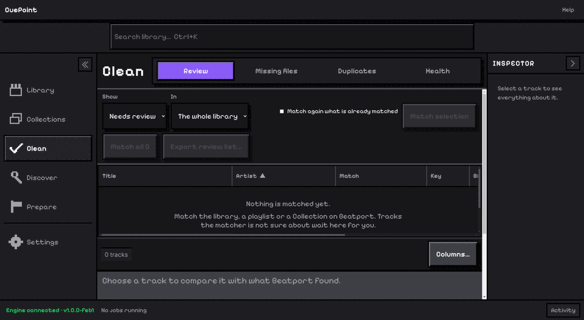

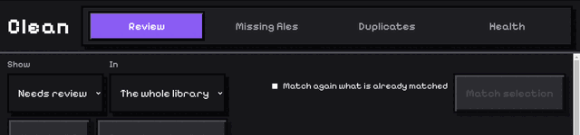

*There is no intro line today.*

#### CLN-2 — Make the first-visit empty state start matching

**Recommendation**: Yes

**Mark**: **Yes** (2026-10-07, the recommendation)

**What**: Replace "Nothing is matched yet." / **Show what is not matched** (`cleanEmpty.ts:71-75`) with the heading "Match your library on Beatport". Body: "CuePoint searches Beatport for each of your N tracks to find the right release, key and label. It runs in the background and can take a while for a big library; you can keep using the app." Primary button: **Match all N tracks**. Secondary: **Choose a playlist first**, which focuses the In select.

**Why**: DEC-132 says an empty state should say what to do next. Today it takes three clicks to find the real action.

**Size**: M (a new offer kind; it starts the match from the empty state).

**Files**: `clean/cleanEmpty.ts`, `clean/ReviewView.tsx`, `clean/cleanEmpty.test.ts`, `clean/CleanScreen.test.tsx`.

**Screenshots**:

*The "Nothing is matched yet." empty state.*

#### CLN-3 — Put work counts on the tabs

**Recommendation**: Yes

**Mark**: **Yes** (2026-10-07, the recommendation)

**What**: "Review (40)", "Missing files (3)", "Duplicates (5)". The numbers come from the Health counts already loaded (needs_review + disputed, missing_files, duplicates). Show no number at zero, and none for a check that has never run.

**Why**: It shows where work waits without opening Health.

**Size**: S–M (does `components/Tabs` accept badge text?).

**Files**: `clean/CleanScreen.tsx`, `clean/cleanSections.ts`, `components/Tabs.tsx`.

**Screenshots**:

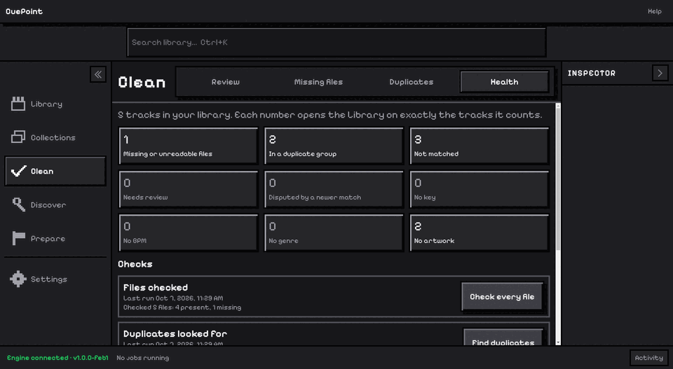

*The tabs have no counts, after a match and a file check.*

#### CLN-4 — Rename the match states in plain words

**Recommendation**: Yes

**Mark**: **Yes** (2026-10-07, the recommendation)

**What**:

Changes in `cleanRules.ts:39-44`, `cleanFormat.ts:21-58` and `cleanColumns.tsx:39`:
- "Needs review" → "Waiting for you";
- "Disputed" → "Changed since you decided", with hint "A newer search found a different best match than the one you chose.";
- "No match" → "Not found on Beatport";
- "Not matched" → "Not looked up yet";
- "Rejected" → "Rejected (no match)".

The Health labels in `health_service.py:99-111` change to match.

**Why**: "No match" and "Not matched" are indistinguishable today, and "Disputed" is jargon.

**Size**: S.

**Files**: The files above, plus `cleanEmpty.ts`, the e2e specs that assert these strings (`e2e/clean.spec.ts`, `e2e/cleanPage.spec.ts`), and engine tests for the Health labels.

**Screenshots**:

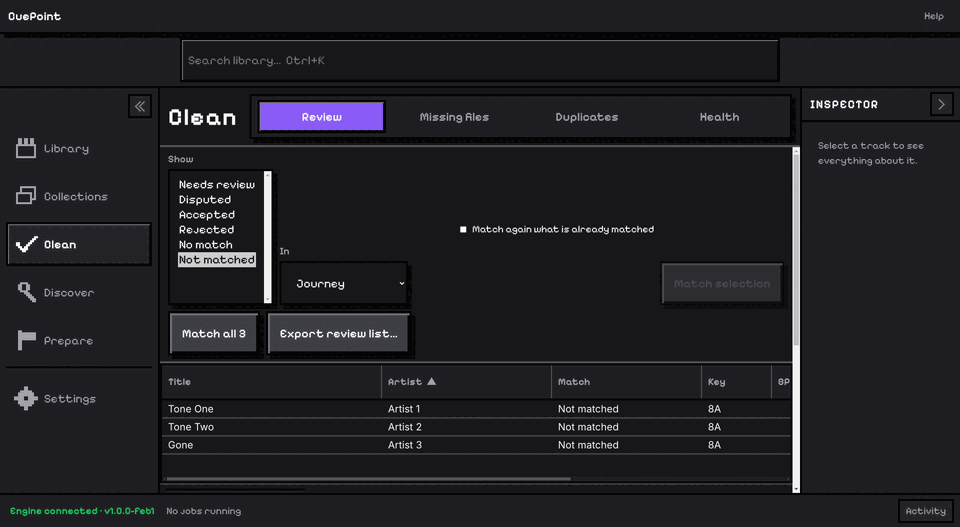

*The Show select drawn open, and the Match column values.*

#### CLN-5 — Hide the matcher's scoring behind "Why this score?"

**Recommendation**: Yes

**Mark**: **Yes** (2026-10-07, the recommendation)

**What**:

By default the comparison shows the value rows and one plain line per candidate such as "Very likely (94/100)", "Possible (71/100)" or "Ruled out: no artist in common". The rows Before bonuses / Title similarity / Artist similarity / Year bonus / Key bonus / Guards / Found by (`comparison.ts:126-137`) fold under a disclosure "Why this score?", and the choice is remembered.

Rename the badges: "Proposed" → "Suggested", "Matcher's pick" → "Best score", "Refused" → "Ruled out" (`comparison.ts:192-198`).

**Why**: The scoring internals dominate the panel for a new user.

**Size**: M.

**Files**: `clean/ComparisonPanel.tsx`, `clean/comparison.ts`, `clean/cleanFormat.ts`, `clean/clean.css`, `comparison.test.ts`, `e2e/clean.spec.ts` (it clicks `#n · 94.0`).

**Screenshots**:

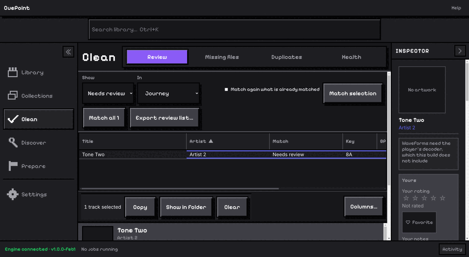

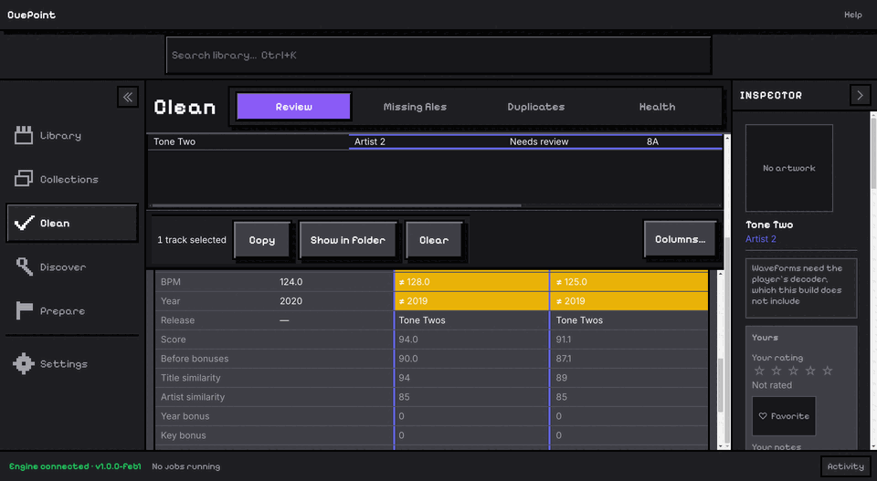

*Tone Two needs review, with the score rows visible. A "Refused" candidate is not in the stub, so it is not shown.*

#### CLN-6 — Say what Accept and Apply do

**Recommendation**: Yes

**Mark**: **Yes** (2026-10-07, the recommendation)

**What**:

Under the Decide group add "Accepting links this track to the Beatport release. It changes no values." Under the Apply legend (`ComparisonPanel.tsx:338`) add "Copies these values into CuePoint. Your audio files and Rekordbox are unchanged until you export; you can revert from the track's History."

Rename **Clear decision** → **Undo my decision**, and **Re-match** → **Search Beatport again**.

**Why**: DEC-004 separates the two acts, but nothing on screen tells the user that.

**Size**: S.

**Files**: `clean/ComparisonPanel.tsx`, `CleanScreen.test.tsx`.

**Screenshots**:

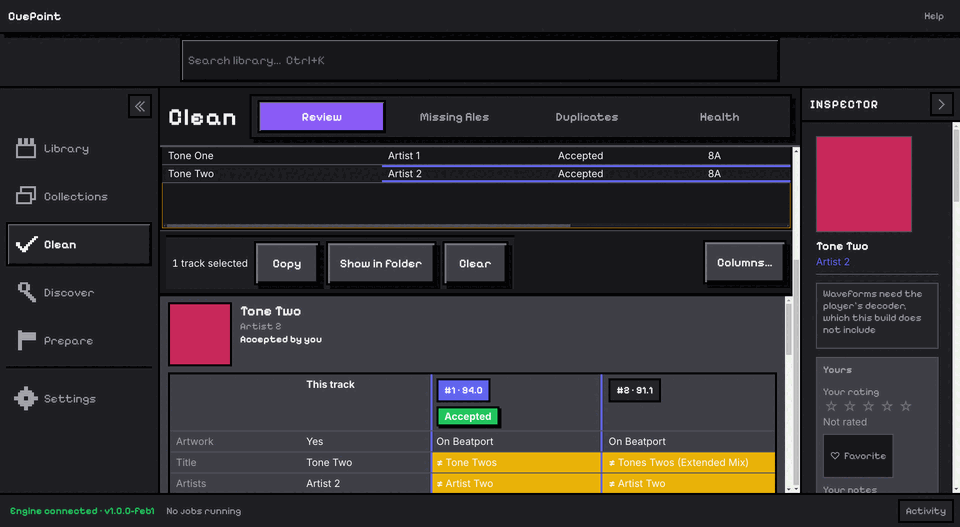

*An accepted track with the Apply fieldset.*

#### CLN-7 — Explain a running match on the page

**Recommendation**: Yes

**Mark**: **Yes** (2026-10-07, the recommendation)

**What**: While `jobs.running`, show a note above the queue: "Matching N tracks on Beatport. This runs in the background — the bar at the bottom shows progress, and you can leave this page. The list updates when it finishes." It reuses `matchStartedLine`. Optionally reload the queue every K tracks.

**Why**: DEC-132 asks for background work to be explained as it happens. Today there is a spinner and a toast.

**Size**: S (note only), M (with periodic reload).

**Files**: `clean/ReviewView.tsx`, `clean/cleanFormat.ts`.

**Screenshots**:

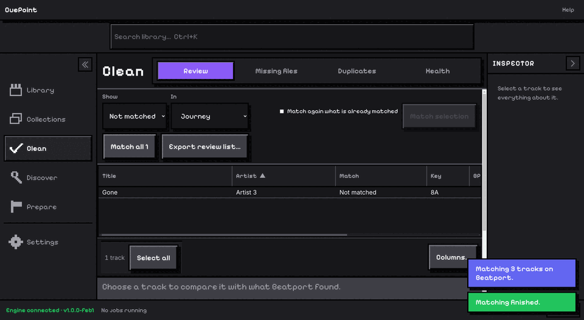

*The stub is fast, so the running shots show only a toast or spinner; no on-page note exists today.*

#### CLN-8 — Make Missing files say the fix in steps, with a link to Refresh

**Recommendation**: Yes

**Mark**: **Yes** (2026-10-07, the recommendation); amended 2026-10-08: its link reads "Check Rekordbox for changes" (Q-206)

**What**:

Replace the sentence at `MissingFilesView.tsx:190-191` with a numbered list: "1. In Rekordbox, right-click the track → Relocate, and point it at the file. 2. In Rekordbox, File → Export Collection in xml format. 3. Here, **Refresh the Library**." The last item is a button that goes to the Library's refresh.

Add a hint to the "Unreadable" status: "the file is there but CuePoint cannot open it".

**Why**: This is expert Rekordbox knowledge given in one sentence.

**Size**: S–M.

**Files**: `clean/MissingFilesView.tsx`, `clean/cleanFormat.ts`.

**Screenshots**:

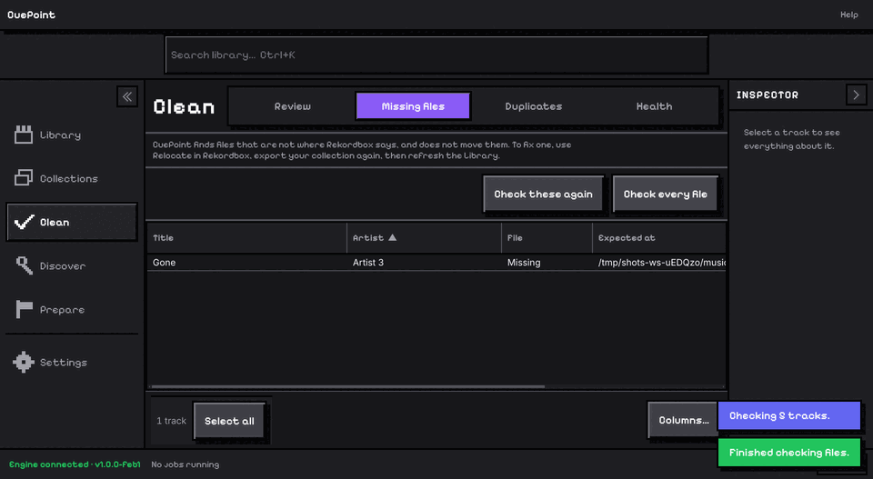

*The Missing files tab with "Gone" listed.*

#### CLN-9 — Rename the Health checks in plain words

**Recommendation**: Yes

**Mark**: **Yes** (2026-10-07, the recommendation)

**What**:

- "Files checked" → "Files on disk";
- "Duplicates looked for" → "Duplicate search";
- "Artwork read" → "Cover art in your files";
- the button **Read artwork** → **Read cover art**;
- "Waveforms analysed" → "Waveform drawing".

Add a one-line purpose under each (e.g. "Looks for tracks whose file has moved or been deleted"), and replace "Never run" with "Not done yet".

**Why**: The labels are verbs about internals, not outcomes.

**Size**: S.

**Files**: `src/cuepoint/services/health_service.py:147-161`, `clean/HealthView.tsx`, `HealthView.test.tsx`, `e2e/cleanPage.spec.ts` ("Files checked").

**Screenshots**:

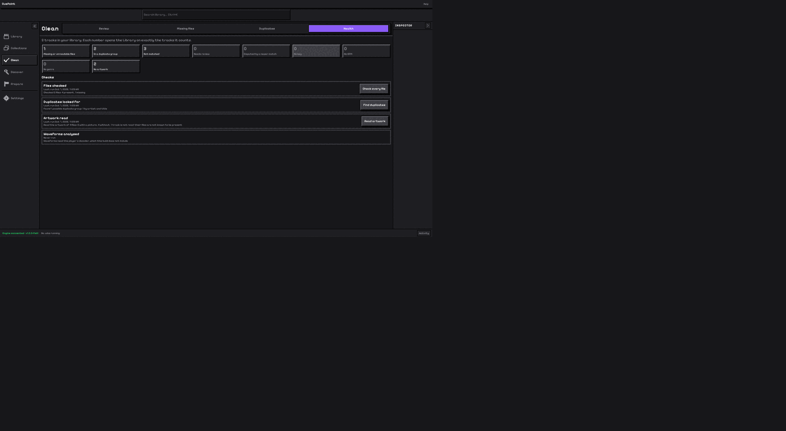

*Health after Check every file.*

#### CLN-10 — Merge the two re-match controls

**Recommendation**: Yes

**Mark**: **Yes** (2026-10-07, the recommendation)

**What**: Remove the toolbar checkbox "Match again what is already matched" (`ReviewView.tsx:562-569`). Instead make **Match all N** / **Match selection** a split choice in a small dialog: "Only tracks not looked up yet (N)" (default) or "Look all of them up again (M)".

**Why**: A persistent checkbox silently changes what the main button does.

**Size**: M.

**Files**: `clean/ReviewView.tsx`, `CleanScreen.test.tsx`.

**Screenshots**:

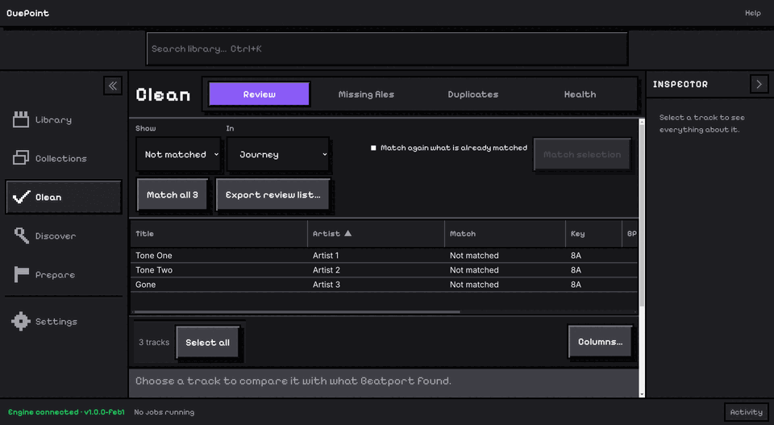

*The toolbar with the "Match again what is already matched" checkbox and Match all 3; the dialog does not exist yet.*

#### CLN-11 — Explain the Export review list

**Recommendation**: Yes

**Mark**: **Yes** (2026-10-07, the recommendation); amended 2026-10-08: named "Save review list as a file…" in Clean's header (FLW-13)

**What**: Rename the button **Export review list…** → **Save list as a file…**. The dialog text (`ReviewView.tsx:684-688`) becomes "Saves the N tracks shown — with their match state and Beatport link — as a spreadsheet you can share or check by hand."

**Why**: The page does not say why someone would want the file (point 11).

**Size**: S.

**Files**: `clean/ReviewView.tsx`.

**Screenshots**:

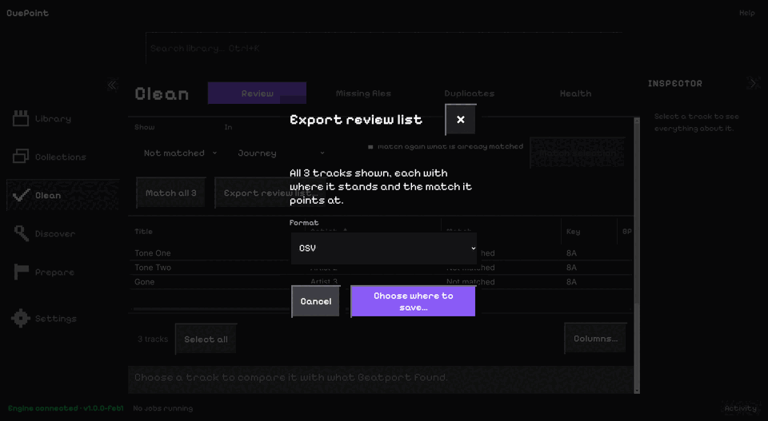

*The Export review list dialog.*

#### CLN-12 — Hide the keyboard hint until the user asks for it

**Recommendation**: Yes

**Mark**: **Yes** (2026-10-07, the recommendation)

**What**: Show the hint `ComparisonPanel.tsx:367-370` after the first arrow-key use, or behind a "Keyboard shortcuts" link. Write it as "A = accept, R = reject, N = next".

**Why**: The hint is letters only, which reads as noise to a new user (point 6).

**Size**: S.

**Files**: `clean/ComparisonPanel.tsx`.

**Screenshots**:

*The keyboard hint line in the panel; before and after a key press were not shot separately.*

*Not proposed (decided elsewhere):* DEC-136 lists library health in Statistics (Phase 15). Phase 15 should decide whether Clean's Health tab stays or is replaced by a link to it.

## Discover

*Paths are relative to `apps/desktop-electron/renderer/src/screens/` unless they start with `src/` (the engine) or `e2e/`.*

### What it does

Discover is one sidebar destination (`components/shell/navRegistry.ts:97`, `nested: true`). It holds the main page and two kinds of sub-page (Artist/Label and Similar tracks). The sub-pages are reached only from track menus elsewhere (`library/libraryDiscover.ts:90`).

**Page states (`discover/DiscoverScreen.tsx`)**
- "Opening Discover…" (:257). The failure panel is "Discover could not open" with the engine's message and **Try again** (:248-255). Without the engine, the message is "Discover needs the desktop app with the engine connected." (`discover/discoverTools.ts:26`).
- Header: `h1` "Discover", tabs **Runs / Wantlist** (:269-274, `discoverSections.ts:11-14`). There is no subtitle or intro.
- **Beatport banner** (:277-296; wording in `discover/beatportState.ts:51-90`):
  - "Beatport is not connected" — "Discover needs a Beatport token to run and to push playlists. Past runs and your wantlist still open without it." with **Open Settings**.
  - The other variants are "rejected the token", "refused this token … may be missing a scope", "limiting requests" and "cannot be reached". Each has **Open Settings** or **Try again**.
- **Resolve banner** (:298-309): "N matched tracks have not been read from Beatport yet. Reading them tells Discover which Beatport artists and labels your library holds, so runs and pages find them by id rather than by name." (`discoverFormat.ts:223-228`) with **Resolve Beatport identities** (:306).
- **Push result banner** (:311-336): "Added N tracks to “X” on Beatport. …" (`discoverFormat.ts:167-187`), **Open the playlist**, and a "×" dismiss.
- The Inspector says: "Tracks found on Beatport are not in your library, so there is nothing to inspect here. Select a track in the Library to see its details." (:63-68).

**Runs tab** (`discover/RunsView.tsx`, `RunList.tsx`, `NewRunPanel.tsx`, `RunDetail.tsx`)
- A. **Run list** (`RunList.tsx`):
  - **New run** button (:49);
  - "No runs yet. Start one to see what is new from your artists and labels." (:52);
  - items: date, state badge (Running/Finished/Stopped/Failed, `discoverFormat.ts:38-50`), summary "House, Techno · 30 days of releases" or "No charts · …" (`discoverFormat.ts:122-132`), and "N tracks found";
  - **Show older runs** (:76).
  - The list polls while a run is running (`RunsView.tsx:116-122`).
- B. **New run panel** (`NewRunPanel.tsx`). It opens by default when there are no runs (`RunsView.tsx:95`).
  - Intro: "A run reads charts your artists made in the genres you choose, and recent releases on your labels, and keeps what it finds." (:143-146).
  - Warnings: "Your library has no artists or labels yet. …" (:149-154), "CuePoint is still indexing your artists and labels, …" (:155-159).
  - "Chart genres (N chosen)" fieldset (:162-212):
    - **Find genres** filter;
    - a checkbox for every Beatport genre, with defaults from config (`src/cuepoint/services/discovery_service.py:369-381`);
    - **Charts from** / **Charts to** date fields, defaulting to the last 30 days (`discovery_service.py:107,379`);
    - when genres cannot be read: "Beatport's genres could not be read, so no charts can be chosen now."
  - "Releases from the last (days)" (:215-223).
  - Artists and Labels radio groups (:38-90): "Every artist in your library (N)", "Only the artists I choose" + **Choose artists…**, and "No artists".
  - "What to fix" problems list (:243-249, `newRun.ts:59-88`, e.g. "Charts are found through your artists: choose some, or no genres.").
  - **Start run**, with the hint "Needs a Beatport token, in Settings." (`beatportState.ts:114-116`) or "A run is already running." (:256-268).
- C. **Choose artists/labels dialog** (`ScopeDialog.tsx:63-104`):
  - a filter ("Type to narrow the list");
  - "N artists chosen";
  - checkboxes with track counts;
  - "Nothing matches.";
  - a truncation note;
  - **Done** / **Cancel**.
- D. **Run detail header** (`RunDetail.tsx:281-315`):
  - "Run of {date}", a badge, and **Delete run…** (disabled while running);
  - outcome line "Found N tracks from X charts and Y releases." or "Stopped because …" (`discoverFormat.ts:71-77`);
  - "What this run looked for": the charts line, releases line, "Artists: every artist in your library (N)" and Labels;
  - a disclosure "The N artists it looked for" (:70-80).
- E. **Run tracks toolbar** (:317-335):
  - checkbox "Show tracks you own" (off by default, :85);
  - "N owned tracks hidden" (:328);
  - "N found, M owned" (:333).
- F. **Beatport table** (`BeatportTable.tsx`, `beatportColumns.tsx:116-137`):
  - columns #, Title, Artists, Label, Released, BPM, Key, Genre, Release (hidden), Found in ("Chart “X” by A" / "{label}: “release”", `discoverFormat.ts:147-153`), Owned ("Owned") and Wantlist ("Wanted");
  - actions bar: count, **Add to wantlist**, **Push to Beatport playlist…**, **Open on Beatport** (`beatportActions.ts:59-79`), **Clear**, **Columns…**; the same items appear in a right-click menu;
  - empty states: "Nothing found yet." / "This run found nothing." / "You own every track this run found." + **Show them** (:255-275).
- G. **Push dialog** (`PushDialog.tsx:69-113`):
  - "Push to a Beatport playlist" — "Makes a new playlist on your Beatport account with …, in the order the table shows.";
  - Playlist name field (default from `IBeatportPlaylistService.default_name()`);
  - "Include tracks you already own";
  - **Push**.
  - Toast: "Pushing to Beatport. The status bar shows how far it has got." (`DiscoverScreen.tsx:191`).
- H. **Delete run dialog** (`RunDetail.tsx:371-382`): "Delete this run?" … **Keep it** / **Delete run**.

**Wantlist tab** (`discover/WantlistView.tsx`)
- I. Filters: **Owned** (Owned or not / Not owned / Owned only), **Bought** (Bought or not / Not bought / Bought only) (:43-53, :253-266), and a summary "N wanted tracks, X bought, Y owned" (:267-272).
- J. Table: the shared columns plus Note, Added, Bought (a date) and Owned (`beatportColumns.tsx:153-175`). Actions: **Edit note…**, **Mark bought** / **Mark not bought**, **Remove from wantlist**, Push, Open (`beatportActions.ts:97-100`).
- K. Empty states: "Your wantlist is empty. Select tracks in a run and choose Add to wantlist to keep them here." (:226-229), and "No wanted track matches these filters." + **Show every wanted track** (:233-243).
- L. Note dialog "Wantlist note": "Leave it empty to clear the note.", **Save note** (`NoteDialog.tsx`).

**Sub-pages**
- M. **Artist/Label page** (`discover/EntityScreen.tsx:240-347`):
  - header: kind and a badge "Beatport artist" / "Grouped by name" (`entityFormat.ts:33-35`);
  - the title is the name, or "Beatport artist 12345" when only the id is known (`entityFormat.ts:59`);
  - identity hint (`entityFormat.ts:38-53`) and redirect note (:98);
  - facts: "N tracks in your library", years, genres, and related labels/artists as links;
  - **Open in Library** and **Save as Smart Collection…**.
  - "Your tracks" half: a Library table (`LibraryHalf.tsx`).
  - "On Beatport" half (`BeatportHalf.tsx`):
    - "Asking Beatport…";
    - the state headlines "Several Beatport artists share this name", "Not found on Beatport" and "Known by name only" (`entityFormat.ts:102-110`), with **Resolve Beatport identities** / **Open Settings** / **Try again**;
    - toolbar: "N tracks released since D, M owned.", "Hide tracks you own" (off by default, :89,421), "From CuePoint's copy of Beatport's listing." / "Just read from Beatport." (`entityFormat.ts:113-115`), and **Read again**;
    - the Beatport table.
- N. **Similar tracks** (`discover/SimilarScreen.tsx:268-345`):
  - header: "Similar tracks", the seed title, linked artists, facts "128.0 BPM · 8A · House", and "Compared with N tracks in your library. K copies of this track left out." (`entityFormat.ts:134-137`);
  - the "This track has no BPM or key to compare." sentence (`similarReasons.ts:84-92`);
  - table: Title, **Reasons** ("Same key: 8A", "One step on the wheel: 8A → 9A", "Relative key", "Half time", `similarReasons.ts:36-71`), **Score** as a raw number (`similarColumns.tsx:60-67`), then the library columns;
  - empty state: "Nothing in your library is close enough to suggest."

### What a new user would not understand

1. **What Discover is for.** There is no subtitle or intro on the page (`DiscoverScreen.tsx:268-275`). The tabs are "Runs" and "Wantlist". "Run" is a programmer's word for "a search I started".
2. **"Beatport token".** The banner (`beatportState.ts:56-58`) assumes the user knows what a token is and where to get one. "may be missing a scope" (:73) is API language.
3. **"Resolve Beatport identities"** (`DiscoverScreen.tsx:306`). The prompt mentions "find them by id rather than by name" (`discoverFormat.ts:227`), which is internal. The prompt also does not say why the user should care.
4. **Charts.** "Chart genres" and "charts your artists made" (`NewRunPanel.tsx:144,164`) assume the user knows that Beatport DJ charts are lists published by artists. The validation "Charts are found through your artists: choose some, or no genres." (`newRun.ts:88`) is circular. The chart date fields are two more inputs a beginner does not need.
5. **Owned vs Bought vs Wanted.**
   - "Owned" means "in your library and matched on Clean" (DEC-092). The page never says that, so a track that is in the library but unmatched shows as not owned with no explanation.
   - "Bought" is the user's own mark. The filters "Owned or not" and "Bought or not" (`WantlistView.tsx:44,50`) look alike.
   - The column says "Wanted" while the header says "Wantlist" (`beatportColumns.tsx:110-113`).
6. **The run toolbar says the same thing twice:** "12 owned tracks hidden" (`RunDetail.tsx:328`) and "40 found, 12 owned" (:333).
7. **"Push to Beatport playlist…"** (`beatportActions.ts:59`). "Push" is developer jargon. The page does not say that a new playlist is made each time.
8. **"Found in"** column. For label releases it reads "{label}: “release”" (`discoverFormat.ts:152`) and does not say that the first name is a label.
9. **Artist page identity.** The badge "Grouped by name" and the title "Beatport artist 12345" (`entityFormat.ts:34,59`) are unexplained. So are "Known by name only" and "From CuePoint's copy of Beatport's listing." (:106,115).
10. **Similar tracks.** The "Score" column is a bare number (`similarColumns.tsx:66`). "One step on the wheel" and "Relative key" (`similarReasons.ts:57-59`) assume the user knows harmonic mixing.
11. **The pages hidden inside Discover.** Artist/Label pages and Similar tracks live under Discover, but nothing on the Discover page mentions them or leads to them.

### Proposals

**Inventory: every part, with a recommendation.**

| # | Part | Where | Recommendation |
|---|---|---|---|
| 1 | Page header and the Runs/Wantlist tabs | `DiscoverScreen.tsx:268-275` | **Change**: add an intro line and rename "Runs" (DSC-1, DSC-2) |
| 2 | Beatport-not-connected banner and its variants | `beatportState.ts:51-90` | **Change**: plain words and a "how to get a token" link (DSC-3) |
| 3 | Resolve banner and **Resolve Beatport identities** | `DiscoverScreen.tsx:298-309` | **Change**: plain words, and resolve automatically after matching (DSC-4) |
| 4 | Push result banner | `DiscoverScreen.tsx:311-336` | **Keep**: rename "push" only (DSC-7) |
| 5 | Run list, with New run, items and Show older runs | `RunList.tsx` | **Keep**; wording via DSC-2 |
| 6 | New run panel: intro, genres and scopes | `NewRunPanel.tsx:140-241` | **Change**: explain charts; move the chart dates under "More options" (DSC-5) |
| 7 | Chart dates **Charts from / Charts to** | `NewRunPanel.tsx:194-211` | **Remove from the default view**, behind "More options" (DSC-5) |
| 8 | Choose artists/labels dialog | `ScopeDialog.tsx` | **Keep** |
| 9 | Run detail header and "What this run looked for" | `RunDetail.tsx:285-314` | **Keep**; title wording via DSC-2 |
| 10 | Run tracks toolbar (two count lines) | `RunDetail.tsx:317-335` | **Change**: merge into one line (DSC-6) |
| 11 | Beatport table, actions and right-click menu | `BeatportTable.tsx`, `beatportActions.ts` | **Keep**; rename Push (DSC-7) |
| 12 | Columns: Found in, Owned, Wantlist | `beatportColumns.tsx:96-137` | **Change**: wording (DSC-6, DSC-8) |
| 13 | Push dialog | `PushDialog.tsx` | **Keep**; wording (DSC-7) |
| 14 | Delete-run dialog | `RunDetail.tsx:371-382` | **Keep** |
| 15 | Wantlist filters, summary and table | `WantlistView.tsx:251-293` | **Change**: explain owned vs bought (DSC-6) |
| 16 | Wantlist note dialog, Mark bought and Remove | `NoteDialog.tsx`, `beatportActions.ts:97-100` | **Keep** |
| 17 | Inspector empty text | `DiscoverScreen.tsx:63-68` | **Keep** |
| 18 | Artist/Label page | `EntityScreen.tsx`, `BeatportHalf.tsx` | **Change**: identity wording (DSC-9) |
| 19 | Similar tracks | `SimilarScreen.tsx`, `similarColumns.tsx` | **Change**: Score as a word, and explain key terms (DSC-10) |
| 20 | Way into the sub-pages from Discover | none today | **Change (add)**: a hint card (DSC-11) |
| 21 | Loading and could-not-open states | `DiscoverScreen.tsx:241-260` | **Keep** |

No part is recommended for full removal. The chart date fields leave the default view. One of the two duplicate count lines in the run toolbar goes. No like/dislike feature is proposed (DEC-130).

#### DSC-1 — Add an intro line to the page

**Recommendation**: Yes

**Mark**: **Yes** (2026-10-07, the recommendation)

**What**: Under the `h1` add "Find new music from the artists and labels already in your library, keep what you want on a wantlist, and send it to a Beatport playlist."

**Why**: The page has no explanation at all (DEC-132).

**Size**: S.

**Files**: `discover/DiscoverScreen.tsx`, `discover/discover.css`.

**Screenshots**:

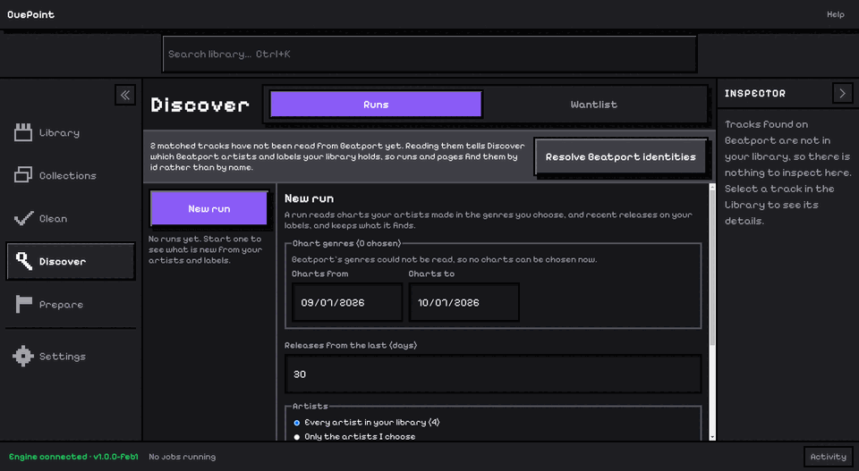

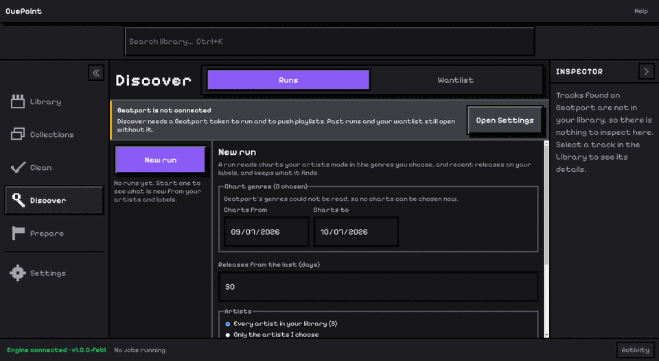

*There is no intro line today.*

#### DSC-2 — Rename "Run" to plain words

**Recommendation**: Yes

**Mark**: **Yes** (2026-10-07, the recommendation); amended 2026-10-08: FLW-15's tabs, New search, Results and Wantlist, replace the tab names (PAGES-08)

**What**:

- tab "Runs" → "New music";
- **New run** → **Look for new music**;
- **Start run** → **Start looking**;
- "Run of {date}" → "Search of {date}";
- **Delete run…** → **Delete this search…**;
- "No runs yet. Start one…" → "Nothing looked for yet. Choose genres and press Start looking to see what's new from your artists and labels.";
- "Show older runs" → "Show older searches".

The engine's word "run" stays internal (`discoverSections.ts:12`, `RunList.tsx:49,52,76`, `NewRunPanel.tsx:142,263`, `RunDetail.tsx:292,301`).

**Why**: "run" is jargon.

**Size**: S (wording).

**Files**: Many tests assert these strings: `DiscoverScreen.test.tsx`, `e2e/discover.spec.ts`, `e2e/discoverPages.spec.ts`.

**Screenshots**:

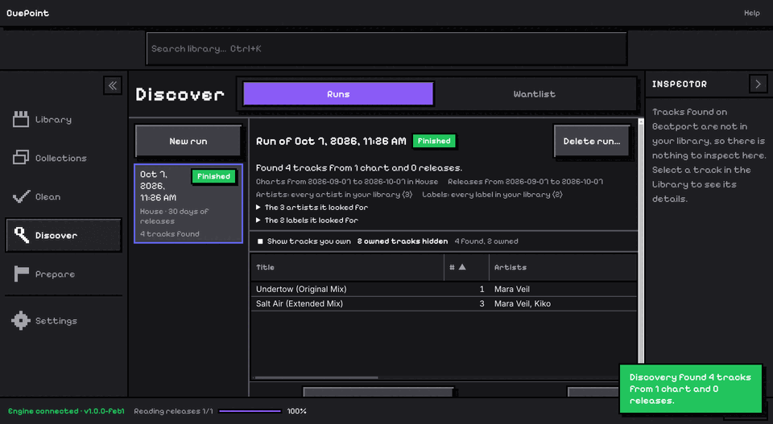

*The Runs tab, New run, "No runs yet", Start run, "Run of {date}" and Delete run….*

#### DSC-3 — Explain the token in the banner

**Recommendation**: Yes

**Mark**: **Yes** (2026-10-07, the recommendation)

**What**:

The headline becomes "Connect your Beatport account". The hint is "Discover reads Beatport's charts and releases with your Beatport sign-in key (a "token"). Paste it in Settings — the guide shows where to find it. Your past searches and wantlist still open without it." Add a **How do I get one?** link to the user-guide page.

In place of "may be missing a scope" (`beatportState.ts:73`), say "Beatport accepted the key but won't allow this action with it."

**Why**: "token" and "scope" are API words.

**Size**: S.

**Files**: `discover/beatportState.ts`, `DiscoverScreen.tsx`, and `docs/user-guide/` (a link target).

**Screenshots**:

*The no-token banner; Open Settings lands on the token field.*

#### DSC-4 — Make resolving plain, and automatic

**Recommendation**: Yes

**Mark**: **Yes** (2026-10-07, the recommendation)

**What**:

The prompt becomes "N of your matched tracks still need their Beatport artist and label looked up. This makes artist pages and searches more accurate." The button **Resolve Beatport identities** → **Look them up now**. The same rename applies on the Artist page's Beatport half.

Optionally (M), start the resolve automatically after a Clean match finishes when a token is set, so the banner rarely appears.

**Why**: The wording is internal and the action is busywork.

**Size**: S (wording) or M (automatic; an engine or Clean hook).

**Files**: `discover/discoverFormat.ts:223-228`, `DiscoverScreen.tsx:306`, `BeatportHalf.tsx`, and the engine job trigger if automatic.

**Screenshots**:

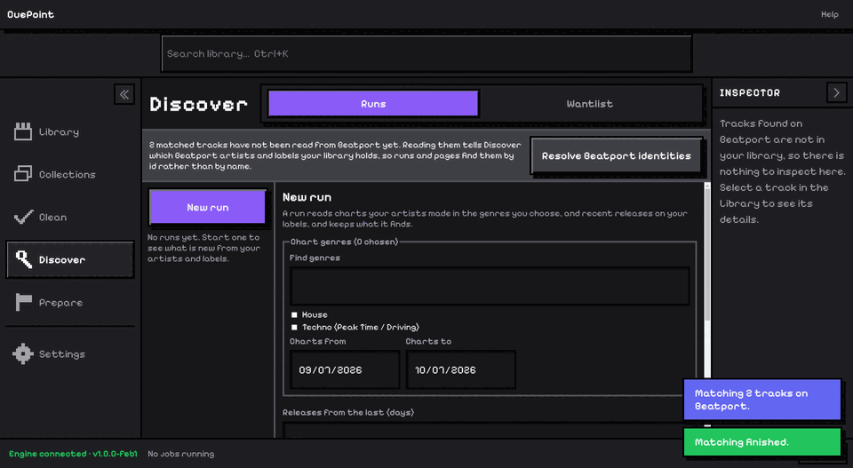

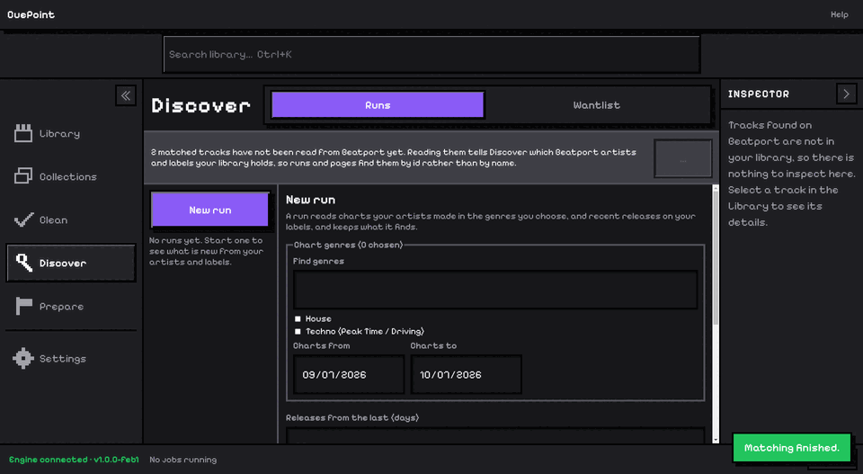

*After matching 2 tracks; the running shot shows only a toast.*

#### DSC-5 — Explain charts, and move the dates under "More options"

**Recommendation**: Yes

**Mark**: **Yes** (2026-10-07, the recommendation)

**What**:

- the legend "Chart genres" → "Genres for DJ charts";
- add "On Beatport, artists publish charts — short lists of tracks they play. CuePoint reads the charts made by artists in your library, in the genres you tick.";
- **Charts from / Charts to** (`NewRunPanel.tsx:194-211`) fold under a "More options" disclosure, with the default "last 30 days" shown as text;
- the problem text `newRun.ts:88` becomes "Charts come from your artists. Choose some artists, or untick every genre."

**Why**: Four concepts at once for a beginner.

**Size**: M.

**Files**: `discover/NewRunPanel.tsx`, `discover/newRun.ts`, `discover/discover.css`, `DiscoverScreen.test.tsx`, `discoverPure.test.ts`.

**Screenshots**:

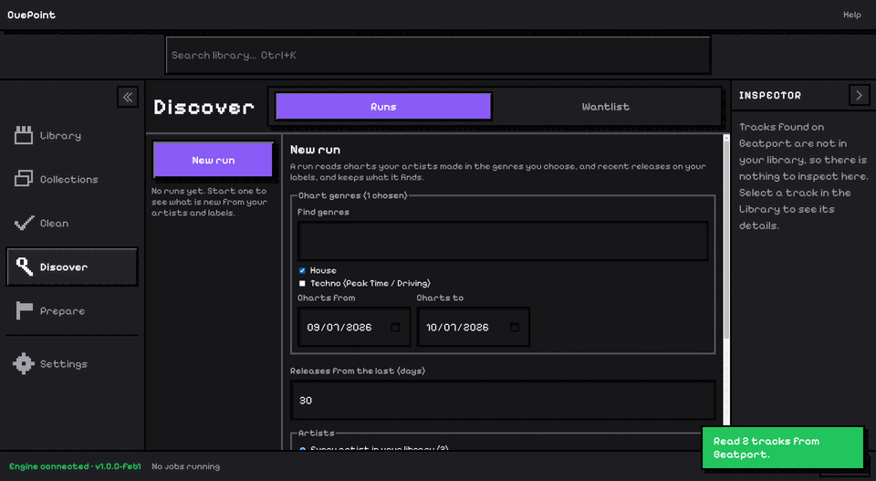

*House ticked, with Chart genres and Charts from/to visible; there is no More options today.*

#### DSC-6 — Explain "owned" once, and merge the duplicate counts

**Recommendation**: Yes

**Mark**: **Yes** (2026-10-07, the recommendation)

**What**:

- the column "Owned" → "In your library";
- the run toolbar's two lines (`RunDetail.tsx:328,333`) become one: "40 found · 12 already in your library (hidden)";
- add a tooltip or "?" on "In your library": "Tracks you've matched on the Clean page. Match more tracks there to hide more of what you already have.";
- the Wantlist filters become **In your library:** Any / No / Yes and **Marked bought:** Any / No / Yes (`WantlistView.tsx:43-53`);
- the column value "Wanted" → "On wantlist".

DSC-6 (part b): the run detail hides owned tracks by default ("Show tracks you own", `RunDetail.tsx:85,324`). The Artist page shows them by default ("Hide tracks you own", `BeatportHalf.tsx:89,421`). Use one checkbox wording and one default on both.

**Why**: DEC-092's rule is invisible. The bought/owned pair confuses.

**Size**: S–M.

**Files**: `discover/beatportColumns.tsx`, `discover/RunDetail.tsx`, `discover/WantlistView.tsx`, `discover/discoverFormat.ts:161-164`, `BeatportHalf.tsx:413,421` (also flip "Hide tracks you own" to the same wording and default as runs, DSC-6 (part b)).

**Screenshots**:

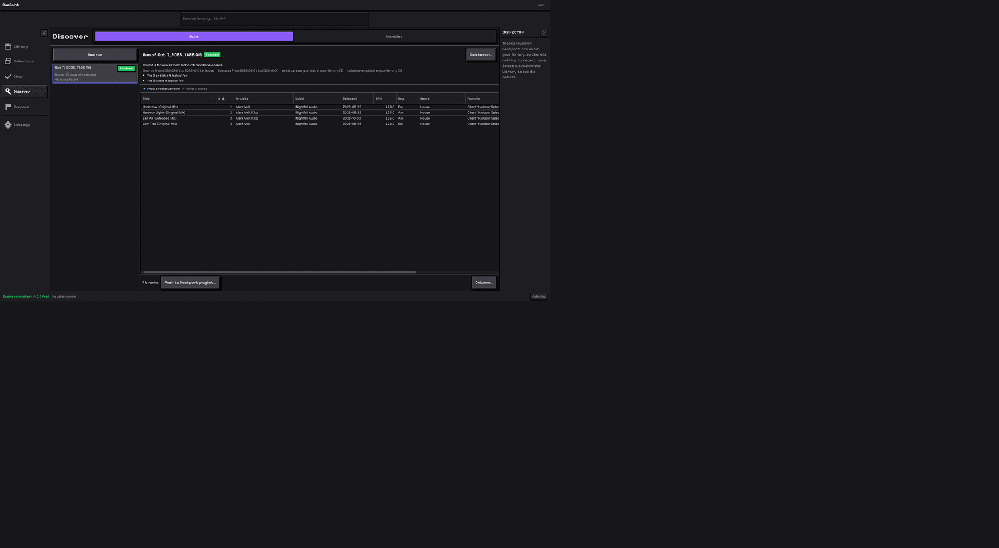

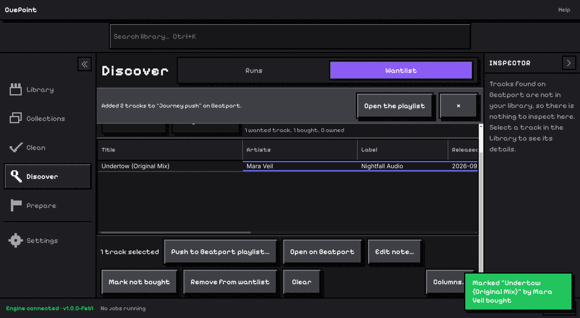

*Two toolbar count lines and 2 owned tracks hidden, then the Wantlist filters.*

#### DSC-7 — Rename "Push"

**Recommendation**: Yes

**Mark**: **Yes** (2026-10-07, the recommendation)

**What**:

- **Push to Beatport playlist…** → **Make a Beatport playlist…** (`beatportActions.ts:59`);
- the dialog title → "Make a playlist on Beatport", and the button **Push** → **Make playlist**;
- toasts and banners say "Making the playlist on Beatport…" and "Made “X” on Beatport with N tracks." (`discoverFormat.ts:167-187`, `DiscoverScreen.tsx:191`, `BeatportHalf.tsx:260`).

**Why**: "Push" is developer jargon, and the page does not say that a new playlist is made each time (point 7).

**Size**: S.

**Files**: Those files, plus the tests and `e2e/discoverPages.spec.ts:361-388`.

**Screenshots**:

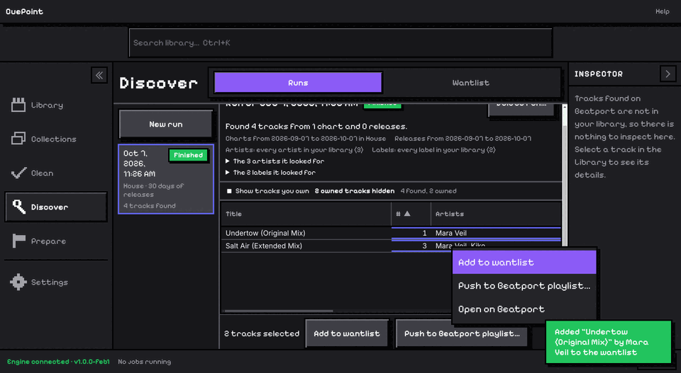

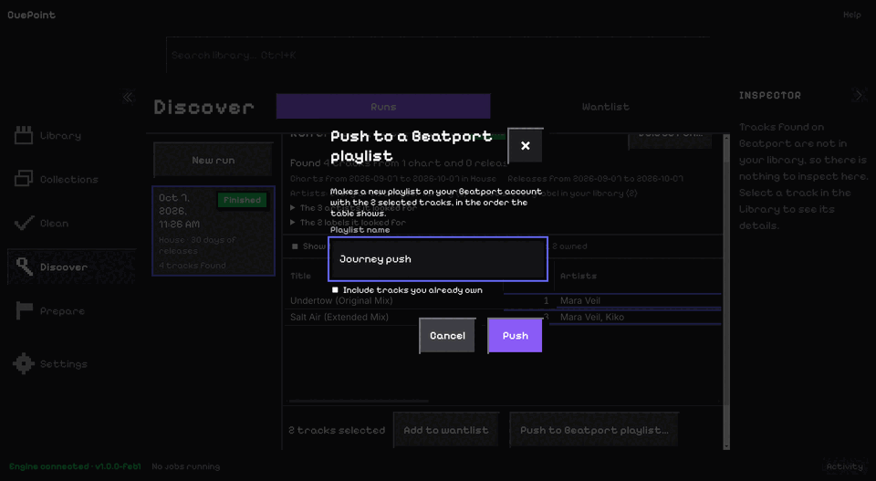

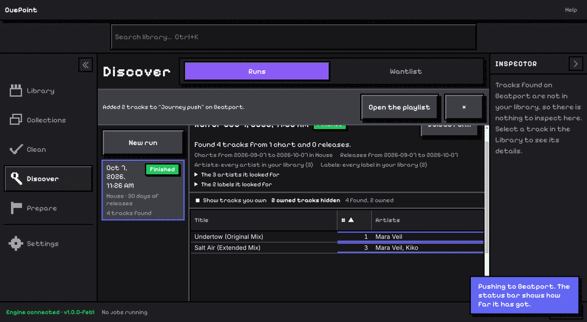

*The Push to Beatport playlist… menu, the dialog and the result banner.*

#### DSC-8 — Say what the "Found in" column means

**Recommendation**: Yes

**Mark**: **Yes** (2026-10-07, the recommendation)

**What**: The column → "Why it's here". Values: "On a chart by {artist}: “{chart}”" and "New on {label}: “{release}”" (`discoverFormat.ts:147-153`).

**Why**: The column does not say that the first name can be a label (point 8).

**Size**: S.

**Files**: `discover/discoverFormat.ts`, `discover/beatportColumns.tsx:131`, `discoverPure.test.ts`.

**Screenshots**:

*The "Found in" column; no label-release row appears in the stub shots.*

#### DSC-9 — Make Artist and Label identity plain

**Recommendation**: Yes

**Mark**: **Yes** (2026-10-07, the recommendation)

**What**:

- the badge "Grouped by name" → "Your tracks by this name";
- "Beatport artist" → "Linked to Beatport";
- never use "Beatport artist 12345" as a title: fall back to the most common spelling from the library, then "Unknown artist" (`entityFormat.ts:57-60`);
- "Known by name only" → "Not linked to Beatport yet";
- "From CuePoint's copy of Beatport's listing." → "Saved earlier from Beatport — Read again for the latest.";
- **Read again** → **Check Beatport again**.

**Why**: The page's words name CuePoint's internals (grouping, ids, a cached copy) where a DJ wants to know whether the artist is on Beatport and how fresh the data is (DEC-132).

**Size**: S (wording), M (the title fallback may need engine data).

**Files**: `discover/entityFormat.ts`, `BeatportHalf.tsx`, `EntityScreen.test.tsx`.

**Screenshots**:

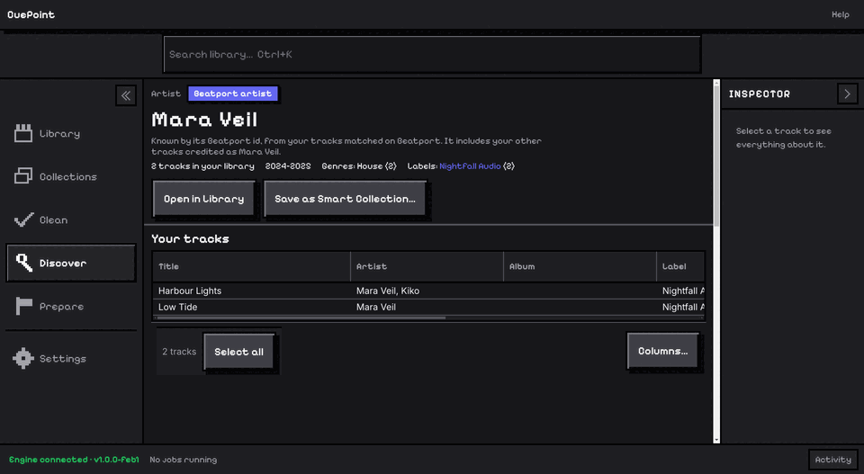

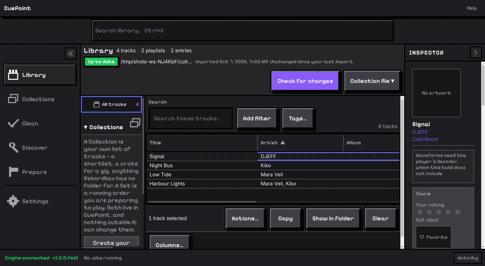

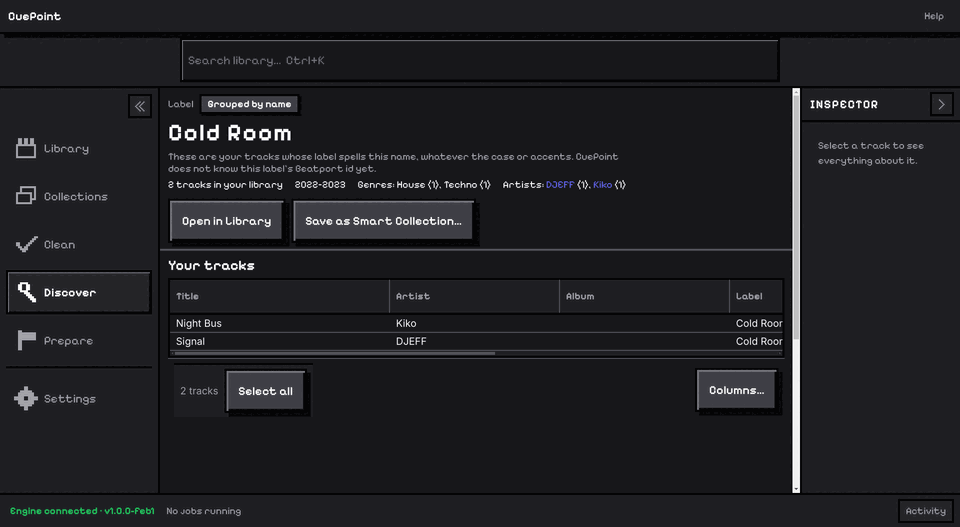

*"Beatport artist" and "Grouped by name" / "Known by name only". The "Beatport artist 12345" title case is not reachable, so it is not shown.*

#### DSC-10 — Make Similar tracks readable

**Recommendation**: Yes

**Mark**: **Yes** (2026-10-07, the recommendation)

**What**:

The Score column → "Match", shown as "Strong / Good / Some" bands (keep the number in a tooltip). Reasons:
- "One step on the wheel: 8A → 9A" → "Mixes well (next key): 8A → 9A";
- "Relative key" → "Mixes well (relative key)";
- "Half time" → "Half the tempo".

Add a header line "Tracks from your library that would mix well after this one."

**Why**: There are bare numbers and harmonic-mixing terms. (The Camelot wheel itself is DEC-133's and is not proposed here.)

**Size**: S–M.

**Files**: `discover/similarColumns.tsx`, `discover/similarReasons.ts`, `discover/entityFormat.ts:134-137`, `SimilarScreen.tsx`, `similarReasons.test.ts`.

**Screenshots**:

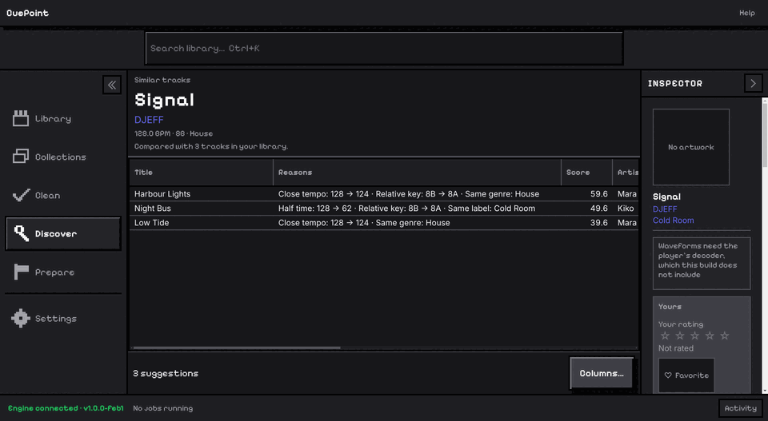

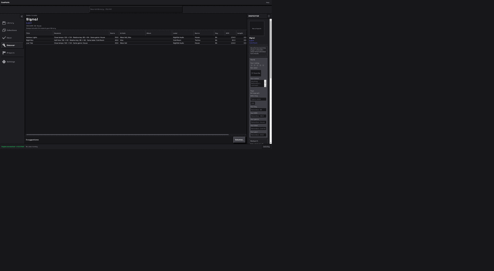

*The Score column and "One step on the wheel" reasons.*

#### DSC-11 — Point to the sub-pages from Discover

**Recommendation**: Yes

**Mark**: **Yes** (2026-10-07, the recommendation); amended 2026-10-08: the card points at the artist and label links and at Track details' Similar tracks, not a right-click

**What**:

Add a small card on the New music tab: "Also in Discover: right-click any track in the Library for **Similar tracks** (what mixes well from your own library) or its **artist** and **label** pages."

Show it once and allow it to be dismissed (localStorage).

**Why**: Two of Discover's three features cannot be found from Discover.

**Size**: S.

**Files**: `discover/RunsView.tsx` or `DiscoverScreen.tsx`, `discover/discover.css`.

**Screenshots**:

*No hint card exists today; this is the page it would go on.*

#### DSC-12 — Explain running work on the page

**Recommendation**: Yes

**Mark**: **Yes** (2026-10-07, the recommendation)

**What**:

While a search runs, the run header adds "This can take a few minutes. It keeps going if you leave this page; the bar at the bottom shows progress." (`RunDetail.tsx:304`, `discoverFormat.ts:72`).

While resolving, the resolve banner reads "Looking up N tracks on Beatport…" in place of only a spinner (`DiscoverScreen.tsx:298-309`).

**Why**: A run or a resolve shows only a spinner, so it is not clear the work keeps going after leaving the page (DEC-132: background work explained).

**Size**: S.

**Files**: `discover/RunDetail.tsx`, `discover/discoverFormat.ts`, `discover/DiscoverScreen.tsx`.

**Screenshots**:

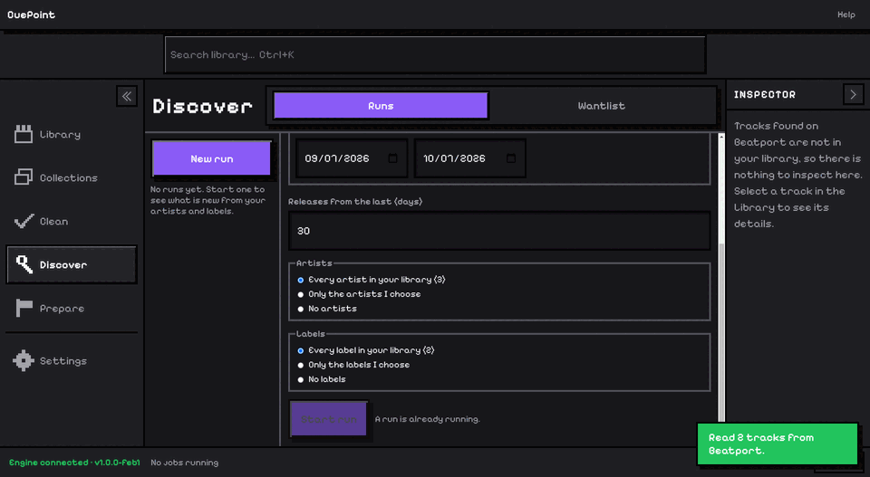

*A run in flight (the button says a run is already running), and a resolve that shows only a toast.*

## Prepare

*Paths are relative to `apps/desktop-electron/renderer/src/` unless they start with `e2e/` or `docs/`.*

### What it does

Route `/prepare` reopens the last Set or the first (`screens/prepare/PrepareScreen.tsx:174-178`);
`/prepare/:setId` opens one. Sidebar entry "Prepare" (`components/shell/navRegistry.ts:98`).

**States before a Set is drawn**
- No Sets bridge (browser tab): panel "Prepare", "Prepare needs the desktop app with the engine connected." (`PrepareScreen.tsx:675-683`, `prepareFormat.ts:190`).
- No Sets at all: panel "Prepare a Set", the WHAT_A_SET_IS paragraph (`prepareFormat.ts:184-187`), buttons **New Set** and **New Set from…** (`PrepareScreen.tsx:691-707`). This is the only place on the page these two buttons exist.
- Tree failed: panel "Prepare", the error, **Try again** (`PrepareScreen.tsx:708-714`).
- Loading: bare text "Reading your Sets…" (`:716`) / "Reading the Set…" (`:741`).
- Bad address: "This address names no Set." + **Open your Sets** (`:726-732`).
- Set failed: panel "The Set could not open", problem text, **Try again** (`:733-739`).
- Set deleted elsewhere: warning toast "The Set that was open is not there any more." (`:127`, `:160-168`).

**Dialogs reached from the empty state**
- "New Set": Name (placeholder "Friday at the Warehouse"), "In" (folder, "Top level"), **Make the Set** (`NewSetDialogs.tsx:65-98`).
- "New Set from…": "Copy the tracks of" grouped select, "(Smart)" suffix, **Continue…**; empty: "There is nothing to copy yet: make a Collection in the Library, or import a Rekordbox collection with playlists." (`NewSetDialogs.tsx:127-161`), then the Library's `NewSetFromDialog`.

**Header (one line, DEC-112)** — `PrepareScreen.tsx:845-911`
- Set picker select, which is also the page title; folders are listed but disabled, indented with ideographic spaces (`:850-863`).
- **Play Set** (disabled when empty or no player) (`:864-866`).
- **Export ▾** → "Save set list…", "Copy set list", "Export to Rekordbox…" (`:867-877`, `:952-969`).
- Facts line (`prepareFormat.ts:67-93`): "N entries" · "1:34:20 planned · 3 untimed" · "No warnings"/"N warnings · M accepted" (title lists kinds, e.g. "key clashes", "chapters outside their BPM ranges", `:49-60`) · "Files never checked"/"N files never checked".
- Link-styled **Notes…** (title: "Notes for the whole Set: the venue, the times, anything to remember", `prepareFormat.ts:180`) and **View ▾** → "Show/Hide tempo and key lanes", "Show/Hide transition strip", "Columns…" (`PrepareScreen.tsx:886-909`, `:971-991`).

**Left pane: the Set** (`PrepareScreen.tsx:761-838`)
- Optional tempo/key lanes: gutter labels "BPM" with range and "Key 1A–12B" (`SetLanes.tsx:65-74`); clicking a mark selects the entry.
- Optional transition strip: the selected entry's waveform beside the next one's, "In 0:16 · Out 5:42", "Untimed", integrated loudness (LUFS) and an "LU" difference, "End of Set", "Select an entry to see its transition" (`transitionStrip.ts:26-95`, `SetTransition.tsx:95-110`, `components/waveform/loudnessWords.ts:53-63,142-147`).
- Table columns: "#", "Starts", "In", "Out", "Planned", "Title", "Artist", "BPM", "Key", "Transition", "Note" (`prepareColumns.tsx:27-162`). Chapter heading rows ("Chapter 1", "9:00 of 8:00", BPM range "120–123"). Warning cells: "+12% tempo", "Key clash", "No BPM", "No key", "Past the end", "Over target", "Outside BPM range", "… accepted" (`prepareFormat.ts:114-165`).
- Empty Set: "This Set is empty. Add tracks with “Add to Set…” in the Library, or drop them on the Set in the Collections tree." (`prepareFormat.ts:193-194`); the note is a drop target (`PrepareScreen.tsx:813-832`).
- Gestures: click/shift-select, double-click plays from there, drag to reorder, double-click a heading opens the chapter dialog.
- Entry menu: "Play Set from here", "Play next", "Add to queue", "Start a chapter here", "Insert a repeat after", "Remove from Set", + Discover items (`prepareMenus.ts:39-61`). Heading menu: "Rename, targets and notes…", "Move chapter up/down", "Delete chapter…" (`:89-105`).
- Chapter dialog: Name ("Blank leaves the chapter unnamed."), Target length ("As m:ss or h:mm:ss. Blank for none."), Lowest/Highest BPM, error "A BPM is a number above zero, or blank for no limit." (`ChapterDialog.tsx:55-134`). Delete confirm explains where entries go (`prepareFormat.ts:201-213`).

**Right pane: source panel "Add to the Set"** (`SourcePanel.tsx:170-226`), resizable divider (`PrepareLayout.tsx:90-110`)
- Tabs **Suggestions** / **Library**; pool select (aria "From", title "Where Suggestions and the search look…", `:173-186`); **Insert here** / "Insert 3 here" (`prepareSource.ts:325-328`).
- Insertion line: "Between *A* and *B*, in Peak" / "After *A*, at the end of the Set" / "At the start of the empty Set" (`SourcePanel.tsx:105-123`).
- Suggestions columns: Title (↻ = "Already in this Set twice: inserting it plays it again"), "With previous", "With next", "Score" (title "The mean of 72 and 80"), BPM, Key, Artist (`sourceColumns.tsx:75-129`); reasons "Same key", "One step on the wheel", "Relative key", "Keys clash" (`prepareSource.ts:243-251`).
- Suggestions states: empty Set → "An empty Set has nothing to fit against. Add its first track from the Library tab…" + **Open the Library tab** (`SourcePanel.tsx:75-76,310-318`); "Finding what fits…"; problem + **Try again**; no-fit sentence ("…they are 18% apart, and no tempo is close to both.") with **Fit after “A”** / **Fit before “B”** and "Fit both sides"; "Only tracks inside Peak's range, 124–128 BPM."; "Nothing in your library fits here." (`SourcePanel.tsx:310-370`, `prepareSource.ts:260-300`).
- Library tab: search "Search title, artist, label…", "Reading your library…", "Nothing in … matches “q”.", "… holds no tracks." (`SourcePanel.tsx:447-470`).
- Toasts: "Inserted “X” into “Set”.", "A Set holds at most N entries…" (`prepareSource.ts:311-335`), "Removed 2 entries from “Set”." (`PrepareScreen.tsx:342`).

**Inspector zone "In this Set"** (`SetEntryZone.tsx:89-193`): "Entry 4, in Peak · starts at 12:30"; In / Out fields; "Plays for 4:30" or "Untimed: set an out time to count it"; "Not saved: the times above were refused."; Note ("What to do here: a loop, an effect, a word to the crowd"); Chapter select; list "What the checks found" with **Acknowledge** / **Withdraw** and "(acknowledged)"; "Played again: also at 3 and 9".

Covered by `e2e/prepare.spec.ts:275-292`, `e2e/prepareJourney.spec.ts:166-392`, `e2e/prepareSource.spec.ts:131-175`.

### What a new user would not understand

1. **No way to start a second Set from Prepare.** Once one Set exists, the empty-state panel never shows again and the header has no New Set (`PrepareScreen.tsx:688-707` vs `:845-911`); `setCreating(true)`/`chooseSource()` are only reachable at `:698,703`.
2. **"untimed" / "0:00 planned"** (`prepareFormat.ts:26-29`): a fresh Set made from a playlist reads "12 entries · 0:00 planned · 12 untimed". Nothing says times are optional or where to type them (the Inspector's In/Out, `SetEntryZone.tsx:97-128`).
3. **"In", "Out", "Starts", "Planned"** column headers (`prepareColumns.tsx:52-83`) — no hint they are mix-in/mix-out points the user types, not track facts.
4. **"accepted" vs "Acknowledge"/"(acknowledged)"/"Withdraw"** — the header and cells say "accepted" (`prepareFormat.ts:35,159,164`), the Inspector says "Acknowledge"/"(acknowledged)" (`SetEntryZone.tsx:177-181`). Same action, two words; "Withdraw" is formal.
5. **"Files never checked"** (`prepareFormat.ts:88`) — no action; the fix ("Check every file" on Clean, `docs/user-guide/prepare.md:172-173`) is only in the guide; the title is a tooltip (`setWarnings.ts:116-119`).
6. **Empty Set text points away from the page** — "Add tracks with “Add to Set…” in the Library, or drop them on the Set in the Collections tree" (`prepareFormat.ts:193-194`) while a Library tab with **Insert here** sits beside it; Suggestions' empty text says the other thing (`SourcePanel.tsx:75-76`). Two answers, neither the shortest.
7. **"Score"** with a bare number and "With previous"/"With next" (`sourceColumns.tsx:95-129`) — no scale (0–100?) or meaning is given.
8. **"1A–12B"** key lane label (`SetLanes.tsx:72-73`) and "One step on the wheel" (`prepareSource.ts:247`) assume Camelot knowledge.
9. **"LU", "LUFS"** in the transition strip (`loudnessWords.ts:62`, `SetTransition.tsx:95-109`) — unexplained units.
10. **"Insert here"** disabled with only a title (`SourcePanel.tsx:187-198`) — "where the Set's selection points" is not visible; the insertion line is the real explanation but sits under the tabs.
11. **"Insert a repeat after"**, **"Start a chapter here"** (`prepareMenus.ts:49,56`) — "chapter" is never defined on the page (WHAT_A_SET_IS mentions it only in the no-Sets state).
12. **"View ▾" and "Notes…" look like text**, not buttons (`prepare-link`, `PrepareScreen.tsx:886-909`); lanes and strip are off/on by stored state, so a newcomer may never find them.
13. **Background work not explained**: waveforms in the strip wait on the analysis ("Waiting for analysis", `components/waveform/analysisWords.ts:97`) with no link to its progress; "Finding what fits…" gives no sense of time.
14. **Loading states are bare text** outside a panel (`PrepareScreen.tsx:716,741`).
15. **Getting started omits Prepare**: the onboarding has three screens — Welcome, Import, Clean (`components/OnboardingDialog.tsx:9-18`).

### Proposals

#### PRP-1 — Put New Set in the header

**Recommendation**: Yes

**Mark**: **Yes** (2026-10-07, the recommendation)

**What**: Add a **New Set ▾** button after the picker with "New Set…" and "New Set from…" (the dialogs are already mounted at `PrepareScreen.tsx:1037`).

**Why**: Today a second Set needs the Library's tree.

**Size**: S.

**Files**: `PrepareScreen.tsx`, `prepare.css`, `PrepareScreen.test.tsx`.

**Screenshots**:

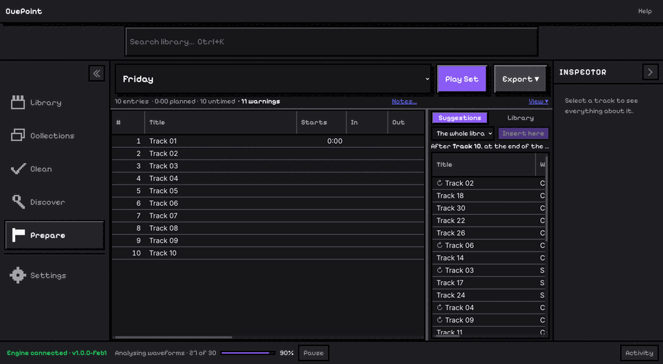

*The header has no New Set button.*

#### PRP-2 — Use one empty-Set message that points at the panel beside it

**Recommendation**: Yes

**Mark**: **Yes** (2026-10-07, the recommendation)

**What**: Replace EMPTY_SET with: "This Set is empty. Pick tracks on the right under **Library** and choose **Insert here**, or drag them in from the Library or the Collections tree." Suggestions' EMPTY_SET_SUGGESTIONS becomes: "Suggestions need a track to fit against. Add the first one from the **Library** tab." (keep the **Open the Library tab** button).

**Why**: Item 6.

**Size**: S.

**Files**: `prepareFormat.ts`, `SourcePanel.tsx`, tests.

**Screenshots**:

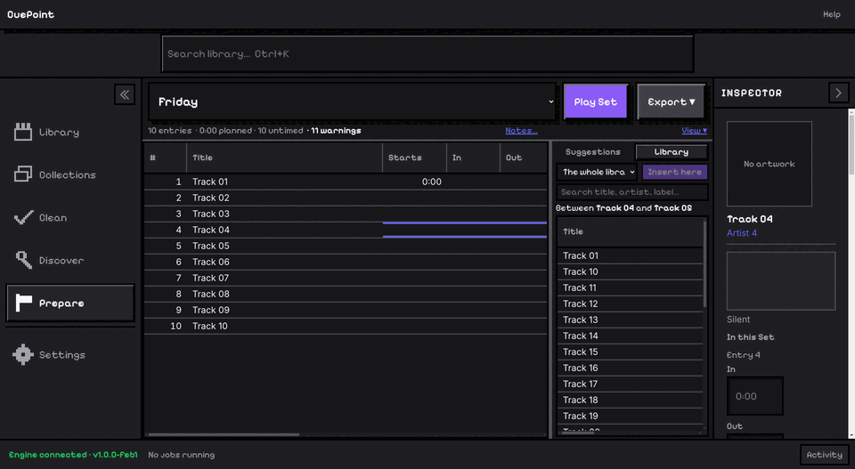

*No empty Set shot: a Set made from a playlist is never empty here, so the empty Set text was not reached.*

#### PRP-3 — Say what "planned" means when nothing is timed

**Recommendation**: Yes

**Mark**: **Yes** (2026-10-07, the recommendation); amended 2026-10-08: the hint says to type In and Out in the table (FLW-18)

**What**: When `running.seconds === 0 && untimed === entries`: header fact "No times planned yet" with title "Select an entry and type its In and Out in the Inspector to plan the Set's length. Times are optional." Otherwise "1:34:20 planned · 3 without times". Inspector line `SetEntryZone.tsx:127`: "No out time yet: type one to count this track in the Set's length."

**Why**: Items 2–3.

**Size**: S.

**Files**: `prepareFormat.ts`, `SetEntryZone.tsx`, `transitionStrip.ts` ("Untimed" → "No out time"), tests, `docs/user-guide/prepare.md`.

**Screenshots**:

*"0:00 planned · 10 untimed"; the after-typing-Out shot was not taken.*

#### PRP-4 — Use column headers that say what the user types

**Recommendation**: Yes

**Mark**: **Yes** (2026-10-07, the recommendation)

**What**: "In" → "Mix in", "Out" → "Mix out", "Starts" → "Starts at", "Planned" → "Plays for"; each header gets a title ("When you plan to bring this track in, as m:ss into the track"). Same words for the Inspector fields.

**Why**: Item 3.

**Size**: S.

**Files**: `prepareColumns.tsx`, `SetEntryZone.tsx`, e2e selectors in `prepareJourney.spec.ts`.

**Screenshots**:

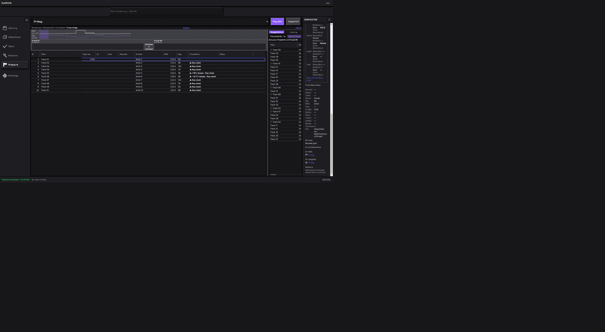

*The In, Out and Starts headers.*

#### PRP-5 — Use one word for accepting a warning: "Accept"

**Recommendation**: Yes

**Mark**: **Yes** (2026-10-07, the recommendation)

**What**: Inspector buttons become **Accept** / **Undo accept**, suffix "(accepted)"; header and cells keep "accepted". Add a one-line hint above the list: "Accept a warning once you have heard the mix work. It comes back if either track changes."

**Why**: Item 4.

**Size**: S.

**Files**: `SetEntryZone.tsx`, `prepare.test.ts`, `docs/user-guide/prepare.md:177-181`, e2e.

**Screenshots**:

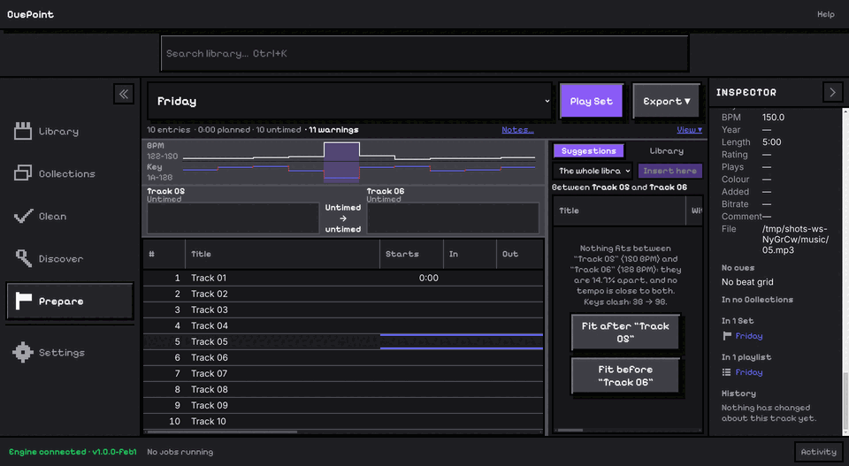

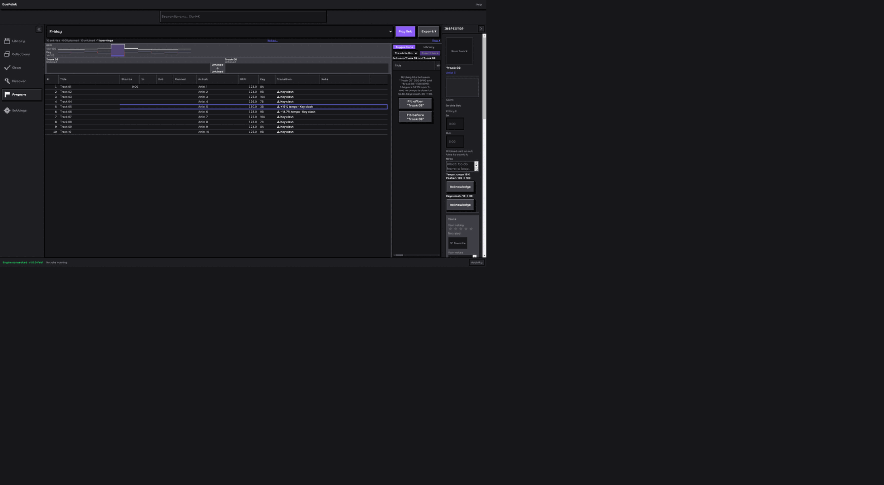

*Track 05 at 150 BPM and 3B: a tempo jump and 11 warnings, with the Accept and Acknowledge buttons in the Inspector zone. The after-accept state was not shot.*

#### PRP-6 — Make "Files never checked" a link to the fix

**Recommendation**: Yes

**Mark**: **Yes** (2026-10-07, the recommendation)

**What**: Render the fact as a link-button "Files not checked — check now" that opens Clean's file check (the screen already receives `onOpenMissingFiles`, `PrepareScreen.tsx:133`; add an `onCheckFiles` that starts Clean's "Check every file").

**Why**: Item 5, DEC-132 "say what to do next".

**Size**: M.

**Files**: `PrepareScreen.tsx`, `prepareFormat.ts`, `App.tsx`, `setWarnings.ts`.

**Screenshots**:

*No screenshot: the "Files never checked" fact is not reachable; the post-import file check finished before Prepare opened.*

#### PRP-7 — Explain Suggestions' columns

**Recommendation**: Yes

**Mark**: **Yes** (2026-10-07, the recommendation)

**What**: "Score" → "Fit" shown as "72/100"; "With previous"/"With next" → "Fits after"/"Fits before"; a one-line note under the insertion line the first time Suggestions shows: "Ranked by how well each track follows the one before and leads into the one after: tempo, key, genre, label and artist."

**Why**: Item 7.

**Size**: S.

**Files**: `sourceColumns.tsx`, `SourcePanel.tsx`, `prepareSource.ts`, tests.

**Screenshots**:

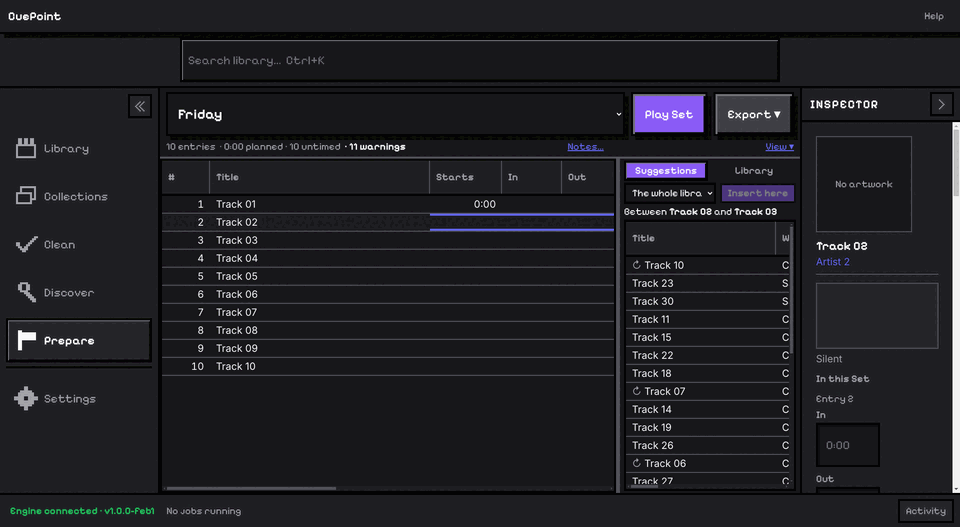

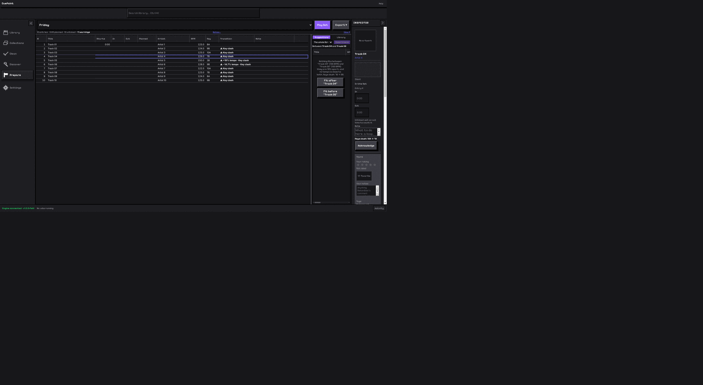

*The Score and With previous columns, and the "Nothing fits" state.*

#### PRP-8 — Use plain key and loudness words

**Recommendation**: Yes

**Mark**: **Yes** (2026-10-07, the recommendation); amended 2026-10-08: "Next key", in fact 2's words, not "Neighbouring key" (DEC-158)

**What**: Key lane gutter "Key (Camelot)" with title "Keys on the Camelot wheel: neighbours mix well"; "One step on the wheel" → "Neighbouring key"; strip loudness gets a title "Loudness (LUFS). +2.1 LU means the next track is 2.1 dB louder."

**Why**: Items 8–9. Wording only; the wheel itself is DEC-133's.

**Size**: S.

**Files**: `SetLanes.tsx`, `prepareSource.ts`, `SetTransition.tsx`, `components/waveform/loudnessWords.ts`.

**Screenshots**:

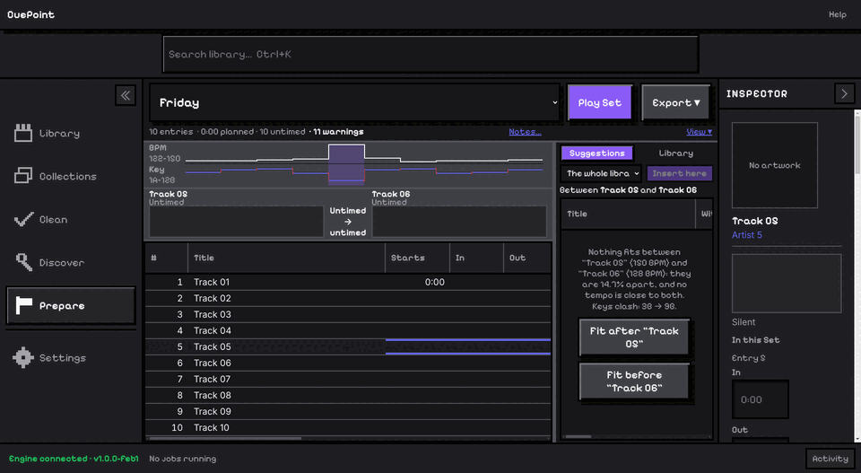

*Lanes and the transition strip are on; the loudness hover tooltip is not captured.*

#### PRP-9 — Lift the insertion line above the tabs and give Insert a visible reason

**Recommendation**: Yes

**Mark**: **Yes** (2026-10-07, the recommendation)

**What**: Move `PointLine` to the panel's top so it reads "Inserting: between *A* and *B*, in Peak"; with nothing picked, the button reads "Pick tracks below" instead of a disabled "Insert here".

**Why**: Item 10.

**Size**: S.

**Files**: `SourcePanel.tsx`, `prepare.css`, `prepareSource.ts`, `e2e/prepareSource.spec.ts`.

**Screenshots**:

*The Insert here button and the insertion line; the "two picked" state was not shot.*

#### PRP-10 — Use real buttons for Notes and View

**Recommendation**: Yes

**Mark**: **Yes** (2026-10-07, the recommendation)

**What**: Restyle `Notes…`/`View ▾` as small secondary buttons; when Set notes exist, show "Notes (1)" style indicator. Keep them on the facts line (DEC-112 height).

**Why**: Item 12.

**Size**: S.

**Files**: `PrepareScreen.tsx`, `prepare.css`.

**Screenshots**:

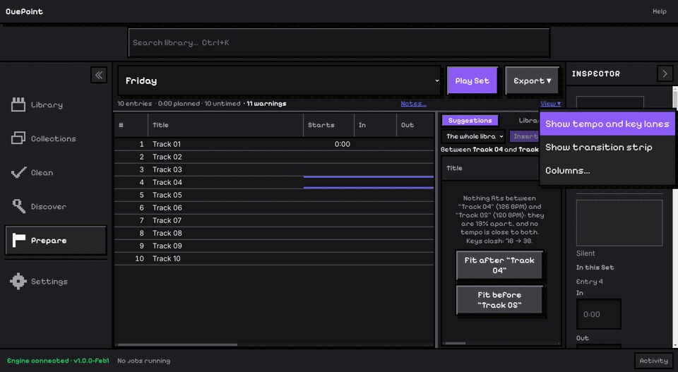

*Notes… and View ▾ as text links; the Notes indicator state was not shot.*

#### PRP-11 — Say what a chapter is, and where chapters are made

**Recommendation**: Yes

**Mark**: **Yes** (2026-10-07, the recommendation)

**What**: Chapter dialog gains a lead line: "A chapter is a part of the Set — warm-up, peak, closing — with its own target length and tempo range." The entry menu's "Start a chapter here" title: "Splits the Set here; this track begins a new chapter."

**Why**: Item 11.

**Size**: S.

**Files**: `ChapterDialog.tsx`, `prepareMenus.ts`.

**Screenshots**:

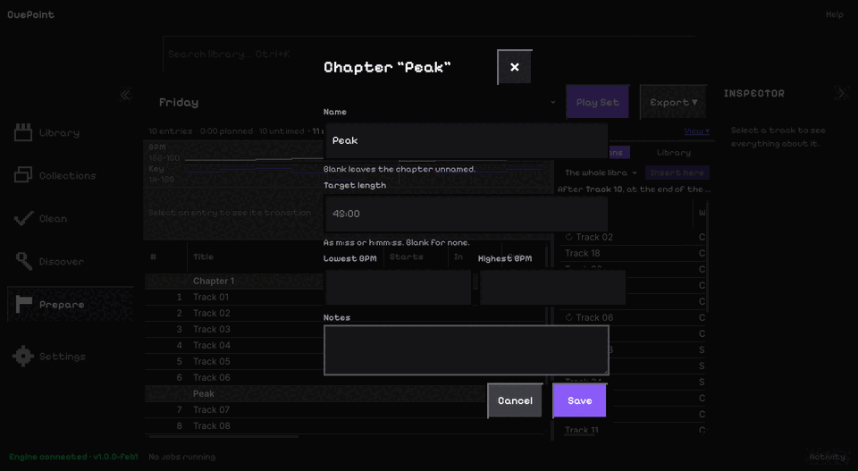

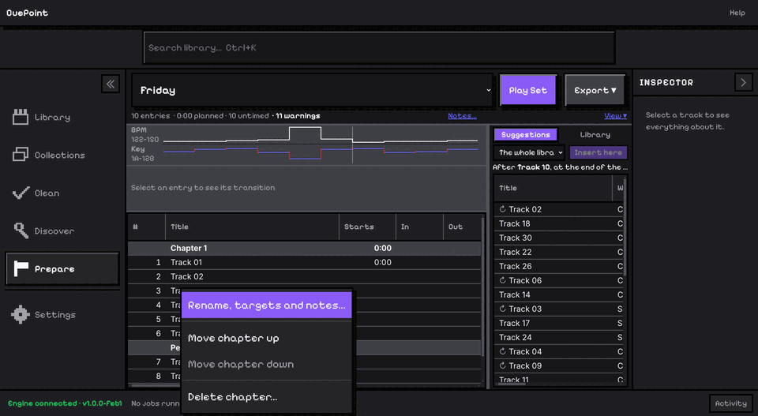

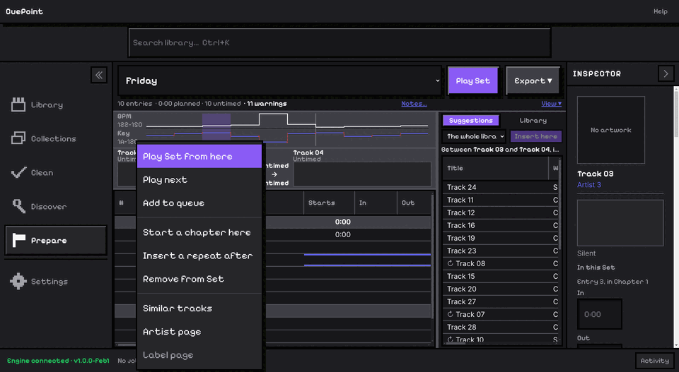

*The chapter dialog and the right-click menus.*

#### PRP-12 — Explain waiting waveforms and loading in place

**Recommendation**: Yes

**Mark**: **Yes** (2026-10-07, the recommendation)

**What**: Strip halves without a waveform say "Waveform not made yet — analysis is 312 of 4,000" with a link "See progress" to Settings → Waveforms; page loading states go inside a panel with the pixel loading motion (DEC-134 "loading").

**Why**: Items 13–14, DEC-132 "background work explained as it happens".

**Size**: M.

**Files**: `SetTransition.tsx`, `transitionStrip.ts`, `PrepareScreen.tsx`, `components/waveform/analysisWords.ts`.

**Screenshots**:

*The strip's "Untimed" halves; the "Waiting for analysis" text and the Set loading state were not caught because analysis is fast.*

#### PRP-13 — Add Prepare to Getting started

**Recommendation**: Yes

**Mark**: **Yes** (2026-10-07, the recommendation)

**What**: A fourth screen: title "Prepare a Set", body "Put tracks in the order you will play them. CuePoint suggests what fits next, checks every change of tempo and key, and plays the Set as the queue."

**Why**: Item 15 / DEC-132 first-run guide.

**Size**: S.

**Files**: `components/OnboardingDialog.tsx`. Built inside RUN-1.

**Screenshots**:

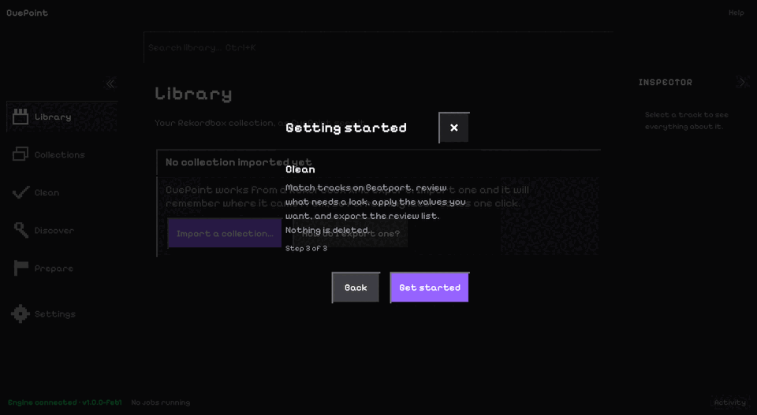

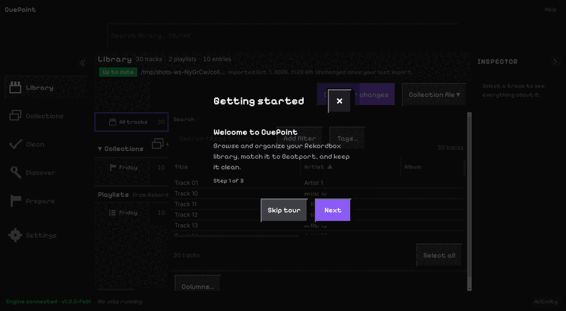

*The tour has three screens today and none about Prepare.*

## The first run

*Paths are relative to `apps/desktop-electron/renderer/src/` unless they start with `src/cuepoint/`, `docs/` or `apps/`.*

### What it does

- **When it appears.** The App checks once, at mount, whether `localStorage["cuepoint-onboarding-complete"]` equals `"1"`. If the key is absent, the dialog opens (`App.tsx:72`; `OnboardingDialog.tsx:5,63-68`), and it is rendered at `App.tsx:297`. When storage throws, `shouldShowOnboarding()` returns false, so the tour never shows (`:64-67`).
- **How to reopen it.** Help → "Getting started…" (`AppMenuBar.tsx:61-63` → `App.tsx:220`).
- **What it is.** A `Modal` titled `"Getting started"` (`OnboardingDialog.tsx:40`) with three text screens (`:7-20`):
  1. "Welcome to CuePoint" — "Browse and organize your Rekordbox library, match it to Beatport, and keep it clean."
  2. "Import your collection" — "Export your Rekordbox collection as XML, then import it in the Library. A refresh picks up later changes."
  3. "Clean" — "Match tracks on Beatport, review what needs a look, apply the values you want, and export the review list. Nothing is deleted."
- **Buttons.**
  - Primary: Next, then "Get started" on the last screen (`:42-45`).
  - Secondary: "Skip tour" on screen 1, and "Back" after it (`:46-50`).
  - The footer shows "Step n of 3" (`:55-57`).
- **Text only.** No images, links or actions. The dialog sits over the empty Library, whose own empty state already offers "Import a collection…" and "How do I export one?" (`screens/library/LibraryScreen.tsx:1524-1549`).

### What a new user would not understand

1. **It omits most of the app:** Discover, Prepare, the player, the Inspector, the status strip, search, and the Beatport token needed for Clean and Discover.
2. **"Export … as XML" has no link** to the Rekordbox instructions dialog, though one exists (`RekordboxInstructionsDialog`). It also has no button to start the import.
3. **Defect: reopening from Help starts on the last screen seen.** `step` is component state that is never reset (`OnboardingDialog.tsx:28`), and the dialog stays mounted (`App.tsx:297`).
4. **Defect: a backdrop click or Escape marks the tour complete for good.** `onClose={finish}` (`OnboardingDialog.tsx:41`), and the Modal's backdrop click and Escape both call onClose (`components/Modal.tsx:73-75,104`).
5. **Defect: `finish()` calls `localStorage.setItem` without try/catch** (`OnboardingDialog.tsx:33`). `scale.ts:30-36` guards the same call.
6. **There is a stale second onboarding flag.** `docs/user-guide/getting-started.md:79-81` documents `product.onboarding_seen` in `~/.cuepoint/config.yaml`. It belongs to the legacy Python path (`src/cuepoint/services/onboarding_service.py:39`, `models/config_models.py:91`), and the Electron app does not read it.

### Proposals

#### RUN-1 — Write a short first-run guide

**Recommendation**: Yes

**Mark**: **Yes** (2026-10-07, the recommendation)

**What**:

Rework `OnboardingDialog` into five short screens. Each screen has one sentence and one pixel illustration, a screenshot crop or icon drawn with `PixelIcon`. Screens 2 and 3 carry real actions.
1. **Welcome.** "CuePoint keeps your Rekordbox library tidy, finds new music and helps you plan sets. Nothing changes in Rekordbox until you export."
2. **Get your collection out of Rekordbox.** One sentence, plus a button "Show me how" that opens `RekordboxInstructionsDialog` (`App.tsx:221`).
3. **Import it.** A button "Import a collection…" that closes the guide and runs the Library's import, through a location-state opener like `libraryRefreshState` (`libraryLink.ts:88-97`), for example `libraryImportState()`.
4. **Find your way around.** The sidebar's pages, one line each, reusing NAV-1's hints. Also: "Double-click a track to play it."
5. **Background work.** "The strip at the bottom shows what CuePoint is doing; you can keep working. Activity lists everything it did."

Plus:
- "Step n of 5" stays.
- "Skip" is always visible.
- Backdrop clicks are disabled.
- Reopening always starts at step 1.

**Why**: DEC-132's "short first-run guide", built on the existing dialog, storage key and Help entry.

**Size**: M.

**Files**:

- `OnboardingDialog.tsx`, `OnboardingDialog.css`, `App.tsx`;
- `screens/library/libraryLink.ts`, `LibraryScreen.tsx` (an import opener);
- possibly new pixel art;
- a new `OnboardingDialog.test.tsx`;
- `docs/user-guide/getting-started.md:17-19`, `workflows.md:7`.

**Screenshots**:

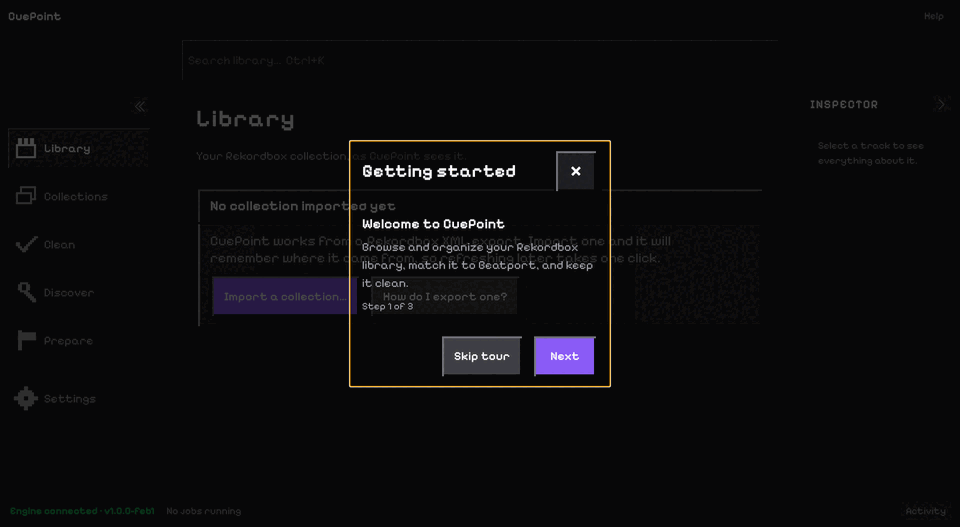

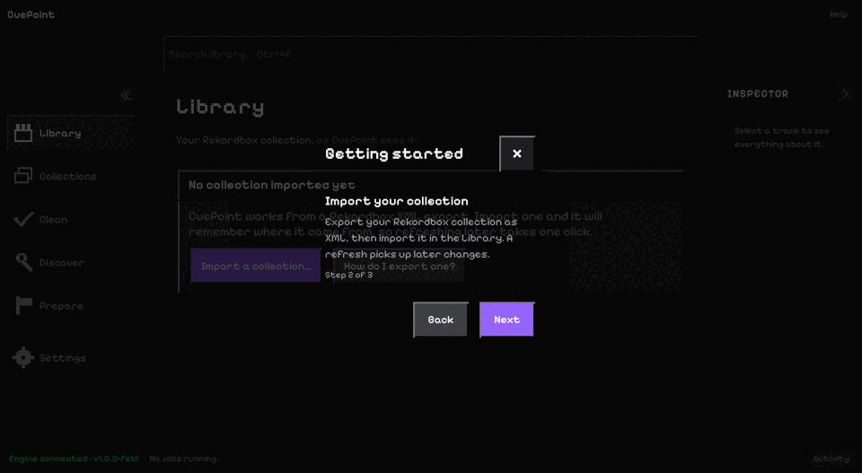

*Three screens today.*

#### RUN-2 — Fix the three onboarding defects

**Recommendation**: Yes

**Mark**: **Yes** (2026-10-07, the recommendation)

**What**:

- Reset `step` to 0 whenever `open` turns true (`OnboardingDialog.tsx:28`).
- Make Escape and backdrop clicks close without marking the tour complete (only "Skip" and "Get started" mark it), or keep closing but ask nothing.
- Wrap `setItem` in try/catch.

**Why**: Reopening mid-tour and losing the tour to a stray click are bugs.

**Size**: S.

**Files**: `OnboardingDialog.tsx`, `Modal.tsx` (may need a `dismissible={false}` prop), a test.

**Screenshots**:

*Reopened from Help; it starts on the last step, which is the defect.*

#### RUN-3 — Add a first-steps checklist on the empty Library

**Recommendation**: Yes

**Mark**: **Yes** (2026-10-07, the recommendation)

**What**:

Beneath the "No collection imported yet" panel (`LibraryScreen.tsx:1531-1549`), show a three-item checklist that ticks itself from real state:
1. "Import your collection" (`summary.library_empty`).
2. "Play a track" (`selectHasPlayed`).
3. "Add a Beatport token to use Clean and Discover" (`/config/beatport-token`).

Once all three are done it hides for good.

**Why**: The guide is skippable; the checklist persists where the user will be.

**Size**: M.

**Files**: `LibraryScreen.tsx`, a new `FirstSteps.tsx`, the player store, the config bridge.

**Screenshots**:

*The empty Library, with no checklist.*

#### RUN-4 — Correct the user guide's onboarding facts

**Recommendation**: Yes

**Mark**: **Yes** (2026-10-07, the recommendation)

**What**: Remove or relabel `onboarding_seen` in `getting-started.md:79-81` as CLI-only, and update "CuePoint opens with a short tour" (`:19`) to describe the new guide.

**Why**: The doc describes a flag the desktop app ignores.

**Size**: S.

**Files**: `docs/user-guide/getting-started.md`.

**Screenshots**:

*No screenshot: this is a documentation fix.*

## Interactions with what is already decided

- DEC-133's Camelot wheel lights the selected track's key, so the Inspector's Key row and the Key column are its natural partners (see INS-3, LIB-9 and BAR-5).
- DEC-134's motion switches cover INS-2, INS-3 and LIB-1's appearance.
- Phase 15's Statistics reads `PlayCount`. The Inspector's "Plays" row and the hidden Plays column could link to it later.
- DEC-132's first-run guide should land on LIB-2's empty state and name the Inspector (called "Track details" if INS-1 is accepted).
